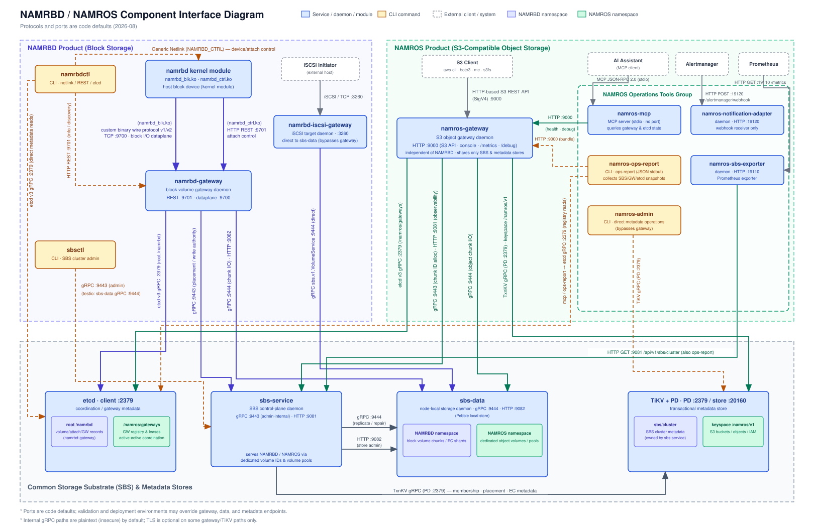

#  NAMRBD

NAMRBD (Network Attached Multipath Resilient Block Device) is an open-source
distributed block storage platform for Linux. The public source tree provides
the replicated storage core, gateway and SBS services, host and kernel control
paths, Kubernetes CSI integration, snapshot and restore building blocks,
discard/zero handling, basic iSCSI connectivity, and operational visibility.


NAMROS (<https://github.com/nosway/namros>) is a sibling S3-compatible object
storage project that uses the NAMRBD SBS backend. The relationship between the
two projects is shown below.



The public repository is intended to work as a normal open-source checkout for
building, testing, inspecting, and packaging the platform. Source availability
does not by itself mean that every integration is a supported v1.0 release
surface; [Feature Status](docs-src/feature-status.md) records that distinction.

## Contents

- [Platform Capabilities](#platform-capabilities)
- [Advanced Features](#advanced-features)
- [Prerequisites](#prerequisites)
  - [Metadata Backend Requirements](#metadata-backend-requirements)
- [Quickstart](#quickstart)
- [Operations Assets](#operations-assets)
- [Documentation](#documentation)
- [Developer Onboarding](#developer-onboarding)
- [License](#license)

## Platform Capabilities

The open-source platform includes:

- replicated volume lifecycle and placement;
- `namrbd-gateway`, `namrbdctl`, `sbs-service`, `sbs-data`, `sbsctl`,
  `namrbd-debug`, `namrbd-csi-driver`, `namrbd-iscsi-gateway`, and
  `namrbd-mcp`;
- Linux kernel block/control modules;
- Kubernetes CSI manifests under `deploy/kubernetes/csi`;
- public health, metrics, Grafana, alert, and metric catalog assets under
  `deploy/observability`;
- public Markdown documentation source under `docs-src`;
- manual replicated snapshot and restore-from-snapshot workflows;
- basic Kubernetes CSI replicated provisioning and snapshot restore surfaces;
- discard, write-zeroes, and zero/read-view correctness observability;
- basic iSCSI target and control CLI surfaces with a limit of three distinct
  exported volumes.

Some integrations are available in source but have not yet been validated as
supported v1.0 release surfaces. See [Feature Status](docs-src/feature-status.md)
before making deployment or compatibility assumptions.

## Advanced Features

NAMRBD is also developing and validating advanced capabilities for the
Enterprise edition. These descriptions are development directions, not
general-availability, compatibility, performance, or support commitments.
The [Edition Boundary Guide](docs-src/manuals/edition-boundary.md) defines the
required `[Enterprise Edition Only]` marker and fail-closed behavior when an
advanced CLI/API capability is unavailable.

- **Erasure-coded storage:** full-stripe userspace EC placement, encoding,
  rebuild, and maintenance paths.
- **Automated backup and recovery:** policy-driven backup targets, runs,
  retention, restore drills, and recovery evidence.
- **Security and governance:** KMS-backed data keys, encryption, rotation,
  audit, crypto erase, and scoped governance/WORM controls.
- **Performance and QoS:** workload classification, rate controls, performance
  tiers, and scale-oriented observability.
- **Advanced iSCSI and large-scale operations:** larger export fleets,
  redundant target paths, MPIO/ALUA, and controlled membership operations.
- **Remote replication and disaster recovery:** replication links, recovery
  points, shipping workflows, standby import, and failover orchestration.
- **Data mobility and repack:** controlled movement between placement or
  geometry layouts with verification and rollback boundaries.
- **Deduplication:** scoped replicated-data dedupe and reclaim workflows.

NVMe/TCP remains an exploratory future direction and is not a current platform
or Enterprise support claim.

## Prerequisites

Install only the tools needed for the workflow you plan to run:

| Workflow | Requirements |
| --- | --- |
| Source build and tests | Git, `make`, and Go 1.22 or newer with automatic toolchain download enabled (`GOTOOLCHAIN=auto`), or Go 1.26.6 installed directly. The repository's `go.mod` pins the effective build toolchain to Go 1.26.6. |
| Local container Quickstart | Docker Engine with BuildKit, Docker Compose v2 through `docker compose`, `curl`, and `jq`. The host must be able to pull the configured container images and expose the local ports in `examples/quickstart/.env.example`. |
| kind CSI PVC demo | All container Quickstart tools plus `kind`, a `kubectl` client compatible with the kind cluster, Helm 3, and enough Docker resources to build the CSI image and run the Compose and kind containers together. |
| Linux kernel module | A Linux build host, compiler/build tools, and kernel headers or a kernel build tree matching `uname -r`. This is not required for the userspace or container Quickstart. |
| Documentation | Python 3 and `pip`; install the pinned packages from `docs-src/requirements.txt`. |

Check the main toolchain before starting:

```bash
go version
docker version
docker compose version
```

For the kind CSI demo, also check:

```bash
kind version
kubectl version --client
helm version
jq --version
```

### Metadata Backend Requirements

- **Local Quickstart:** no host-installed etcd or TiKV is required. Compose
  pulls etcd `v3.6.8` for gateway/control-plane metadata, while the local
  `sbs-service` uses its embedded Pebble metadata backend. TiKV/PD is not part
  of this entry-level topology.
- **External or HA deployment:** provide an etcd v3-compatible cluster for
  gateway/control-plane metadata. A three-member cluster is recommended for
  quorum; the current [etcd HA guide](docs-src/manuals/etcd-ha-cluster-install-operations-guide.md)
  uses etcd `v3.5.9` as its installation example.
- **Primary multi-node SBS deployment:** provide a separate PD/TiKV cluster for
  authoritative SBS metadata and configure `sbs-service` with the PD endpoints.
  The current [TiKV HA guide](docs-src/manuals/tikv-ha-cluster-install-operations-guide.md)
  uses TiKV/PD `v6.5.2` as its deployment example. PD client traffic normally
  uses TCP `2379`, while TiKV storage traffic normally uses TCP `20160`.

The etcd endpoints used by the gateway and the PD endpoints used by
`sbs-service` are different service authorities even though their client ports
may both be `2379`. Neither external backend is required merely to compile the
source or run the ordinary unit tests.

## Quickstart

Build the Community binaries from a clean checkout:

```bash
make build-community
make test-community
```

Build the local Community container image set:

```bash
make container-build-community-images
```

Run the local container quickstart. This starts `etcd`, `sbs-service`,
`sbs-data`, and `namrbd-gateway`, creates a small replicated volume, verifies `sbsctl`
write/read I/O, and checks gateway readiness plus Prometheus metrics:

```bash
make quickstart-compose-config
make quickstart-local-sbs-smoke
```

The same smoke is also exposed as:

```bash
make quickstart-local-all-smoke
```

Run the kind CSI PVC demo. This starts the local Compose quickstart, creates a
kind cluster, installs the CSI Helm chart, and waits for one block PVC to
become `Bound`:

```bash
make kind-csi-pvc-demo
```

Stop or reset it with:

```bash
make quickstart-local-down
make quickstart-local-reset
```

Kernel modules are built separately on a Linux host with matching kernel
headers:

```bash
make kernel-module
```

Quickstart files live under `examples/quickstart`. The kind CSI PVC demo lives
under `examples/kind-csi-pvc`. Kubernetes CSI deployment assets live under
`deploy/kubernetes/csi`; use the Helm chart for normal installs and create
credential Secrets outside git.

Validate the public observability and documentation source assets:

```bash
make observability-assets-check
make docs-source-check
```

Build the editable public docs when MkDocs is installed:

```bash
make docs-build
```

## Operations Assets

SBS service and data endpoints expose `/healthz`, `/readyz`, and `/metrics`.
`namrbd-gateway` also exposes `/healthz`, `/readyz`, `/metrics`, and JSON debug
metrics through `/api/v1/debug/gateway/metrics` and
`/api/v1/debug/sbs-cluster/metrics`. `namrbd-iscsi-gateway` exposes
`/healthz`, `/readyz`, and `/metrics` when started with
`--observability-listen`.

Prometheus scrape examples, starter alert rules, a Grafana overview dashboard,
and the metric catalog live under `deploy/observability`.

## Documentation

The manual set is published at <https://nosway.github.io/namrbd/> after a
maintainer enables GitHub Pages and runs the `Docs` workflow with
`deploy_pages=true`. Every push to `main` render-checks `docs-src/`, but does
not require Pages to be enabled. No rendered HTML is committed, so the sources
cannot drift from what readers see.

`docs-src/` is the single MkDocs authoring surface, with `mkdocs.yml` at the
repository root and the installation, user, admin, HA, and architecture
manuals under `docs-src/manuals/`. Repository-only architecture decisions live
under `docs/adr/`; rendered HTML is not committed. Start incident response with the
[Troubleshooting and FAQ](docs-src/manuals/troubleshooting-and-faq.md), and
check the [OS, Kernel, and Kubernetes Compatibility Matrix](docs-src/manuals/compatibility-matrix.md)
before qualifying a deployment. Build the documentation locally with:

```bash
python -m pip install -r docs-src/requirements.txt
make docs-render-check
mkdocs serve
```

Internal planning notes, private validation tooling, and generated working directories
are not part of the public documentation tree.

## Developer Onboarding

Start with the [Developer Onboarding Guide](docs-src/manuals/developer-onboarding.md)
for the package map, repository-local Go cache workflow, validation gates, and
Delve examples. Each top-level implementation directory also has a local
`README.md` describing its role and interfaces. Durable technical decisions are
indexed in [Architecture Decision Records](docs/adr/README.md).

Release artifact expectations and the source-only status of `v1.0.0` are
documented in [`RELEASE.md`](RELEASE.md). For issue and support boundaries, see
[`SUPPORT.md`](SUPPORT.md).

## License

Unless a file or directory says otherwise, NAMRBD source is licensed under the
Apache License, Version 2.0. The Linux kernel module under `kernel/module/` is
licensed under GPL-2.0-only. See `LICENSE`, `LICENSE-POLICY.md`, `NOTICE`,
`THIRD_PARTY_NOTICES.md`, and the license texts under `LICENSES/`.
