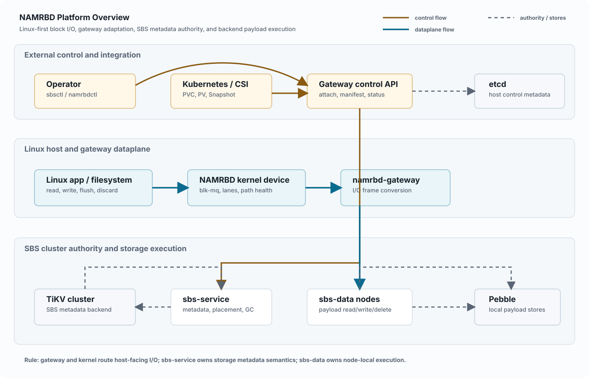

Chapter 2

# Platform Overview

## In This Chapter

- Whole-platform shape
- Component block diagram
- Control and data flows
- Linux-first framing

NAMRBD is a Linux block storage platform. A Linux application issues filesystem or raw block I/O to a local NAMRBD block device. The kernel module dispatches requests through gateway dataplane paths. The gateway translates host requests into SBS volume operations. `sbs-service` owns cluster metadata and placement authority, while `sbs-data` nodes execute local payload operations.

The name expands to Network Attached Multipath Resilient Block Device and is pronounced \[nae-mur-bee-dee\]. This overview uses that expansion as a guide to the platform boundaries: network-attached access, multipath host routing, resilience, and Linux block-device semantics.

The same name also summarizes the intended feature set: scalable distributed block storage over a network, multipath connection support for high availability, automatic recovery from internal component failures where practical, and product direction centered first on Linux and Kubernetes (K8S).

The gateway and kernel route host-facing I/O, but SBS metadata semantics live in the SBS cluster. That split is the organizing rule for every flow in this overview.

One I/O through the platform

Linux app / filesystem

block I/O

NAMRBD kernel device

gateway frame

namrbd-gateway

SBS operation

sbs-service metadata + sbs-data payload

physical

Pebble payload on SBS nodes

<figure class="architecture-figure" markdown="1">

<figcaption>Shared English SVG for the platform overview. The diagram highlights component groups, flow categories, and ownership boundaries; protocol details remain in the surrounding text.</figcaption>

</figure>

## What This Overview Is Not

This overview is a concept map. It is not a deployment topology, full metadata schema, or operations runbook. Later chapters explain the exact metadata records, backend descriptors, read-view roots, and operational evidence used to prove each behavior.

## Primary Flows

| Flow | What Happens | Main Owner |
|----|----|----|
| Volume create | An operator/API creates SBS-side volume metadata, geometry, and placement policy. | `sbs-service` |
| Attach | Host-side tooling asks the gateway for a manifest, then applies device/path state to the kernel module. | Gateway/control plane plus kernel local state |
| Read/write | The kernel sends block requests to gateway paths; the gateway calls SBS storage operations. | Kernel/gateway dataplane and SBS execution |
| Snapshot/clone | Read-view metadata captures immutable roots and clone delta mappings. | `sbs-service` and SBS metadata |
| Discard | Aligned discard detaches live mappings and makes old backing objects protected or reclaimable. | SBS metadata and reachability/GC |

## What Is Not The Primary Frame

Kubernetes is important, but the platform does not start there. The CSI driver translates Kubernetes objects into NAMRBD controller and node calls. It does not own placement, fencing, read-view, snapshot, clone, discard, or GC semantics.

[\<- Previous](00-reading-guide.md) [Next: Components And Ownership -\>](02-components-and-ownership.md)
