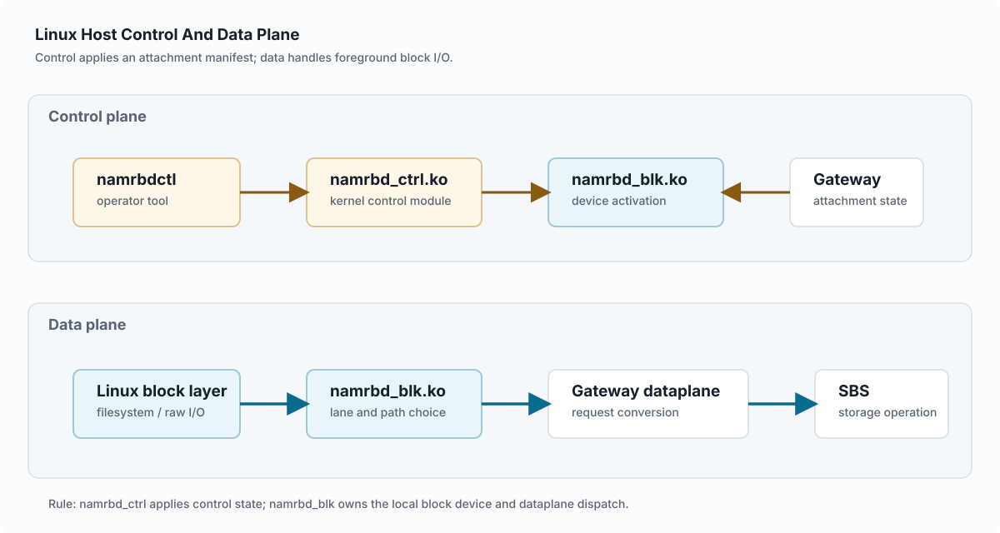

Chapter 4

# Linux Host Control And Data Plane

## Linux First

This chapter frames the platform from ordinary Linux block-device usage.

- `namrbdctl`
- `namrbd_ctrl.ko`
- `namrbd_blk.ko`
- blk-mq dispatch

A Linux host uses NAMRBD as a block device. Control-plane operations create, attach, detach, and reconfigure the device. Data-plane operations carry block reads, writes, flushes, zeroes, and discards through gateway paths into SBS.

The kernel owns host-local device state and path health. The gateway validates and returns a manifest; attachment identity and generation come from control metadata rather than kernel-local opinion.

The host path is split inside Linux as well. `namrbdctl` is the userspace operator tool, `namrbd_ctrl.ko` is the generic-netlink control module, and `namrbd_blk.ko` is the blk-mq block-device module that receives real I/O.

<figure class="architecture-figure" markdown="1">

<figcaption>Shared English SVG for the Linux host path. Control applies attachment state; the block module owns the local device and foreground dispatch.</figcaption>

</figure>

## Host Components

| Host Component | Primary Role | Depends On | Does Not Do |
|----|----|----|----|
| `namrbdctl` | Operator entry point for device create/destroy, REST endpoint configuration, attach, detach, reconfigure, resize, status, and userspace gateway read/write helpers. | Generic netlink client for kernel control commands; gateway HTTP APIs when a command is userspace-mediated. | It is not a kernel I/O path and does not complete Linux block requests. |
| `namrbd_ctrl.ko` | Kernel control module. It registers the `NAMRBD_CTRL` generic netlink family, receives TLV commands, stores configured gateway REST endpoints, and applies attach/detach/reconfigure requests to the block module. | `namrbd_blk.ko` exported activation, deactivation, path configuration, resize, and status functions. In the kernel-mediated attach path, it also calls gateway REST attach/info/detach APIs. | It does not implement blk-mq request dispatch or own storage placement. |
| `namrbd_blk.ko` | Kernel block-device module. It owns the local gendisk, blk-mq queue, device capacity, path/lane state, no-path policy, persistent gateway TCP sockets, pending request table, and request completion. | Attach manifests and path-plan updates supplied through `namrbd_ctrl.ko`; gateway dataplane endpoints from the manifest; Linux block layer requests from filesystems or raw device users. | It does not call SBS metadata APIs, decide attachment ownership, or mutate placement/maintenance state. |
| `namrbd-gateway` | Host-facing control and dataplane peer. It admits attach/detach/info, advertises dataplane endpoints, accepts kernel TCP dataplane frames, and translates them to SBS volume operations. | etcd attachment/generation control metadata and `sbs-service` published SBS target views. | It does not own kernel queue state or SBS raw metadata authority. |

## Attach Flow

Linux attach and manifest application

operator

-\>

namrbdctl

-\>

gateway attach/info

-\>

manifest JSON

-\>

generic netlink

-\>

namrbd_ctrl.ko

-\>

namrbd_blk.ko activated

The common userspace-mediated attach path starts with `namrbdctl attach --gateway ...`: userspace calls the gateway attach and discovery APIs, prepares the attach manifest, configures kernel REST endpoint metadata, then sends `AttachManifest` over generic netlink. The kernel-mediated compatibility path sends an `Attach` netlink command to `namrbd_ctrl.ko`; the control module then calls the configured gateway REST attach/info APIs itself before activating the block device.

Both paths end at the same host-local boundary: `namrbd_ctrl.ko` validates and forwards the manifest into `namrbd_blk.ko`, which updates capacity, generation, dataplane paths, lane topology, and path health runtime state. The kernel does not decide whether the attach is allowed; it applies the gateway result.

| Attach Artifact | Meaning | Authority |
|----|----|----|
| `volume_id` | The target block volume identity. | Control/SBS metadata |
| `attachment_id` | The active writer/session binding. | Control-plane attachment manager |
| `generation` | Writer fencing generation. | Control-plane metadata |
| dataplane endpoints | Gateway paths the kernel can use for I/O. | Gateway discovery/path-plan response |
| path health | Whether a host-local path is ready, degraded, down, or draining. | Kernel runtime state |

## Attach Manifest Data

The attach manifest is a gateway-produced JSON document. It is the handoff object between gateway control metadata, userspace preparation, `namrbd_ctrl.ko` validation, and `namrbd_blk.ko` runtime activation. The kernel consumes a strict core subset for block-device activation and dataplane setup; other fields remain part of the control and observability envelope used by `namrbdctl`, gateway path-plan reconciliation, and status comparison.

| Manifest Data | Examples | Consumer / Meaning | Boundary |
|----|----|----|----|
| Volume and attachment identity | `volume_id`, `generation`, `attachment_id`, `attached_host_id`, `attached_device_id` | `namrbd_ctrl.ko` validates these against the request, then `namrbd_blk.ko` stores volume/generation for response validation and resize fencing. | The gateway returns the identity after control metadata admission. The kernel applies it; it does not mint a new attachment. |
| Device geometry | `size_bytes`, `block_size`, `chunk_size_bytes`, `extent_page_bytes` | `namrbd_blk.ko` uses size and block/chunk geometry to expose capacity and choose range-based lanes for write-like operations. | Volume size and geometry authority remains in SBS/control metadata. The kernel rejects invalid values but does not choose geometry. |
| Control endpoints | `control_endpoints[].address`, `port`, `use_tls`, `server_name`, `api_prefix`, `bearer_token` | `namrbdctl` normalizes these into generic-netlink REST server entries for `namrbd_ctrl.ko`; the compatibility kernel-mediated path uses them for gateway HTTP attach/info/detach calls. | These endpoints are control API reachability, not dataplane sockets and not storage placement. |
| Dataplane endpoints | `dataplane_endpoints[].path_id`, `gateway_id`, `address`, `port`, `use_tls`, `server_name`, `auth_mode`, `priority` | `namrbd_ctrl.ko` parses them into kernel path inventory. `namrbd_blk.ko` turns them into path slots, lane preferred paths, fallback candidates, and persistent TCP connection targets. | Duplicate `path_id` values are rejected. A dataplane path is a host route to a gateway, not SBS backend placement. |
| Dataplane limits | `max_inflight_requests`, `max_inflight_bytes`, `max_io_size` | The kernel stores these as per-volume dataplane guardrails for request sizing and inflight accounting. | They bound the host-gateway connection; they do not prove SBS quorum, EC reconstruction, or payload durability. |
| Dataplane authentication | `dataplane_auth.mode`, `token`, `session_key`, `expires_at` | When present and supported by the selected operation, the kernel can use authenticated wire-v2 session setup. The gateway validates token claims such as volume, attachment, host, device, generation, gateway, and allowed path ids. | Authentication binds the dataplane session to an admitted attachment. It does not replace generation checks or detach revocation. |
| Path-plan and handoff observability | `path_plan_revision`, `path_plan`, `runtime_no_path`, `handoff_required`, `writer_fencing_epoch`, `controller_recommended_actions` | `namrbdctl` and gateway reconciliation use these fields to compare manifest, kernel runtime, and controller state. | These fields guide operators and reapply flows. Kernel path masks are still applied through explicit path-plan netlink commands. |

Validation is deliberately defensive: the parsed `volume_id` must match the requested volume, host and device identity must match the attach request, `generation`, `size_bytes`, `block_size`, attachment identity, and at least one dataplane endpoint are required, and path identifiers must be unique. This keeps a malformed or stale manifest from silently creating a different local block device binding.

## Kernel-Gateway Protocol Boundary

| Connection | Protocol | Used For | Important Boundary |
|----|----|----|----|
| `namrbdctl` to kernel control | Generic netlink family `NAMRBD_CTRL` with TLV payloads. | Create/destroy device, configure REST servers, attach manifest, detach, resize, status, list, and path-plan mask updates. | This is local host control. It is not the foreground block I/O transport. |
| Kernel control to gateway control | HTTP/1.1 JSON over kernel TCP sockets in the compatibility path. | `POST /api/v1/volumes/{id}/attach`, `GET /api/v1/volumes/{id}/info`, and `POST /api/v1/volumes/{id}/detach` style control calls. | These calls fetch or clear attachment state. They do not carry Linux block read/write payloads. |
| `namrbd_blk.ko` to gateway dataplane | Persistent TCP connection per selected path, using NAMRBD binary wire frames. | Read, write, flush, discard, write-zeroes, heartbeat/path-probe, request ids, response status, and payload where needed. | This is the foreground I/O path. The kernel validates response opcode, request id, volume id, and generation before completing a request. |
| Gateway dataplane to SBS | Gateway-internal service calls and SBS data/metadata protocols. | Translate the kernel frame into SBS volume operations and return committed/read payload results. | The kernel never calls TiKV, Pebble, or `sbs-service` metadata APIs directly during foreground I/O. |

## Control Plane Operations

| Operation | Userspace Action | Kernel Control Action | Gateway / Metadata Dependency |
|----|----|----|----|
| Create / destroy local device | `namrbdctl create-device` or `destroy-device` sends generic netlink commands. | `namrbd_ctrl.ko` asks `namrbd_blk.ko` to allocate or remove a local gendisk and blk-mq queue. | No SBS storage metadata mutation is implied by creating or destroying the local Linux device shell. |
| Configure gateway REST endpoints | `namrbdctl config-rest` or attach/reconfigure preparation sends endpoint entries. | `namrbd_ctrl.ko` stores the REST server list used by kernel-mediated control calls and status context. | The endpoints point to gateway control APIs. Endpoint configuration is not gateway liveness or placement truth. |
| Attach | `namrbdctl` obtains or requests an attach manifest and sends it to the kernel. | `namrbd_ctrl.ko` parses/validates the manifest, then calls `namrbd_blk.ko` activation and datapath configuration functions. | Gateway validates host, attachment, generation, and target view using control metadata and SBS published views. |
| Detach | `namrbdctl detach` calls gateway detach or asks the kernel control module to do so; `--local-only` only tears down local kernel state. | `namrbd_ctrl.ko` calls `namrbd_blk.ko` deactivation or local detach, closing dataplane paths and clearing local attach state. | Gateway detach clears attachment and can bump generation. Local-only detach does not replace control-plane fencing. |
| Reconfigure paths | `namrbdctl reconfigure-data-paths` or `apply-volume-path-plan` fetches gateway discovery/path-plan data. | `namrbd_ctrl.ko` applies a new manifest or path masks; `namrbd_blk.ko` recomputes path state, active lanes, and queue topology. | Gateway discovery suggests usable paths. The kernel owns local path health and no-path behavior after apply. |
| Status / list | `namrbdctl status` and `list-devices` read generic netlink status and may compare it with gateway manifest data. | `namrbd_blk.ko` reports attached volume, generation, path masks, lane map, queue topology, pending/outstanding counters, and no-path state. | Status can diagnose divergence between gateway manifest and runtime state, but it does not mutate SBS metadata. |
| Resize after expansion | `namrbdctl volume-reload-size` asks gateways for current size/generation and sends a resize command. | `namrbd_blk.ko` changes local device capacity only if the volume and generation match the attached runtime. | SBS owns the volume size change. The kernel only reloads the already authorized size into the local block device. |

## Data Plane Overview

Block I/O request lifecycle

filesystem / raw block user

-\>

Linux block layer

-\>

blk-mq queue_rq

-\>

namrbd_blk lane/path

-\>

gateway TCP dataplane

-\>

SBS volume operation

After attach, Linux sees a normal block device backed by `namrbd_blk.ko`. Filesystems and raw block users submit bio/request work through the standard Linux block layer. The blk-mq queue calls the NAMRBD `queue_rq` handler, so `namrbd_blk.ko` is the first NAMRBD component on the real I/O path.

For read, write, discard, and write-zeroes requests, `namrbd_blk.ko` checks that the device is attached, selects a lane from the blk-mq hardware context, chooses a preferred or fallback gateway path, opens or reuses that path's persistent TCP connection, sends a request-id tagged frame and payload where needed, waits for the matching response or async completion, validates response opcode, request id, volume id, and generation, then completes the Linux block request.

The gateway dataplane handler converts the kernel frame into SBS request context and calls SBS storage operations. `sbs-data` executes payload work and SBS metadata visibility remains governed by SBS rules. The kernel does not directly call TiKV, local Pebble, or `sbs-service` metadata APIs during foreground I/O.

## Data Plane Responsibilities

| Layer | Responsibility | Important Boundary |
|----|----|----|
| Linux block layer | Turns filesystem/raw-device operations into block requests, applies queue limits, and invokes blk-mq scheduling. | It treats NAMRBD as a block driver; it does not understand gateway placement or SBS semantics. |
| `namrbd_blk.ko` queue_rq | Maps the request to lane/path state, enforces local no-path policy, tracks inflight/pending work, retries eligible paths, and completes the request. | It owns host-local path behavior, not gateway process recovery or SBS placement. |
| Gateway TCP dataplane | Receives framed kernel requests on persistent connections and translates them into SBS volume operations. | It can route and adapt requests, but committed data visibility still depends on SBS metadata/payload completion rules. |
| SBS execution | Executes read/write/zero/discard against replicated or EC backend state through `sbs-data` and cluster metadata rules. | Foreground I/O correctness is not proven by kernel path success alone; generation, idempotency, and metadata commit boundaries still matter. |

## Lane And Path Model

`namrbd_blk.ko` separates a gateway dataplane path from a dispatch lane. A path is a concrete gateway dataplane endpoint from the attach manifest or path-plan apply. It carries endpoint address, port, gateway identity, TLS/server-name fields, health state, socket state, and per-path counters. A lane is the host-local dispatch affinity used by blk-mq requests before they choose a preferred path.

Lane to path relationship inside <code>namrbd_blk.ko</code>

blk-mq hctx or write range

-\>

lane id

-\>

preferred path

fallback when needed

eligible gateway socket

| Term | Meaning In The Kernel | Boundary |
|----|----|----|
| Path | A runtime gateway dataplane entry. The kernel preserves the manifest/path-plan endpoint fields and tracks local socket, inflight, pending, error, and completion state for that entry. | A path is not SBS placement authority. It is the host's current way to reach a gateway dataplane endpoint. |
| Lane | A dispatch slot selected for a request before path choice. Each active lane has a preferred path id and, when possible, a fallback path id. | A lane is a host-local affinity and observability unit, not a storage consistency domain. |
| Active lane count | Derived from eligible paths, online CPUs, `max_gateway_connections`, and `default_active_lanes`. Eligible lane paths are `UP` or `DEGRADED`; `DOWN` and `DRAINING` paths are excluded from the lane map. | The count is a kernel queue/connection target. It does not change the gateway's published target view or SBS topology. |
| Preferred path | The first path a lane tries. Remapping preserves surviving preferred paths so unaffected lanes keep their ordering affinity across transient path changes. | Preference is local dispatch state. Gateway maintenance and SBS placement still decide which backend nodes execute the operation. |
| Fallback path | An alternate eligible path used when the preferred path is failed or unsuitable. If the preferred path is degraded, the fallback search prefers an `UP` path. | Fallback keeps I/O moving across host-visible paths; it is not gateway process recovery. |
| Queue topology | `target_nr_hw_queues` follows the active lane target during attach or reconfigure control events. The kernel avoids broad topology changes on every fast-path health probe. | Queue topology belongs to local blk-mq scheduling and should not be read as cluster-wide availability truth. |
| Lane readiness | Status reports classify lanes as `stable`, `degraded_with_up_fallback`, `degraded_without_up_fallback`, or `unavailable` from preferred and fallback path health. | Readiness is host runtime status. Operators should compare it with gateway discovery and SBS health when diagnosing availability. |

Lane selection is intentionally simple. Writes, discards, and write-zeroes use the logical range index, based on `chunk_size_bytes` or `NAMRBD_BLOCK_SIZE`, modulo the active lane count. Reads use `hctx->queue_num % active_lane_count`; if no hardware context is available, the kernel falls back to a round-robin cursor. This gives multi-queue workloads natural distribution while keeping same-range write-like operations biased toward the same lane. It does not provide cross-gateway write ordering or multi-gateway read-after-write visibility by itself.

## Multipath Resilient Behavior

The "multipath resilient" part of the kernel module name is provided by host-local path inventory, lane-to-path affinity, fallback selection, retry/failover, and no-path policy. A manifest can advertise multiple gateway dataplane endpoints. `namrbd_blk.ko` maps active lanes to preferred paths, keeps persistent sockets per path, detects request failures, marks paths degraded or down, retries eligible alternate paths, and reports lane readiness and path counters through status/debug output.

Resilience is bounded by the path set and the higher-level authority contracts. If at least one eligible path remains, the kernel can continue I/O through surviving gateway dataplane paths subject to request ordering limits and gateway/SBS correctness. If all paths are unavailable, `no_path_retry` decides whether requests fail immediately, queue, or use a timed retry. The kernel does not restart gateways, repair SBS placement, or guarantee cross-gateway ordering; those remain gateway/SBS/control-plane responsibilities.

## Kernel Module Parameters

The following `namrbd_blk.ko` module parameters shape local device defaults, path inventory, lane count, retry behavior, and debug visibility. The values below are current code defaults.

| Parameter | Default | Meaning | Operational Note |
|----|----|----|----|
| `size_mb` | `64` | Initial RAM backing size in MiB for the local block-device scaffold. | Attach and resize load the authorized volume size into the device. This parameter is not SBS volume-size authority. |
| `nr_paths` | `2` | Number of kernel path slots initialized for a device, bounded by `NAMRBD_MAX_PATHS`. | Manifest/path-plan application supplies the active endpoint inventory. The initialized slot count is not a gateway placement decision. |
| `default_active_lanes` | `2` | Default cap for active dispatch lanes. `0` means no default cap. | This controls host dispatch fanout. It does not change SBS replica or EC placement. |
| `max_gateway_connections` | `NAMRBD_MAX_PATHS` (`16`) | Maximum active dispatch lanes and gateway path connections considered by the kernel. | Use this to bound host-side connection fanout. Gateway admission and SBS health are separate contracts. |
| `per_path_outstanding` | `1` | Maximum outstanding requests on one persistent gateway path connection. | The product/default path is one outstanding request per path connection. `per_path_outstanding > 1` is a guarded performance experiment until ordering, FLUSH/FUA, and read-after-write validation cover the mode. |
| `sched_policy` | `least_inflight` | Local scheduler policy for path choice: `rr`, `least_inflight`, or `ewma`. | The policy is kernel-local fallback/path selection behavior. It is not gateway target-view generation. |
| `down_mask` | `0x0` | Initial bitmask marking path slots as `DOWN`. | Useful for harness and failure-shape tests. Runtime path-plan apply can supersede the initial state. |
| `degraded_mask` | `0x0` | Initial bitmask marking path slots as `DEGRADED`. | Degraded paths can remain eligible, but fallback selection prefers an `UP` path when possible. |
| `draining_mask` | `0x0` | Initial bitmask marking path slots as `DRAINING`. | Draining paths are excluded from active lane mapping and can have their sockets closed during path-plan apply. |
| `fail_path_id` | `-1` | Optional injected path failure id for newly created devices. | `-1` disables injection. This is a test/debug hook for retry and failover behavior. |
| `no_path_retry` | `fail` | No-path policy when no eligible dataplane path is available: `fail`, `queue`, or a timed retry in seconds. | `fail` completes I/O with error. Queueing favors availability but can block application I/O until a path returns or the bounded policy expires. |
| `no_path_requeue_delay_ms` | `1000` | Delay before rechecking queued no-path requests. | Changing the delay changes recovery polling cadence, not gateway discovery truth. |
| `no_path_max_queued_requests` | `0` | Maximum no-path queued requests. `0` means unlimited. | Set a finite bound when `no_path_retry=queue` could otherwise accumulate unbounded blocked work. |
| `trace_enabled` | `true` | Enables verbose NAMRBD debug hooks. | Observability only. It can increase log volume but should not be treated as a behavior contract. |

## Control Plane Is Not Data Plane

Attach and reconfigure operations decide which paths the kernel may use. Data-plane requests then flow over those paths. A bug in attachment metadata is different from a bug in request dispatch. A path can fail after attach; the kernel handles host-local path health and no-path policy without becoming the owner of SBS placement, global storage truth, or gateway process recovery.

[\<- Previous](02-components-and-ownership.md) [Next: Metadata Authority -\>](04-metadata-authority.md)
