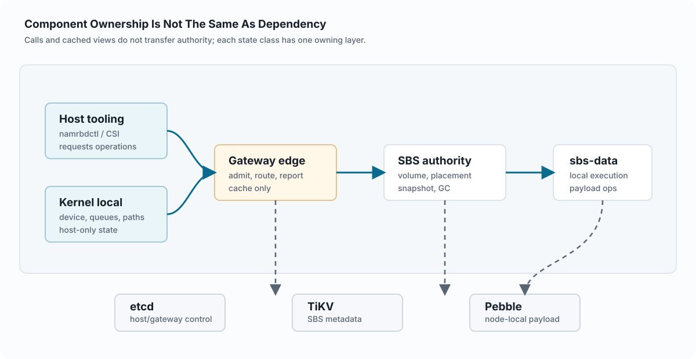
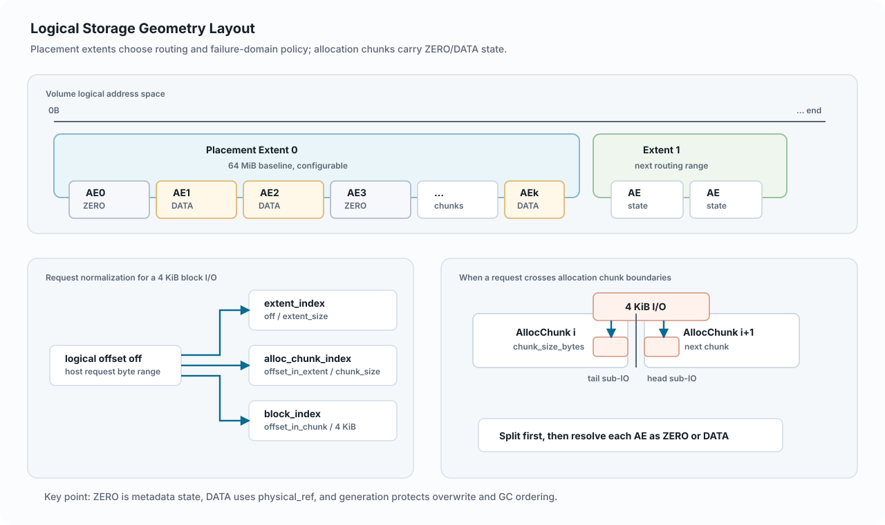
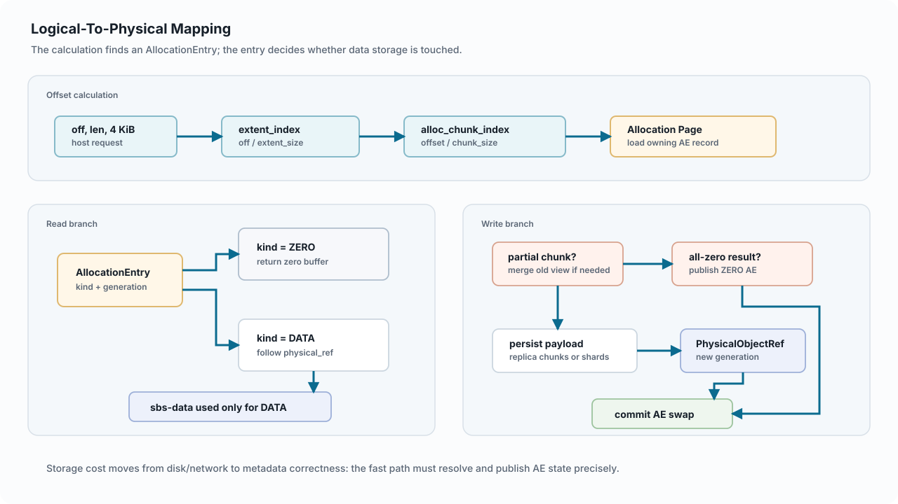
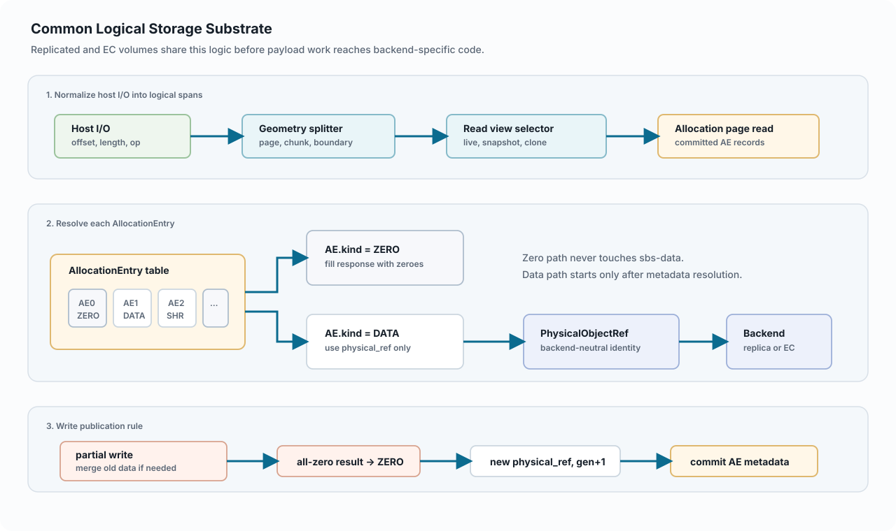
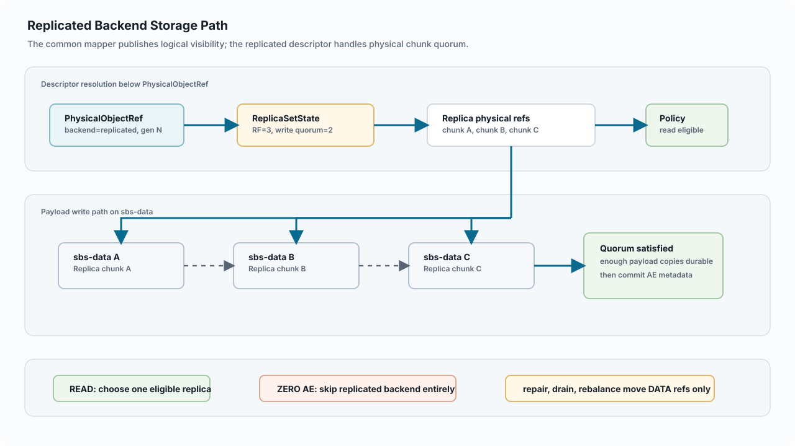
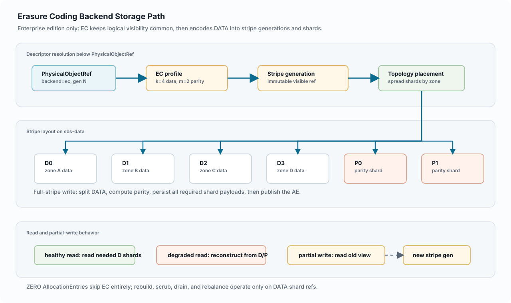
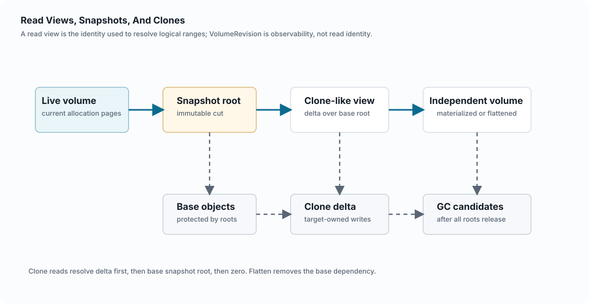
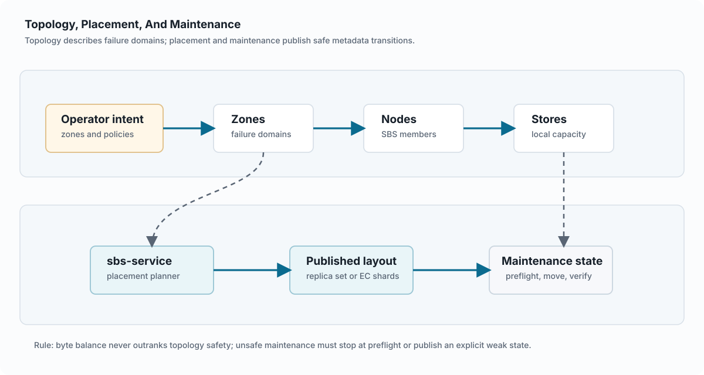

첫 번째 판

Edition boundary: Community edition 아키텍처와 Enterprise edition only 기능 섹션이 함께 포함되어 있습니다.

# NAMRBD 플랫폼 아키텍처

이 HTML 판은 개발자, 운영자, 리뷰어가 NAMRBD의 공개 아키텍처를 빠르게 이해할 수 있도록 정리한 문서다. 일반적인 Linux 블록 디바이스 사용 방식에서 출발해 커널 모듈, 게이트웨이, SBS 클러스터, 메타데이터 저장소, 논리 스토리지 계층, 백엔드, 읽기 뷰, Backup/DR control-plane state, Security/Compliance state, scoped Governance/WORM state, iSCSI target gateway, 검증 하네스까지 요청이 흐르는 길을 따라 설명한다.

NAMRBD는 Network Attached Multipath Resilient Block Device의 약자이며, 발음은 \[nae-mur-bee-dee\]로 표기한다. 이름 그대로 네트워크로 연결되는 블록 디바이스, 호스트와 게이트웨이 사이의 다중 경로, 장애에 견디는 동작을 핵심 아키텍처 속성으로 둔다.

제품 이름에서 바로 떠올려야 할 주요 특징은 다음과 같다.

- 네트워크로 연결된 확장 가능한 분산 클러스터 구조의 블록 스토리지.
- 고가용성을 제공하기 위한 multipath connection(다중 경로 연결) 지원.
- 시스템 내부 구성요소에 장애가 발생했을 때 가능한 한 자동으로 복구하고 정상 상태로 회복하는 기능.
- 제품 방향을 정할 때 Linux 환경과 Kubernetes(K8S) 환경 지원을 최우선으로 두는 원칙.
- 표준 iSCSI initiator가 NAMRBD/SBS-backed volume을 사용할 수 있는 target gateway option. Community는 기본 gateway, `sbsctl iscsi`, 최대 3개 distinct iSCSI-exported volumes 대상 LUN export를 포함하고, iSCSI HA, MPIO/ALUA, 고급 보안/감사, 대규모 관측성은 Enterprise-only로 남긴다.
- block-native derived object와 userspace gateway sealed-target write rejection에 한정된 scoped Governance/WORM support. Regulatory certification이나 object-store API compatibility는 주장하지 않는다.

Kubernetes와 CSI는 Linux 및 핵심 스토리지 모델을 설명한 뒤 통합 사례로 다룬다.

독자 경로

Linux 호스트 경로

-\>

권한 경계

-\>

스토리지 기반

-\>

읽기 뷰와 GC

-\>

Security/Compliance

-\>

Kubernetes 사례

## 문서 형태

영문판은 장 단위 HTML 파일로 나뉘어 있고, 한글판은 같은 장 구성을 한 페이지 안의 앵커로 제공한다. 각 영문 장의 KO 링크는 이 번역판의 대응 섹션으로 이동한다.

GitHub contributor는 [개발자 빌드와 테스트](../../ko/installation-guide.md#2-developer-build-and-test) 경로에서 명령 바이너리 빌드와 edition-boundary 검사를 먼저 확인한 뒤, 이 아키텍처 문서의 컴포넌트 소유권과 검증 장을 함께 읽는 것이 좋다.

## 주요 리뷰 질문

| 질문 | 시작 위치 |
|----|----|
| 어떤 컴포넌트가 상태 전이를 소유하는가? | [컴포넌트와 소유권](#02-components-and-ownership) |
| 논리 범위는 어떻게 물리 페이로드 객체가 되는가? | [논리-물리 매핑](#06-logical-to-physical-mapping) |
| overwrite나 discard 이후에도 스냅샷과 클론이 안전한 이유는 무엇인가? | [읽기 뷰](#10-read-views-snapshots-and-clones)와 [도달 가능성과 GC](#11-reachability-and-gc) |
| Backup/DR 상태는 어디에 있는가? | [메타데이터 권한](#04-metadata-authority), [관측성과 검증](#15-observability-and-validation), [에디션 경계](#17-edition-and-release-boundaries) |
| Security/Compliance 상태는 어디에 있는가? | [메타데이터 권한](#04-metadata-authority), [관측성과 검증](#15-observability-and-validation), [인터페이스 명세](#appendix-interface-specifications) |
| Kubernetes는 스토리지 의미론을 소유하지 않으면서 NAMRBD를 어떻게 사용하는가? | [Kubernetes/CSI 통합 사례](#16-kubernetes-csi-integration-case) |
| 구성요소 간 인터페이스 surface는 어디에서 요약하는가? | [인터페이스 명세](#appendix-interface-specifications) |

Chapter 1

Edition boundary: Community edition 읽기 경로와 Enterprise edition only 아키텍처 주제가 함께 포함되어 있습니다.

# 읽기 안내

이 첫 번째 판은 현재 NAMRBD 내부 아키텍처를 이해해야 하는 개발자와 리뷰어를 위한 문서다. 먼저 Linux 블록 디바이스의 일반적인 요청 경로를 설명하고, 그 위에 스토리지 메타데이터와 백엔드 모델을 쌓아 올린 뒤, Kubernetes/CSI는 마지막에 통합 사례로 다룬다.

NAMRBD는 Network Attached Multipath Resilient Block Device의 약자이며, 발음은 \[nae-mur-bee-dee\]로 표기한다. 이 이름을 네트워크 연결형 블록 디바이스, 다중 경로, 장애 회복성을 함께 담은 범위 선언으로 읽으면 이후 장의 경계를 이해하기 쉽다.

또한 이 이름은 네트워크 기반의 확장 가능한 분산 클러스터형 블록 스토리지, 고가용성을 위한 multipath connection, 내부 구성요소 장애에 대한 최대한의 자동 복구와 회복, Linux 및 Kubernetes(K8S) 환경 우선 지원이라는 제품 방향을 함께 가리킨다.

이 안내는 설치 절차가 아니라 아키텍처 지도다. 각 장은 소유권, 현재 권한의 출처, 호환성을 위해 남아 있는 용어를 본문 안에서 분명히 설명해야 한다.

이 판의 개념 지도

플랫폼 참여자\
host, gateway, SBS

-\>

host control/data plane\
attach와 I/O

-\>

메타데이터 권한\
etcd, TiKV, Pebble

-\>

논리 구조와 매핑\
AllocationEntry, PhysicalObjectRef

-\>

백엔드, 읽기 뷰, GC, 운영\
replica, EC, snapshot, CSI

## 이 판에서 다루는 내용

| 영역 | 포함하는 초점 |
|----|----|
| Linux 호스트 경로 | 커널 모듈, `namrbdctl`, 게이트웨이 attach, 데이터면 경로 선택, 블록 I/O 흐름. |
| SBS 클러스터 | `sbs-service`의 권한, `sbs-data`의 로컬 실행, TiKV 메타데이터, 로컬 Pebble 페이로드 저장소. |
| 스토리지 기반 | AllocationEntry, PhysicalObjectRef, 복제 descriptor, EC descriptor, 읽기 뷰 resolver. |
| 정확성 | 메타데이터 commit 가시성, snapshot/clone root, 도달 가능성, GC, zero/discard 동작 식별자. |
| Backup/DR | Backup/DR enterprise target, policy, run, restore-drilled artifact availability, hold, purge-plan, status control-plane state. |
| Kubernetes | 핵심 스토리지 모델이 분명해진 뒤 다루는 얇은 변환 계층으로서의 CSI driver. |

## 소스 우선순위

이 HTML 판에서 설계 판단이 필요할 때는 운영 가이드보다 현재 architecture authority 문서를 먼저 따른다. 내부 경계의 기준은 authority/interface cleanup부터 Backup/DR까지의 권한 문서 집합이며, Backup/DR은 enterprise Backup/DR control-plane state에 대해 우선하고 discard/reclaim hardening/Kubernetes/CSI baseline은 현재 storage, discard, CSI, snapshot/restore baseline에 대해 우선한다. 운영 가이드는 현재 사용자에게 노출되는 이름을 확인할 때 유용하지만, 아키텍처 권한 문서를 대체하지 않는다.

읽기 순서는 Kubernetes 통합보다 Linux 내부 아키텍처를 먼저 다룬다. 호환성을 위해 남아 있는 필드명을 새로운 설계 기준으로 삼지 않으며, 과거 이름은 호환성 또는 보관된 인터페이스를 설명할 때만 사용한다.

아키텍처 읽기 순서

호스트와 게이트웨이

-\>

SBS 권한

-\>

논리 스토리지

-\>

읽기 뷰

-\>

CSI 사례

Chapter 2

# 플랫폼 개요

NAMRBD는 Linux 블록 스토리지 플랫폼이다. Linux 애플리케이션은 로컬 NAMRBD 블록 디바이스에 파일시스템 I/O 또는 raw block I/O를 보낸다. 커널 모듈은 요청을 게이트웨이 데이터 경로로 전달하고, 게이트웨이는 호스트 요청을 SBS 볼륨 동작으로 바꾼다. `sbs-service`는 클러스터 메타데이터와 배치 권한을 소유하며, `sbs-data` 노드는 로컬 페이로드 동작을 실행한다.

이 이름은 Network Attached Multipath Resilient Block Device의 약자이며, 발음은 \[nae-mur-bee-dee\]로 표기한다. 이 개요에서는 네트워크 연결, 호스트 다중 경로 라우팅, 장애 회복성, Linux 블록 디바이스 의미론을 플랫폼 경계로 삼는다.

같은 이름은 네트워크로 연결된 확장 가능한 분산 클러스터 구조의 블록 스토리지, 고가용성을 위한 multipath connection, 내부 구성요소 장애에 대한 자동 복구와 회복, Linux와 Kubernetes(K8S)를 우선하는 제품 방향을 함께 요약한다.

게이트웨이와 커널은 호스트 I/O를 라우팅하지만, SBS 메타데이터 의미론은 SBS 클러스터 안에 있다. 이 분리가 이 개요의 모든 흐름을 설명하는 기본 원칙이다.

플랫폼을 지나는 하나의 I/O

Linux block request

blk-mq

namrbd_blk.ko

TCP frame

namrbd-gateway

gRPC

sbs-service / sbs-data

metadata / payload

TiKV + Pebble stores

<figure class="architecture-figure" markdown="1">

<figcaption>플랫폼 개요는 영문 SVG 하나를 공유한다. 그림은 component group, flow category, ownership boundary를 보여 주고, 상세 protocol 설명은 주변 본문에 남긴다.</figcaption>

</figure>

## 주요 흐름

| 흐름 | 일어나는 일 | 주요 소유자 |
|----|----|----|
| Volume create | 운영자/API가 SBS 측 volume metadata, geometry, placement policy를 생성한다. | `sbs-service` |
| Attach | 호스트 측 도구가 게이트웨이에 manifest를 요청하고, 커널 모듈에 device/path 상태를 적용한다. | Gateway/control plane과 kernel local state |
| Read/write | 커널이 블록 요청을 gateway path로 보내고, 게이트웨이가 SBS 스토리지 동작을 호출한다. | 커널/게이트웨이 데이터면과 SBS 실행 경로 |
| Snapshot/clone | 읽기 뷰 메타데이터가 불변 root와 clone delta mapping을 캡처한다. | `sbs-service`와 SBS metadata |
| Discard | 정렬된 discard가 live mapping에서 기존 backing object를 분리하고, 그 객체를 protected 또는 reclaimable 상태로 분류한다. | SBS metadata와 reachability/GC |

## 이 개요가 다루지 않는 것

Kubernetes는 중요하지만 플랫폼의 출발점은 아니다. CSI driver는 Kubernetes object를 NAMRBD controller 및 node call로 변환하는 계층이다. 배치, fencing, 읽기 뷰, snapshot, clone, discard, GC의 의미론은 CSI가 소유하지 않는다.

Chapter 3

Edition boundary: Community edition component ownership and Enterprise edition only ownership rows are both present.

# 컴포넌트와 소유권

NAMRBD는 호스트 로컬 런타임, 게이트웨이의 승인/라우팅 경로, SBS 클러스터 권한, 노드 로컬 스토리지 실행, 메타데이터 백엔드, 외부 통합 어댑터를 의도적으로 분리한다. 이렇게 나누어 두어야 장애 양상을 컴포넌트별로 검토할 수 있다.

`sbs-service`는 클러스터 전체의 스토리지 메타데이터, 토폴로지, 배치, 상태 조정, 유지보수를 소유한다. 커널은 호스트 로컬 디바이스와 경로 상태를 소유하고, 게이트웨이는 요청을 라우팅하고 상태를 보고한다. `sbs-data`는 로컬 스토리지 동작을 실행하며, CSI는 외부 Kubernetes 호출을 NAMRBD 호출로 변환한다.

컴포넌트 의존성은 API 호출 방향과 메타데이터 신뢰 방향을 나누어 읽어야 한다. API 호출은 누가 일을 요청하는지 보여 주고, 메타데이터 참조는 누구의 상태를 신뢰하는지 보여 준다. 어떤 컴포넌트가 다른 컴포넌트의 뷰를 호출하거나 캐시하더라도 그 상태의 소유자가 되는 것은 아니다.

<figure class="architecture-figure" markdown="1">

<figcaption>컴포넌트 소유권 그림은 영문 SVG 하나를 공유한다. 호출 경로와 캐시된 뷰는 authoritative state를 소유하는 저장소/계층과 분리해서 읽어야 한다.</figcaption>

</figure>

## 컴포넌트 행렬

| 컴포넌트 | 소유 | 관측 / 소비 | 소유하지 않음 |
|----|----|----|----|
| Linux kernel module | 호스트 로컬 블록 디바이스, 데이터 경로 건전성 진단, queue/no-path 가용성 정책, k8s 적용 매니페스트. | Gateway가 제공하는 dataplane endpoint와 volume/generation/attachment data. | Volume lifecycle, SBS membership, placement, repair, GC. |
| `namrbdctl` | Host-side orchestration call과 kernel control request. | Gateway attach/info response와 kernel status. | SBS 클러스터 메타데이터 의미론. |
| `namrbd-gateway` | Host admission, request conversion, SBS client call, short-lived read-through cache. | etcd attachment/generation, SBS published placement view. | SBS 로우 메타데이터 권한, 자가 오류 복구/데이터 리밸런싱/드레인(drain), EC 복구 엔진. |
| `sbs-service` | Cluster metadata, volume geometry, placement, topology, snapshot, clone, GC root, maintenance, enterprise Backup/DR target/policy/run/artifact/hold/status state, remote DR replication-link/recovery-point/shipping-manifest/shipping-worker state. | `sbs-data` health/capacity report와 operation result. | Host-local blk-mq queueing과 kernel path retry policy. |
| `sbs-data` | 로컬 페이로드 read/write/delete, local store metadata, local idempotency. | SBS service command와 local store state. | Cluster membership, global placement, global reachability truth. |
| `sbs-service` operations views | `namrbd.sbs.observability.v1`, membership status, capacity, reclaim, operation summary, MCP descriptor, GUI descriptor, workflow hardening evidence, static operations console을 read-only로 조립한다. | `sbs-service` metadata, `sbs-data` health detail, gateway/control-plane membership/liveness summary. | Storage mutation authority, live iSCSI HA authority, GUI/MCP action authority, AdminService 또는 gateway control-plane state의 대체 권한. |
| `namrbd-csi-driver` | CSI Identity/Controller/Node translation. | NAMRBD 관리 도구, 무상태 게이트웨이, 호스트 제어 API. | Storage semantics, snapshot cut point, topology, fencing, read-view, GC. |

권한 계층

### 호스트 로컬

커널 모듈과 `namrbdctl`은 로컬 디바이스와 적용된 경로 상태를 소유한다.

### 게이트웨이 경계

게이트웨이는 호스트 요청을 SBS 호출로 바꾸고 런타임 상태를 보고한다.

### SBS 권한

`sbs-service`는 클러스터 메타데이터와 제품의 스토리지 의미론을 소유한다.

### 노드 로컬

`sbs-data`는 로컬 페이로드 실행과 저장소 상태를 소유한다.

## 동작별 의존성 관점

같은 컴포넌트라도 동작에 따라 참여 방식이 달라진다. 유용한 리뷰 질문은 “누가 호출되는가?”에서 멈추지 않는다. “어떤 메타데이터를 신뢰하는가, 그리고 누가 그 메타데이터를 바꿀 수 있는가?”까지 함께 물어야 한다.

| 동작 관점 | 데이터 참조 | API 호출 / Transport | 보존해야 할 경계 |
|----|----|----|----|
| Block device 등록 / attach | etcd의 gateway control metadata: volume spec, current attachment, writer generation, gateway registry. SBS target 정보는 `sbs-service`가 게시한 placement view에서 온다. | `namrbdctl`은 gateway attach/control API를 호출한 뒤, 반환된 manifest를 netlink 같은 host control 경로로 kernel에 적용한다. Gateway는 etcd를 읽고 `sbs-service`에 gateway-facing view를 조회한다. | 커널은 local device와 적용된 path만 소유한다. Gateway는 manifest를 검증하고 조립할 수 있지만, SBS placement와 volume semantics는 SBS authority에 남아야 한다. |
| Foreground read/write/flush/discard/zero I/O | 커널은 적용된 manifest와 local path health를 사용한다. Gateway는 attachment, generation, idempotency context, published SBS target view를 사용한다. `sbs-data`는 local Pebble payload/store state와 request context에 의존한다. | Linux block I/O는 kernel로 들어간 뒤 persistent TCP dataplane path로 gateway에 전달된다. Gateway는 요청을 SBS context로 변환하고 선택된 `sbs-data` node의 `sbs/v1.VolumeService` gRPC를 호출한다. | Gateway retry와 routing은 availability concern이다. Correctness는 SBS metadata visibility, stale attachment/generation check, idempotency, 선택된 backend의 payload persistence가 방어한다. |
| 디바이스 마운트 해제 / 물리 경로 분리 / 볼륨 속성 재구성 | Detach는 etcd의 gateway/control-plane attachment state와 커널의 현재 local device/path state를 참조한다. Gateway liveness와 path health를 관측할 수 있지만 raw SBS metadata를 다시 해석할 필요는 없다. | Host tooling은 gateway detach/info path와 kernel control path를 호출한다. Kernel은 local device/path state를 제거하거나 갱신하고, gateway는 control-plane attachment state를 갱신하며 runtime status를 보고한다. | Detach는 placement, repair, storage metadata mutation이 아니다. Host-local path가 깨끗하게 사라졌다는 사실을 신뢰하기보다 attachment/generation check로 stale writer를 fence해야 한다. |
| Gateway 고가용성 | Gateway registry, liveness, attachment, generation은 etcd에 있다. Gateway-facing replica target view는 `sbs-service`에서 오며 짧게 cache될 수 있다. Gateway restart 후에도 committed SBS metadata/payload state가 authority다. | 여러 gateway가 HTTP control endpoint와 persistent TCP dataplane endpoint를 노출할 수 있다. Host manifest와 kernel path health가 사용할 수 있는 gateway path를 결정하고, gateway instance들은 같은 published-view 및 `VolumeService` surface를 통해 SBS를 호출한다. | Gateway는 교체 가능한 routing/adaptation state이지 durable storage authority가 아니다. Gateway-local cache는 placement truth가 될 수 없고, multi-gateway correctness는 SBS fencing/idempotency와 committed metadata에 의존해야 한다. |
| SBS cluster 고가용성과 metadata 유지 | `sbs-service`는 cluster bootstrap, leader/admin operation, node membership, node health, volume metadata, placement, allocation page, transition state를 TiKV에 저장한다. `sbs-data`는 node-local payload와 local execution state를 Pebble에 저장한다. | `sbsctl`과 gateway-facing control path는 `sbs-service` admin/published-view API를 호출한다. `sbs-service`는 HTTP/debug health surface와 gRPC reachability를 조합해 node/store health를 reconcile하고 gateway-facing target view를 게시한다. | `sbs-service`가 unavailable이면 admin과 maintenance 작업은 멈추거나 degrade되어야 하지만, 이미 routing된 foreground I/O가 gateway-local metadata authority를 필요로 해서는 안 된다. TiKV는 cluster metadata를, local Pebble은 local payload state를 소유한다. |
| Backup/DR and remote DR 백업 및 크로스 리전 DR 컨트롤 플레인 | Backup target, policy, run record, restore-drilled artifact availability, retention hold, purge dry-run guardrail, Backup/DR status summary, remote DR replication link, recovery point, shipping manifest, shipping worker. | Enterprise `sbsctl backup`, `sbsctl dr link`, `sbsctl dr recovery-point`, `sbsctl dr shipping-manifest`, `sbsctl dr shipping-worker`는 `sbs-service` admin API를 호출한다. Fixture validation은 JSON evidence를 낼 수 있지만 product state는 `sbs-service`가 지속화한다. | Backup/DR automation은 enterprise-only다. U-CTRL-003A는 DR link, recovery-point, manifest, shipping-worker admission state만 기록하며 remote transfer completion, standby import, promote/demote, failover support는 계속 gate 뒤에 둔다. |
| SBS maintenance: repair, rebalance, drain, rebuild, scrub | Maintenance는 TiKV topology, placement, allocation, node/store health, operation record, read-view root, backend descriptor를 소비한다. 또한 local `sbs-data` health/capacity와 payload operation result를 소비한다. | `sbsctl` 또는 controller가 `sbs-service` admin API를 호출한다. `sbs-service`는 transition state를 TiKV에 기록하고, eligible source/target을 선택한 뒤 SBS execution API를 통해 `sbs-data`에 read/write/copy/delete 작업을 지시한다. | Gateway와 kernel은 target availability 변화와 path reload를 관측할 수 있지만 maintenance planning을 소유하지 않는다. Maintenance는 read-view root, generation/idempotency boundary, backend-specific payload lifetime rule을 보존해야 한다. |

## 의존성 읽기 규칙

API 호출은 소유권이 아니다. `namrbdctl`은 gateway에 attach를 요청할 수 있고, gateway는 `sbs-service`에 placement view를 요청할 수 있으며, `sbs-service`는 `sbs-data`에 payload 작업 실행을 요청할 수 있다. 하지만 authoritative state는 ownership matrix에 명명된 컴포넌트와 메타데이터 저장소에 남아 있다.

캐시 역시 소유권이 아니다. Gateway와 `sbs-service` cache는 읽기 지연을 줄이거나 hot path를 보호할 수 있지만, cache miss는 owning authority로 돌아가야 하고 cache hit도 fencing, generation, idempotency, reachability rule을 우회해서는 안 된다.

## 리뷰 패턴

변경을 리뷰할 때는 그 변경이 권한을 이 경계 밖으로 옮기는지 먼저 물어야 한다. 상태 전이를 건드리는 변경이라면 authoritative writer를 명명해야 한다. Gateway cache는 라우팅을 효율화할 수 있지만 placement truth가 될 수는 없다. CSI handler는 snapshot API를 호출할 수 있지만 snapshot cut point를 결정할 수는 없다. 로컬 `sbs-data` 노드는 shard health를 보고할 수 있지만 global reachability를 결정할 수는 없다.

Chapter 4

# Linux 호스트 제어면과 데이터면

Linux 호스트는 NAMRBD를 블록 디바이스로 사용한다. 제어면은 디바이스 생성, attach, detach, 재구성을 담당하고, 데이터면은 read, write, flush, zero, discard 요청을 gateway path를 거쳐 SBS로 전달한다.

커널은 호스트 로컬 디바이스 상태와 경로 상태를 소유한다. 게이트웨이는 manifest를 검증해 반환하며, attachment identity와 generation은 커널의 로컬 판단이 아니라 control metadata에서 온다.

Linux 내부에서도 호스트 경로는 둘로 나뉜다. `namrbdctl`은 userspace 운영 도구이고, `namrbd_ctrl.ko`는 generic-netlink 기반 제어 모듈이며, `namrbd_blk.ko`는 실제 I/O를 받는 blk-mq 블록 디바이스 모듈이다.

<figure class="architecture-figure" markdown="1">

<figcaption>Linux host path 그림은 영문 SVG 하나를 공유한다. 제어 경로는 attachment state를 적용하고, 블록 모듈은 로컬 디바이스와 foreground dispatch를 소유한다.</figcaption>

</figure>

## Host 구성요소

| Host 구성요소 | 주요 역할 | 의존 대상 | 하지 않는 일 |
|----|----|----|----|
| `namrbdctl` | device create/destroy, REST endpoint 설정, attach, detach, reconfigure, resize, status, userspace gateway read/write helper를 제공하는 operator entry point. | Kernel control command를 위한 generic netlink client, userspace-mediated command에서 gateway HTTP API. | Kernel I/O path가 아니며 Linux block request를 complete하지 않는다. |
| `namrbd_ctrl.ko` | Kernel control module. `NAMRBD_CTRL` generic netlink family를 등록하고 TLV command를 받으며, gateway REST endpoint 목록을 저장하고 attach/detach/reconfigure request를 block module에 적용한다. | `namrbd_blk.ko`가 export한 activation, deactivation, path configuration, resize, status 함수. Kernel-mediated attach path에서는 gateway REST attach/info/detach API도 호출한다. | blk-mq request dispatch를 구현하지 않고 storage placement를 소유하지 않는다. |
| `namrbd_blk.ko` | Kernel block-device module. local gendisk, blk-mq queue, device capacity, path/lane state, no-path policy, persistent gateway TCP socket, pending request table, request completion을 소유한다. | `namrbd_ctrl.ko`를 통해 전달되는 attach manifest와 path-plan update, manifest의 gateway dataplane endpoint, filesystem 또는 raw device user가 Linux block layer로 보낸 request. | SBS metadata API를 직접 호출하지 않고 attachment ownership이나 placement/maintenance state를 변경하지 않는다. |
| `namrbd-gateway` | Host-facing control 및 dataplane peer. attach/detach/info를 admit하고 dataplane endpoint를 알리며, kernel TCP dataplane frame을 받아 SBS volume operation으로 변환한다. | etcd attachment/generation control metadata와 `sbs-service` published SBS target view. | Kernel queue state나 SBS raw metadata authority를 소유하지 않는다. |

## Attach 흐름

Linux attach와 manifest 적용

operator

-\>

namrbdctl

-\>

gateway attach/info

-\>

manifest JSON

-\>

generic netlink

-\>

namrbd_ctrl.ko

-\>

namrbd_blk.ko activated

일반적인 userspace-mediated attach path는 `namrbdctl attach --gateway ...`에서 시작한다. Userspace는 gateway attach/discovery API를 호출해 attach manifest를 준비하고, kernel REST endpoint metadata를 설정한 뒤 `AttachManifest`를 generic netlink로 보낸다. Kernel-mediated compatibility path에서는 `Attach` netlink command를 `namrbd_ctrl.ko`로 보내며, control module이 설정된 gateway REST attach/info API를 직접 호출한 뒤 block device를 활성화한다.

두 경로 모두 같은 host-local boundary에서 끝난다. `namrbd_ctrl.ko`는 manifest를 검증해 `namrbd_blk.ko`로 넘기고, `namrbd_blk.ko`는 capacity, generation, dataplane path, lane topology, path health runtime state를 갱신한다. Kernel은 attach 허용 여부를 새로 판단하지 않고 gateway 결과를 적용한다.

| Attach 산출물 | 의미 | 권한 |
|----|----|----|
| `volume_id` | 대상 block volume identity. | Control/SBS metadata |
| `attachment_id` | 활성 writer/session binding. | Control-plane attachment manager |
| `generation` | Writer fencing generation. | Control-plane metadata |
| dataplane endpoints | 커널이 I/O에 사용할 수 있는 gateway path. | Gateway discovery/path-plan response |
| path health | host-local path가 ready, degraded, down, draining 중 어떤 상태인지. | Kernel runtime state |

## Attach manifest 데이터

Attach manifest는 gateway가 생성하는 JSON 문서다. Gateway control metadata, userspace 준비 과정, `namrbd_ctrl.ko` 검증, `namrbd_blk.ko` 런타임 활성화 사이에서 전달 객체 역할을 한다. Kernel은 block-device activation과 dataplane setup에 필요한 엄격한 핵심 필드만 소비하고, 나머지 field는 `namrbdctl`, gateway path-plan reconciliation, status comparison이 사용하는 control/observability envelope에 남긴다.

| Manifest 데이터 | 예시 | Consumer / 의미 | 경계 |
|----|----|----|----|
| Volume과 attachment identity | `volume_id`, `generation`, `attachment_id`, `attached_host_id`, `attached_device_id` | `namrbd_ctrl.ko`가 request와 대조해 검증하고, `namrbd_blk.ko`가 response validation과 resize fencing에 사용할 volume/generation을 저장한다. | Gateway가 control metadata admission 이후 identity를 반환한다. Kernel은 이를 적용할 뿐 새 attachment를 만들지 않는다. |
| Device geometry | `size_bytes`, `block_size`, `chunk_size_bytes`, `extent_page_bytes` | `namrbd_blk.ko`는 size와 block/chunk geometry를 사용해 capacity를 노출하고 write-like operation의 range-based lane을 고른다. | Volume size와 geometry authority는 SBS/control metadata에 남는다. Kernel은 invalid value를 reject하지만 geometry를 선택하지 않는다. |
| Control endpoint | `control_endpoints[].address`, `port`, `use_tls`, `server_name`, `api_prefix`, `bearer_token` | `namrbdctl`이 이를 generic-netlink REST server entry로 normalize해서 `namrbd_ctrl.ko`에 전달한다. Compatibility kernel-mediated path는 gateway HTTP attach/info/detach call에 사용한다. | 이 endpoint는 control API reachability다. Dataplane socket도 아니고 storage placement도 아니다. |
| Dataplane endpoint | `dataplane_endpoints[].path_id`, `gateway_id`, `address`, `port`, `use_tls`, `server_name`, `auth_mode`, `priority` | `namrbd_ctrl.ko`가 kernel path inventory로 parse한다. `namrbd_blk.ko`는 이를 path slot, lane preferred path, fallback candidate, persistent TCP connection target으로 바꾼다. | 중복 `path_id`는 reject된다. Dataplane path는 gateway에 도달하는 host route이지 SBS backend placement가 아니다. |
| Dataplane limit | `max_inflight_requests`, `max_inflight_bytes`, `max_io_size` | Kernel은 이를 per-volume dataplane guardrail로 저장해 request sizing과 inflight accounting에 사용한다. | Host-gateway connection을 제한하는 값이다. SBS quorum, EC reconstruction, payload durability를 증명하지 않는다. |
| Dataplane authentication | `dataplane_auth.mode`, `token`, `session_key`, `expires_at` | 존재하고 선택된 operation이 지원하면 kernel은 authenticated wire-v2 session setup을 사용할 수 있다. Gateway는 volume, attachment, host, device, generation, gateway, allowed path id 같은 token claim을 검증한다. | Authentication은 dataplane session을 admitted attachment에 bind한다. Generation check나 detach revocation을 대체하지 않는다. |
| Path-plan과 handoff observability | `path_plan_revision`, `path_plan`, `runtime_no_path`, `handoff_required`, `writer_fencing_epoch`, `controller_recommended_actions` | `namrbdctl`과 gateway reconciliation이 manifest, kernel runtime, controller state를 비교하는 데 사용한다. | 이 field는 operator와 reapply flow를 안내한다. Kernel path mask는 여전히 명시적인 path-plan netlink command로 적용된다. |

검증은 의도적으로 보수적으로 수행한다. 파싱된 `volume_id`는 요청 volume과 일치해야 하고, host/device identity도 attach request와 일치해야 한다. `generation`, `size_bytes`, `block_size`, attachment identity, 최소 하나 이상의 dataplane endpoint가 필요하며 path identifier는 unique해야 한다. 이렇게 해야 malformed 또는 stale manifest가 다른 local block device binding을 조용히 만들지 못한다.

## Kernel-gateway protocol 경계

| 연결 | Protocol | 용도 | 중요 경계 |
|----|----|----|----|
| `namrbdctl` to kernel control | TLV payload를 가진 generic netlink family `NAMRBD_CTRL`. | Device create/destroy, REST server 설정, attach manifest, detach, resize, status, list, path-plan mask update. | Local host control이다. Foreground block I/O transport가 아니다. |
| 커널 제어부와 게이트웨이 제어부 연동 프로토콜 | Compatibility path에서 kernel TCP socket 위의 HTTP/1.1 JSON. | `POST /api/v1/volumes/{id}/attach`, `GET /api/v1/volumes/{id}/info`, `POST /api/v1/volumes/{id}/detach` 형태의 control call. | Attachment state를 가져오거나 clear하는 호출이다. Linux block read/write payload를 싣지 않는다. |
| `namrbd_blk.ko` to gateway dataplane | 선택된 path마다 persistent TCP connection과 NAMRBD binary wire frame. | Read, write, flush, discard, write-zeroes, heartbeat/path-probe, request id, response status, 필요한 payload. | Foreground I/O path다. Kernel은 request를 complete하기 전에 response opcode, request id, volume id, generation을 검증한다. |
| Gateway dataplane to SBS | Gateway-internal service call과 SBS data/metadata protocol. | Kernel frame을 SBS volume operation으로 변환하고 committed/read payload result를 반환한다. | Foreground I/O 중 kernel은 TiKV, Pebble, `sbs-service` metadata API를 직접 호출하지 않는다. |

## 제어면 동작

| 동작 | Userspace 동작 | Kernel control 동작 | Gateway / metadata 의존성 |
|----|----|----|----|
| 로컬 디바이스 매핑 생성 / 폐기 제어 | `namrbdctl create-device` 또는 `destroy-device`가 generic netlink command를 보낸다. | `namrbd_ctrl.ko`가 `namrbd_blk.ko`에 local gendisk와 blk-mq queue allocate/remove를 요청한다. | Local Linux device shell을 만들거나 지우는 일이 SBS storage metadata mutation을 뜻하지는 않는다. |
| Gateway REST endpoint 설정 | `namrbdctl config-rest` 또는 attach/reconfigure 준비 과정이 endpoint entry를 보낸다. | `namrbd_ctrl.ko`가 kernel-mediated control call과 status context에 사용할 REST server list를 저장한다. | Endpoint는 gateway control API를 가리킨다. Endpoint 설정은 gateway liveness나 placement truth가 아니다. |
| Attach | `namrbdctl`이 attach manifest를 얻거나 요청한 뒤 kernel로 보낸다. | `namrbd_ctrl.ko`가 manifest를 parse/validate하고, `namrbd_blk.ko` activation과 datapath configuration 함수를 호출한다. | Gateway는 control metadata와 SBS published view를 사용해 host, attachment, generation, target view를 검증한다. |
| Detach | `namrbdctl detach`가 gateway detach를 호출하거나 kernel control module에 이를 요청한다. `--local-only`는 local kernel state만 해제한다. | `namrbd_ctrl.ko`가 `namrbd_blk.ko` deactivation 또는 local detach를 호출해 dataplane path를 닫고 local attach state를 지운다. | Gateway detach는 attachment를 clear하고 generation을 bump할 수 있다. Local-only detach는 control-plane fencing을 대체하지 않는다. |
| Path reconfigure | `namrbdctl reconfigure-data-paths` 또는 `apply-volume-path-plan`이 gateway discovery/path-plan data를 가져온다. | `namrbd_ctrl.ko`가 새 manifest 또는 path mask를 적용하고, `namrbd_blk.ko`가 path state, active lane, queue topology를 다시 계산한다. | Gateway discovery는 usable path를 제안한다. Apply 이후 local path health와 no-path behavior는 kernel이 소유한다. |
| Status / list | `namrbdctl status`와 `list-devices`가 generic netlink status를 읽고, 필요하면 gateway manifest data와 비교한다. | `namrbd_blk.ko`가 attached volume, generation, path mask, lane map, queue topology, pending/outstanding counter, no-path state를 보고한다. | Status는 gateway manifest와 runtime state 사이의 차이를 진단할 수 있지만 SBS metadata를 변경하지 않는다. |
| Expansion 이후 resize | `namrbdctl volume-reload-size`가 gateway들에 current size/generation을 묻고 resize command를 보낸다. | `namrbd_blk.ko`는 volume과 generation이 attached runtime과 일치할 때만 local device capacity를 바꾼다. | SBS가 volume size change를 소유한다. Kernel은 이미 authorized된 size를 local block device에 reload할 뿐이다. |

## 데이터면 개요

Block I/O request lifecycle

파일시스템 구성자 / Raw 블록 소비자

-\>

Linux block layer

-\>

blk-mq queue_rq

-\>

namrbd_blk lane/path

-\>

gateway TCP dataplane

-\>

SBS volume operation

Attach 이후 Linux는 `namrbd_blk.ko`가 제공하는 일반 block device를 본다. Filesystem과 raw block user는 표준 Linux block layer를 통해 bio/request 작업을 제출한다. blk-mq queue가 NAMRBD `queue_rq` handler를 호출하므로, 실제 I/O path에서 처음 만나는 NAMRBD component는 `namrbd_blk.ko`다.

Read, write, discard, write-zeroes 요청에 대해 `namrbd_blk.ko`는 device attach 여부를 확인하고, blk-mq hardware context에서 lane을 선택한 뒤 preferred 또는 fallback gateway path를 고른다. 그런 다음 해당 path의 persistent TCP connection을 열거나 재사용하고, request-id가 붙은 frame과 필요한 payload를 전송한 뒤 matching response 또는 async completion을 기다린다. 마지막으로 response opcode, request id, volume id, generation을 검증하고 Linux block request를 완료한다.

Gateway dataplane handler는 kernel frame을 SBS request context로 변환하고 SBS storage operation을 호출한다. `sbs-data`가 payload 작업을 실행하며, SBS metadata visibility는 SBS rule이 지배한다. Foreground I/O 중 kernel은 TiKV, local Pebble, `sbs-service` metadata API를 직접 호출하지 않는다.

## 데이터면 책임

| 계층 | 책임 | 중요 경계 |
|----|----|----|
| Linux block layer | Filesystem/raw-device operation을 block request로 바꾸고 queue limit를 적용하며 blk-mq scheduling을 호출한다. | NAMRBD를 block driver로 볼 뿐, gateway placement나 SBS semantics를 이해하지 않는다. |
| `namrbd_blk.ko` queue_rq | Request를 lane/path state에 매핑하고, local no-path policy를 적용하며, inflight/pending work를 추적하고, eligible path retry 후 request를 complete한다. | Host-local path behavior를 소유하지만 gateway process recovery나 SBS placement를 소유하지 않는다. |
| Gateway TCP dataplane | Persistent connection 위에서 framed kernel request를 받고 SBS volume operation으로 변환한다. | Request를 route/adapt할 수 있지만 committed data visibility는 SBS metadata/payload completion rule에 의존한다. |
| SBS execution | `sbs-data`와 cluster metadata rule을 통해 replicated 또는 EC backend state에 대해 read/write/zero/discard를 실행한다. | Foreground I/O correctness는 kernel path success만으로 증명되지 않는다. Generation, idempotency, metadata commit boundary도 여전히 중요하다. |

## Lane과 path 모델

`namrbd_blk.ko`는 gateway dataplane path와 dispatch lane을 구분한다. Path는 attach manifest 또는 path-plan apply에서 전달된 구체적인 gateway dataplane endpoint다. Endpoint address, port, gateway identity, TLS/server-name field, health state, socket state, per-path counter를 가진다. Lane은 preferred path를 고르기 전에 blk-mq request가 사용하는 host-local dispatch affinity다.

<code>namrbd_blk.ko</code> 내부의 lane to path 관계

blk-mq hctx 또는 write range

-\>

lane id

-\>

preferred path

필요 시 fallback

eligible gateway socket

| 용어 | Kernel 안에서의 의미 | 경계 |
|----|----|----|
| Path | Runtime gateway dataplane entry다. Kernel은 manifest/path-plan endpoint field를 보존하고 해당 entry의 local socket, inflight, pending, error, completion state를 추적한다. | Path는 SBS placement authority가 아니다. Host가 현재 gateway dataplane endpoint에 도달하는 방법이다. |
| Lane | Path 선택 전에 request에 대해 고르는 dispatch slot이다. 각 active lane은 preferred path id와, 가능한 경우 fallback path id를 가진다. | Lane은 host-local affinity와 observability 단위이지 storage consistency domain이 아니다. |
| Active lane count | Eligible path, online CPU, `max_gateway_connections`, `default_active_lanes`에서 유도된다. Lane에 들어갈 수 있는 path state는 `UP` 또는 `DEGRADED`이며, `DOWN`과 `DRAINING`은 lane map에서 제외된다. | 이 값은 kernel queue/connection target이다. Gateway published target view나 SBS topology를 바꾸지 않는다. |
| Preferred path | Lane이 먼저 시도하는 path다. Remap은 살아남은 preferred path를 보존해서 transient path change 중에도 영향받지 않은 lane의 ordering affinity를 유지한다. | Preference는 local dispatch state다. Gateway maintenance와 SBS placement가 여전히 backend node execution을 결정한다. |
| Fallback path | Preferred path가 실패했거나 부적합할 때 쓰는 alternate eligible path다. Preferred path가 degraded이면 fallback search는 가능한 한 `UP` path를 선호한다. | Fallback은 host-visible path 사이에서 I/O를 계속 진행하기 위한 장치이며 gateway process recovery가 아니다. |
| Queue topology | `target_nr_hw_queues`는 attach 또는 reconfigure control event 중 active lane target을 따라간다. Kernel은 fast-path health probe마다 넓은 topology change를 만들지 않는다. | Queue topology는 local blk-mq scheduling에 속하며 cluster-wide availability truth로 읽으면 안 된다. |
| Lane readiness | Status report는 preferred/fallback path health에서 lane을 `stable`, `degraded_with_up_fallback`, `degraded_without_up_fallback`, `unavailable`로 분류한다. | Readiness는 host runtime status다. Availability를 진단할 때는 gateway discovery와 SBS health도 함께 비교해야 한다. |

Lane 선택 방식은 의도적으로 단순하다. Write, discard, write-zeroes는 `chunk_size_bytes` 또는 `NAMRBD_BLOCK_SIZE` 기준 logical range index를 active lane count로 나눈 나머지를 사용한다. Read는 `hctx->queue_num % active_lane_count`를 사용하고, hardware context가 없으면 round-robin cursor로 fallback한다. 이 방식은 multi-queue workload를 자연스럽게 분산하면서 same-range write-like operation을 같은 lane 쪽으로 모은다. 다만 이 선택 방식만으로 cross-gateway write ordering이나 multi-gateway read-after-write visibility가 보장되지는 않는다.

## Multipath resilient 동작

Kernel module 이름에 들어 있는 "multipath resilient" 성격은 host-local path inventory, lane-to-path affinity, fallback selection, retry/failover, no-path policy로 제공된다. Manifest는 여러 gateway dataplane endpoint를 알릴 수 있다. `namrbd_blk.ko`는 active lane을 preferred path에 매핑하고, path별 persistent socket을 유지하며, request failure를 감지한다. 필요하면 path를 degraded 또는 down으로 표시하고, 사용 가능한 다른 path로 retry하며, status/debug output으로 lane readiness와 path counter를 보고한다.

이 회복성은 path set과 상위 authority contract의 범위 안에서만 동작한다. 사용 가능한 path가 하나 이상 남아 있으면 kernel은 request ordering limit와 gateway/SBS correctness를 전제로 살아남은 gateway dataplane path를 통해 I/O를 계속 진행할 수 있다. 모든 path가 unavailable이면 `no_path_retry`가 request를 즉시 fail할지, queue할지, timed retry를 사용할지 결정한다. Kernel은 gateway를 restart하거나 SBS placement를 repair하거나 cross-gateway ordering을 보장하지 않는다. 이는 gateway/SBS/control-plane 책임이다.

## Kernel module parameters

다음 `namrbd_blk.ko` module parameter는 로컬 디바이스 기본값, path inventory, lane 수, retry behavior, debug visibility를 조정한다. 아래 기본값은 현재 코드 기준이다.

| Parameter | Default | 의미 | 운영상 주의 |
|----|----|----|----|
| `size_mb` | `64` | Local block-device scaffold의 초기 RAM backing size, MiB 단위. | Attach와 resize가 authorized volume size를 device에 반영한다. 이 parameter는 SBS volume-size authority가 아니다. |
| `nr_paths` | `2` | Device에 초기화되는 kernel path slot 수. `NAMRBD_MAX_PATHS`로 제한된다. | Manifest/path-plan apply가 active endpoint inventory를 제공한다. 초기화된 slot 수는 gateway placement decision이 아니다. |
| `default_active_lanes` | `2` | Active dispatch lane의 기본 cap. `0`은 default cap 없음이다. | Host dispatch fanout을 제어한다. SBS replica 또는 EC placement를 바꾸지 않는다. |
| `max_gateway_connections` | `NAMRBD_MAX_PATHS` (`16`) | Kernel이 고려하는 최대 active dispatch lane 및 gateway path connection 수. | Host-side connection fanout을 제한하는 값이다. Gateway admission과 SBS health는 별도 contract다. |
| `per_path_outstanding` | `1` | 하나의 persistent gateway path connection 위에 둘 수 있는 maximum outstanding request 수. | Product/default path는 path connection당 outstanding request 1개다. `per_path_outstanding > 1`은 ordering, FLUSH/FUA, read-after-write validation이 해당 mode를 포괄할 때까지 guarded performance experiment다. |
| `sched_policy` | `least_inflight` | Path 선택을 위한 local scheduler policy: `rr`, `least_inflight`, `ewma`. | 이 policy는 kernel-local fallback/path selection behavior다. Gateway target-view generation이 아니다. |
| `down_mask` | `0x0` | Path slot을 `DOWN`으로 표시하는 초기 bitmask. | Validation과 failure-shape test에 유용하다. Runtime path-plan apply가 initial state를 대체할 수 있다. |
| `degraded_mask` | `0x0` | Path slot을 `DEGRADED`로 표시하는 초기 bitmask. | Degraded path는 eligible 상태로 남을 수 있지만, fallback selection은 가능하면 `UP` path를 선호한다. |
| `draining_mask` | `0x0` | Path slot을 `DRAINING`으로 표시하는 초기 bitmask. | Draining path는 active lane mapping에서 제외되며 path-plan apply 중 socket이 닫힐 수 있다. |
| `fail_path_id` | `-1` | 새로 만들어진 device에 적용할 optional injected path failure id. | `-1`은 injection disabled를 뜻한다. Retry와 failover behavior를 위한 test/debug hook이다. |
| `no_path_retry` | `fail` | Eligible dataplane path가 없을 때의 no-path policy: `fail`, `queue`, 또는 초 단위 timed retry. | `fail`은 I/O를 error로 complete한다. Queueing은 availability를 선호하지만 path가 돌아오거나 bounded policy가 만료될 때까지 application I/O를 block할 수 있다. |
| `no_path_requeue_delay_ms` | `1000` | Queued no-path request를 다시 확인하기 전 delay. | Delay 변경은 recovery polling cadence를 바꾸며 gateway discovery truth를 바꾸지 않는다. |
| `no_path_max_queued_requests` | `0` | No-path queued request 최대값. `0`은 unlimited다. | `no_path_retry=queue`에서 blocked work가 무제한으로 쌓일 수 있다면 finite bound를 설정한다. |
| `trace_enabled` | `true` | Verbose NAMRBD debug hook을 켠다. | Observability 전용이다. Log volume을 늘릴 수 있지만 behavior contract로 취급하면 안 된다. |

## 제어면은 데이터면이 아니다

Attach와 reconfigure 동작은 커널이 사용할 수 있는 path를 결정한다. 이후 data-plane request는 그 path 위로 흐른다. Attachment metadata 버그와 request dispatch 버그는 서로 다르다. attach 이후 path가 실패할 수도 있다. 이때 커널은 host-local path health와 no-path policy를 처리하지만, SBS placement, global storage truth, gateway process recovery의 소유자가 되지는 않는다.

Chapter 5

Edition boundary: Community edition metadata authority and Enterprise edition only control records are both present.

# 메타데이터 권한

NAMRBD가 여러 메타데이터 저장소를 사용하는 이유는 상태의 종류마다 소유자가 다르기 때문이다. `etcd`는 호스트와 게이트웨이의 제어면 메타데이터를 다루고, TiKV는 SBS 클러스터 권한을 저장한다. 로컬 Pebble은 `sbs-data` 노드의 로컬 메타데이터와 페이로드 객체를 저장한다.

컴포넌트는 자신이 소유하지 않는 상태를 캐시하거나 관측할 수는 있다. 하지만 그 상태를 직접 바꾸거나 자신의 권한으로 해석해서는 안 된다. 상태 변경은 항상 해당 메타데이터 권한을 가진 계층을 통해 이루어져야 한다.

Mutation은 먼저 소유자를 찾는다

상태 변경 요청

classify

host/gateway control\
etcd

또는

SBS cluster metadata\
TiKV

또는

node-local payload\
Pebble

## 권한 표

| 저장소 | 주요 내용 | 쓰기 권한 | 예시 |
|----|----|----|----|
| etcd | Gateway/control-plane metadata, attachment, generation, gateway registry, published summary cache. | Gateway control-plane path와 published summary cache에 대한 `sbs-service`. | `/namrbd/volumes/<id>/spec`, `/attachments/current`, `/generations/current`. |
| TiKV | SBS cluster metadata: volume, allocation page, placement, replica set, topology, operation. | `sbs-service` leader. | `sbs/cluster/volumes/<id>/allocation/pages/`, 노드 멤버십 관리, 세부 운영 기록 제어. |
| local Pebble | Node-local volume materialization, local idempotency, local store metadata, payload chunk 또는 shard. | `sbs-data` node. | `volumes/<id>/state`, `volumes/<prefix>/chunks/`. |

메타데이터 분리

### Host/control

Attachment, generation, gateway registry, published cache는 etcd에 있다.

### SBS authority

Allocation, placement, topology, operation truth는 TiKV에 있다.

### Node local

Payload와 local execution state는 각 `sbs-data` node의 Pebble에 있다.

## 메타데이터 용어

이 장에서는 NAMRBD metadata를 다음 용어로 일관되게 설명한다. 핵심 경계는 logical allocation metadata가 읽기 뷰에서 무엇이 보여야 하는지를 설명하고, backend descriptor는 선택된 payload object가 실제로 어떻게 저장되는지를 설명한다는 점이다.

| 용어 | 정의 | 권한 경계 |
|----|----|----|
| VolumeSpecRecord | Volume 생성 시점에 결정되는 형태다. Size, block size, allocation chunk size, allocation page size, placement extent size, redundancy backend, replication factor 또는 EC profile field를 담는다. | SBS metadata가 소유한다. 이후 control path는 읽을 수 있지만, gateway나 kernel이 volume geometry를 다시 계산하지 않는다. |
| VolumeState | 변경 가능한 volume 상태다. Epoch, revision, placement policy, topology mode, protection policy, redundancy backend, availability status를 담는다. | `sbs-service`가 소유한다. Writer는 epoch와 revision으로 stale mutation을 fence한다. |
| Allocation Page | 안정적인 allocation chunk 범위를 덮는 logical metadata page이며, 그 범위의 allocation entry를 저장한다. | 지속적인 권한은 TiKV에 있다. Gateway는 resolved view를 cache할 수 있지만 allocation truth를 소유하지 않는다. |
| Allocation Chunk | Allocation page 안의 logical allocation unit이다. Read, write, discard, snapshot, clone resolution은 chunk span 단위로 표현된다. | 논리 단위일 뿐이다. Replica chunk, EC stripe, local Pebble object가 아니다. |
| AllocationEntry | Logical chunk span을 `zero`, `data`, `shared` 상태로 매핑하고, 필요하면 PhysicalObjectRef, generation, checksum을 함께 담는다. | 읽기 뷰에서 보이는 논리적 사실이다. Backend-specific physical chunk와 shard detail은 이보다 아래 계층에 남는다. |
| Physical Object | Logical allocation metadata가 참조하는 backend-neutral persisted payload object다. | Reachability는 AllocationEntry, snapshot root, clone delta, pending operation record로 판단한다. |
| PhysicalObjectRef | Allocation metadata에서 physical object를 가리키는 reference다. Backend type, object id, placement ref, logical length, generation, checksum, backend descriptor를 담는다. | Snapshot, clone, read-view, GC logic은 replicated 또는 EC 내부 구조를 해석하지 않고 이 ref를 그대로 다룰 수 있다. |
| Backend Descriptor | PhysicalObjectRef에 붙는 replicated 또는 EC-specific layout이다. 예를 들어 physical chunk start/count 또는 EC stripe/shard reference가 있다. | Backend dispatch 위에서는 opaque하다. Logical allocation truth가 아니다. |
| Read View | Read가 해석 기준으로 삼는 identity다. Live volume, snapshot root, clone overlay, materialized clone이 여기에 해당한다. Raw VolumeRevision과는 별도다. | Resolver는 AllocationEntry span을 반환한다. Replica connection을 열거나 EC를 decode하거나 payload object를 삭제하지 않는다. |
| Operation Record | Mutation, placement, snapshot, clone, delete, maintenance의 진행 상태를 지속적으로 기록하는 레코드이며 idempotency와 replay state를 담는다. | `sbs-service`가 retry 또는 leader change 이후 부분적으로 끝난 작업을 완료하거나 분류하는 데 사용한다. |
| Backup/DR Control Record | Backup/DR enterprise state와 remote DR state다. Backup target, policy, run record, restore-drilled artifact availability, retention hold, purge plan, status summary, DR replication link, recovery point, shipping manifest, shipping worker를 담는다. | `sbs-service`가 지속화한다. U-CTRL-003A state는 control-plane identity, manifest binding, shipping-worker admission일 뿐 gateway, data-node, kernel, remote transfer completion, promote, failover authority가 아니다. |
| Security/Compliance Control Record | Security/Compliance enterprise state다. Security provider, policy, volume binding, data key, key-access lease, rotation plan, audit event, crypto erase plan, encrypted backup-artifact evidence를 담는다. | `sbs-service`가 지속화한다. Gateway는 admission, lease, unwrap authority를 소비하고 kernel은 gateway admission 결과를 적용할 뿐 key material이나 KMS state를 소유하지 않는다. |

## 공통 매핑 구조

Logical metadata에서 backend payload까지

Read view\
live, snapshot, clone

resolves

AllocationEntry\
logical chunk span

refers to

PhysicalObjectRef\
backend-neutral ref

dispatches by

Backend descriptor\
replicated 또는 EC

Allocation resolver는 logical Allocation Chunk range를 Physical Object로 매핑한다. Snapshot root와 clone delta는 AllocationEntry를 저장하며, backend-private physical chunk나 EC shard를 직접 저장하지 않는다. 따라서 visible content change는 metadata swap으로 표현된다. 새로 commit된 AllocationEntry는 새 PhysicalObjectRef를 가리키고, 기존 reachable read view는 이전 ref를 계속 유지한다.

Payload persistence는 metadata publication보다 먼저 일어난다. 일반적인 write는 payload object 또는 shard set을 먼저 저장하고, AllocationEntry를 준비한 뒤 SBS authority를 통해 metadata를 commit한다. 그 후에야 해당 read view에서 새 데이터가 보인다. Payload persistence 이후 metadata commit이 실패하면 그 payload는 unreferenced 상태가 되며, 이후 GC candidate로 처리된다.

## 핵심 SBS 메타데이터 레코드

| Record 계열 | 주요 Field | 용도 |
|----|----|----|
| VolumeSpecRecord | `volume_id`, `size_bytes`, `block_size`, `chunk_size_bytes`, `extent_page_bytes`, `extent_size_bytes`, `replication_factor`, EC profile field. | 이후 allocation, placement, attach path가 따라야 하는 immutable geometry와 redundancy setting을 정의한다. |
| VolumeState | `epoch`, `revision`, `placement_policy_id`, `topology_mode`, `protection_policy`, `redundancy_backend`, `status`. | Writer를 fence하고 현재 mutable SBS volume state를 게시한다. |
| AllocationPageRecord와 AllocationExtentRecord | `page_no`, `page_bytes`, `chunk_size_bytes`, `logical_chunk_start`, `chunk_count`, `kind`, `backing_ref`, `generation`, `checksum`. | Zero, data, shared range의 logical mapping truth를 저장한다. `physical_chunk_start` 같은 compatibility field는 replicated backend descriptor이지 logical truth가 아니다. |
| PhysicalObjectRecord와 PhysicalObjectRef | `object_id`, `backend_type`, `placement_ref`, `logical_length`, `generation`, `checksum`, `state`, replicated descriptor, EC descriptor. | Logical AllocationEntry를 backend-neutral payload object에 연결하고, GC가 공통 reachability handle로 사용할 수 있게 한다. |
| ReplicaSetState, ExtentMappingRecord, PlacementTransitionRecord | Replica set id, placement ref, primary replica, replica member, quorum, failure domain, transition state. | Logical allocation vocabulary를 바꾸지 않고 replicated placement와 maintenance transition을 설명한다. |
| ECStripeRecord와 ECShardRecord | `stripe_id`, `stripe_generation`, `stripe_unit_bytes`, `data_shards`, `coding_shards`, 샤드 역할군, zone 물리영역, 가입 노드, 디스크 스토어, 샤드 오브젝트 식별자, 체크섬 증적. | PhysicalObjectRef가 EC backend를 선택한 뒤의 EC physical layout을 설명한다. |
| SnapshotRecord 레코드, 스냅샷 루트 페이지 포인터, CloneRecord 레코드, 클론 데이터 변동 페이지 매핑 | 스냅샷 식별자, 원본 볼륨, 루트 식별자, 스냅샷 cut revision, 클론 기준 루트, 실체화된 볼륨 식별자, 할당 페이지 기하학, 델타 변동 개수. | Snapshot 또는 clone 생성 시점에 모든 payload object를 복사하지 않고 stable read view와 copy-on-write lineage를 게시한다. |
| 백업 타겟, 스케줄 정책, 백업 실행 일지, 백업 산출물 필증, 보존 홀드 설정, 파일 소거 정책 레코드 | Target id/type/root, policy generation/schedule/retention, run id/state, artifact state, restore drill result, integrity/readback evidence, retention hold, purge dry-run decision. | Backup/DR enterprise Backup/DR control-plane surface를 제공한다. Artifact `available`은 integrity recheck와 userspace/kernel readback evidence를 요구한다. |
| 보안 암호화 공급자, 보안 규격 정책, 키 바인딩 상태, 데이터 암호화 키, 대여 기한, 자동 로테이션, 보안 감사 로그, 암호화 폐기(crypto-erase) 레코드 | Provider id/type/status와 redacted credential ref, policy generation과 disabled-key behavior, volume binding과 active key version, data-key id/version/generation/state와 redacted wrapped ref, lease purpose/expiry/revocation, rotation progress, audit hash-chain entry, protected-reference erase evidence. | Security/Compliance enterprise Security/Compliance control-plane surface를 제공한다. Encrypted payload header는 key identity/version을 담고, plaintext key는 active lease-bound unwrap call을 통해서만 반환되며 metadata나 summary에 저장되지 않는다. |
| MutationOperationRecord | `operation_id`, `kind`, `state`, placement revision, allocation revision, fencing epoch, affected extent/page, completed page, retired physical object, error state. | Write, discard, placement change, snapshot/clone operation, maintenance work에 대한 idempotency, replay, recovery를 제공한다. |
| NodeMembershipRecord, NodeHealthDetailRecord, TopologyZoneRecord | Node id, store id, zone, health, drain/maintenance state, topology revision. | Placement와 maintenance decision을 제한하고 gateway-facing published summary의 입력이 된다. |

## Replicated metadata 구조

Replicated volume에서는 `VolumeSpecRecord.redundancy_backend`가 `replicated`이고, replication factor가 필요한 backend copy 수를 정의한다. Placement metadata는 logical placement reference를 replica member, primary preference, write quorum, read quorum, failure-domain spread를 가진 ReplicaSetState로 resolve한다.

| 계층 | Replicated Metadata | Contract |
|----|----|----|
| Volume policy | `redundancy_backend=replicated`, `replication_factor`, placement policy, topology mode. | 의도한 redundancy를 정의한다. Logical allocation chunk를 직접 이름 붙이지 않는다. |
| Placement | Replica set id, placement ref, replica node/store member, primary replica id, write/read quorum, failure domain. | Replicated payload write를 보낼 위치와 durable commit에 필요한 quorum을 정의한다. |
| Allocation | AllocationEntry가 `backend_type=replicated`인 PhysicalObjectRef를 가리킨다. | AllocationEntry가 계속 logical read-view truth다. |
| Backend descriptor | Physical chunk start/count 같은 replicated descriptor field와 placement-derived replica membership. | Replica Physical Chunk id는 backend-private이다. Snapshot, clone, GC logic은 PhysicalObjectRef 위에서 동작한다. |

## Erasure coding metadata 구조

Erasure-coded volume에서는 volume spec이 EC profile을 담는다. 여기에는 codec id, data shard count, parity shard count, stripe unit size, failure-domain rule, placement cap이 포함된다. Logical allocation layer는 변하지 않는다. 달라지는 것은 PhysicalObjectRef의 backend type과 descriptor다.

| 계층 | EC Metadata | Contract |
|----|----|----|
| Volume policy | `redundancy_backend=ec`, `ec_profile_id`, `ec_codec_id`, `ec_data_shards`, `ec_parity_shards`, `ec_stripe_unit_bytes`, failure-domain limit. | Backend payload object를 어떻게 encode하고 shard를 어떻게 분산해야 하는지 정의한다. |
| Allocation | AllocationEntry가 `backend_type=ec`인 PhysicalObjectRef를 가리킨다. | Read-view, snapshot, clone, GC logic은 logical span에 대해 여전히 하나의 PhysicalObjectRef를 본다. |
| Backend descriptor | EC descriptor field: profile id, stripe id, stripe generation, stripe unit bytes, data/coding shard count, stripe offset, data shard ref, coding shard ref. | Descriptor는 logical resolution 이후 EC backend read/write/delete path가 소비한다. |
| Stripe와 shard record | ECStripeRecord는 stripe state와 generation을 추적한다. ECShardRecord는 role, role index, zone, node, store, shard object id, checksum, size를 추적한다. | EC Stripe와 EC Shard는 physical layout term이다. AllocationEntry를 대체하는 logical metadata unit이 되어서는 안 된다. |

## Snapshot과 clone metadata 구조

Snapshot과 clone은 AllocationEntry 위의 metadata read view다. Snapshot creation은 source volume의 cut revision에 대해 immutable snapshot root를 기록한다. Clone creation은 clone-owned delta page를 먼저 resolve하고 이후 base snapshot root로 fallback하는 clone을 기록한다.

| Record | 주요 Metadata | Read-view 동작 |
|----|----|----|
| SnapshotRecord | `snapshot_id`, `source_volume_id`, `snapshot_root_id`, state, cut volume revision, allocation geometry, source size, clone reference count. | Immutable root의 이름을 붙인다. Root의 AllocationEntry가 이전 PhysicalObjectRef를 reachable 상태로 유지한다. |
| Snapshot root page | Snapshot cut 시점의 allocation page geometry와 captured AllocationEntry. | Read는 root에서 직접 resolve한다. 누락된 entry는 같은 sparse allocation rule에 따라 zero로 읽힌다. |
| CloneRecord | `clone_id`, `source_snapshot_id`, `clone_base_root_id`, 상태 모니터링, 실체화된 볼륨 식별자, 실제 크기, 델타 페이지 및 변동 오브젝트 개수. | Materialization이 independent live allocation page를 만들기 전까지 snapshot root 위의 copy-on-write view를 이름 붙인다. |
| Clone delta page | Page number로 keyed된 clone-owned AllocationEntry. | Clone read는 delta, base snapshot root, zero 순서로 resolve한다. Clone write는 새 PhysicalObject를 allocate하고 delta page를 update한다. |
| Delete와 GC metadata | Snapshot clone reference count, operation record, retired object ref, live allocation page, snapshot root, clone delta page. | Clone이 참조하는 snapshot은 보호된다. GC는 reclaim 전에 모든 live read view와 pending operation에서 reachable PhysicalObjectRef를 mark한다. |

## Published View

Gateway는 request를 라우팅하기 위해 SBS target information이 필요하지만, `sbs-service`가 만든 gateway-facing published view를 소비해야 한다. 이 view에는 endpoint, usability, priority, preference가 들어갈 수 있다. 상세 health, membership, topology, repair, drain 판단은 SBS authority 안에 남는다.

## Sparse Zero Allocation

새로 생성되거나 확장된 logical range는 payload object를 할당하지 않아도 zero로 읽힐 수 있다. 메타데이터는 그 범위를 zero 또는 unallocated로 표현할 수 있다. read path는 호출자에게 zero byte를 materialize하지만, read가 일어났다는 이유만으로 physical zero object를 만들지는 않는다.

Chapter 6

# 논리 스토리지 기하

Logical Storage Geometry는 NAMRBD가 replicated 또는 erasure-coded backend layout을 선택하기 전의 volume address space를 설명한다. 이 구조는 의도적으로 backend-independent하다. Payload가 나중에 replica chunk로 저장되든 EC shard로 저장되든, 같은 Volume byte range, Allocation Page, Allocation Chunk, Placement Extent가 사용된다.

Allocation geometry는 volume의 안정적인 형태에 속한다. Logical range에 어떤 이름을 붙이고, 어떤 page로 나누며, 어떤 정렬 기준과 placement planning 범위에 넣을지를 정의한다. 7장은 이 logical unit이 어떻게 AllocationEntry가 되고 backend-neutral PhysicalObjectRef를 가리키는지 설명한다.

<figure class="architecture-figure" markdown="1">

<figcaption>Logical geometry는 placement planning과 allocation state를 분리한다. Placement Extent는 routing과 failure-domain policy를 고르고, AllocationEntry는 각 logical chunk가 ZERO인지 DATA인지 결정한다.</figcaption>

</figure>

## 여기서 말하는 논리 구조

이 장에서 말하는 단위는 local disk file, Pebble key, replica chunk, EC stripe, EC shard가 아니다. Logical volume 안의 range를 안정적으로 이름 붙이기 위한 단위다. 이 구조 덕분에 control plane과 metadata code는 최종 backend payload layout을 몰라도 어느 range가 update되는지, 어느 allocation metadata page가 entry를 소유하는지, 어느 placement planning range가 적용되는지 결정할 수 있다.

| Logical Unit | 관계 | 같은 것이 아님 |
|----|----|----|
| Volume byte range | Host에 export되는 전체 logical block device address space. | 미리 할당된 physical byte set. |
| Allocation Page | 연속된 logical range를 덮는 AllocationEntry의 metadata container. | Memory page, disk page, backend payload object. |
| Allocation Chunk | AllocationEntry가 zero state 또는 PhysicalObjectRef로 매핑하는 logical unit. | Replicated physical chunk 또는 EC shard. |
| Placement Extent | Placement, replica set, failure-domain spread, shard placement constraint를 고르기 위한 planning range. | Physical object 자체. Payload byte를 저장하지 않는다. |

## 기하 용어

| 용어 | 의미 | 중요한 이유 |
|----|----|----|
| Allocation Chunk | Volume address space의 logical allocation unit. | Read/write/discard mapping decision은 logical chunk 위에서 표현된다. |
| Allocation Page | Logical range의 allocation entry를 담는 metadata page. | Metadata operation은 page-sized ownership domain을 update할 수 있다. |
| Placement Extent | Replica set 또는 failure-domain assignment를 위한 planning unit. | Placement를 physical chunk ID와 혼동하지 않고 설명할 수 있다. |
| Physical Object (물리 데이터 핸드오프 기본 단위) | Logical mapping 이후 등장하는 backend-neutral persisted payload object. | 이 장이 멈추고 7장이 시작되는 지점을 표시한다. |

## 작은 기하 예시

예를 들어 1 GiB volume이 4 MiB Allocation Chunk와 64 MiB Allocation Page를 사용한다면, 하나의 Allocation Page는 16개의 Allocation Chunk를 담는다. 128 MiB Placement Extent는 두 개의 Allocation Page를 함께 placement planning 범위로 묶을 수 있다. 이 숫자는 물리 저장 방식을 설명하지 않는다. 같은 logical range가 replicated object로 저장될 수도 있고 EC stripe로 저장될 수도 있다.

Logical geometry example

Volume 0..1GiB

split

Allocation Page 0\
0..64MiB

contains

16 Allocation Chunks\
4MiB each

planned by

Placement Extent\
0..128MiB

## 물리 저장과의 관계

Logical range는 metadata가 PhysicalObjectRef를 가리키는 AllocationEntry를 게시한 뒤에야 physical storage를 소비한다. 그 전까지 range는 missing metadata 또는 zero metadata로 표현될 수 있고 read는 zero를 반환한다. Data가 쓰이면 7장의 영역으로 넘어간다. AllocationEntry가 PhysicalObjectRef를 가리키고, 그 ref는 opaque backend descriptor를 담는다. 8장과 9장은 그 descriptor가 `sbs-data` store의 replicated chunk 또는 EC stripe/shard object로 어떻게 이어지는지 설명한다.

Physical storage가 시작되는 지점

Allocation Chunk\
logical range

mapped by

AllocationEntry\
zero 또는 data

if data

PhysicalObjectRef\
backend-neutral object

then

replica chunks 또는 EC shards\
backend-specific storage

## Thin provisioning과 zero semantics

Thin provisioning은 logical geometry에서 자연스럽게 나온다. NAMRBD는 큰 Volume byte range를 노출하면서도 committed non-zero data가 있는 chunk에 대해서만 backend payload를 할당할 수 있다. 따라서 새 volume, expanded tail, discarded range는 physical zero object를 만들지 않고 missing AllocationEntry 또는 명시적인 zero entry로 표현할 수 있다.

| Operation 또는 상태 | Logical Geometry 영향 | Physical Storage 영향 |
|----|----|----|
| New volume 또는 expanded tail | Volume byte range는 존재하지만 해당 Allocation Chunk에는 아직 data entry가 없다. | Payload object가 필요하지 않다. Read는 zero를 synthesize한다. |
| Non-zero write | Write range가 Allocation Chunk 단위로 나뉘고, 해당 Allocation Page가 update된다. | Payload가 먼저 persist된 뒤, metadata가 affected chunk에 대한 PhysicalObjectRef를 publish한다. |
| `WRITE_ZEROES` | 해당 range의 future read는 zero를 반환해야 한다. Geometry와 policy가 허용하면 metadata가 zero AllocationEntry를 publish할 수 있다. | 그 자체로 physical reclaim을 약속하지 않는다. Old ref는 reachability와 operation policy가 분류할 때까지 보호된다. |
| `DISCARD` / UNMAP | Live view가 바뀌어 discarded logical chunk가 zero로 읽힌다. | Request가 reclaim-aligned이고 policy가 허용하면 old PhysicalObjectRef가 live view에서 detach되고 snapshot/clone reachability에 따라 protected 또는 reclaimable 상태가 된다. |

Alignment가 중요한 이유는 operation이 Allocation Page와 Allocation Chunk span을 통해 commit되기 때문이다. Page 또는 reclaim-geometry boundary를 넘는 request는 여러 metadata update가 필요할 수 있고, 13장에서 설명하는 policy에 따라 reject되거나 zero fallback으로 보고될 수 있다.

## 7장으로 넘기는 경계

이 장은 logical naming과 alignment에서 멈춘다. 7장은 AllocationEntry가 resolve되거나 commit되는 순간부터 시작한다. Read, write, snapshot, clone, discard, GC가 공유하는 chain을 설명한다. 즉 logical view에서 AllocationEntry로, AllocationEntry에서 PhysicalObjectRef로, 이후 PhysicalObjectRef에서 replicated 또는 EC backend descriptor로 이어지는 구조다.

## Expansion Boundary

Grow-only expansion은 volume size를 늘리고 새 logical range를 노출한다. Allocation chunk size, allocation page size, backend type, EC profile, stripe unit, placement extent size는 바꾸지 않는다. 새 range는 zero/unallocated 상태로 시작하며, 쓰기가 일어날 때 lazy하게 할당된다. Host-side online path는 kernel device를 resize하기 전에 gateway-visible size를 reload한다.

Chapter 7

# 논리-물리 매핑

6장은 logical geometry, 즉 volume byte range, Allocation Page, Allocation Chunk, Placement Extent를 정의한다. 이 장은 그 logical range가 AllocationEntry로 해석되고, data-bearing range라면 backend-neutral PhysicalObjectRef를 가리키는 지점에서 시작한다.

핵심 스토리지 계층은 TiKV에 저장된 SBS metadata를 사용해 logical read/write view를 backend-neutral physical object reference로 매핑한다. Snapshot, clone, discard, GC 코드는 AllocationEntry와 PhysicalObjectRef 수준에서 동작해야 한다. Backend reader와 deleter는 그 resolution 이후에만 replicated 또는 EC descriptor를 살핀다.

Logical storage truth는 조밀하게 이어진 physical chunk sequence가 아니다. PhysicalObjectRef 또는 zero state를 가리키는 AllocationEntry들의 ordered set이다.

<figure class="architecture-figure" markdown="1">

<figcaption>논리-물리 매핑 그림은 영문 SVG 하나를 공유한다. Offset 계산으로 AllocationEntry를 찾고, ZERO/DATA 분기가 <code>sbs-data</code> 접근 여부를 결정한다. Write는 committed AllocationEntry를 통해서만 visible해진다.</figcaption>

</figure>

<figure class="architecture-figure" markdown="1">

<figcaption>공통 storage substrate는 backend-neutral이다. Replicated volume과 EC volume 모두 geometry로 request를 분해하고, AllocationEntry table을 resolve하며, ZERO span은 short-circuit하고, write는 AllocationEntry metadata commit 시점에만 visible해진다.</figcaption>

</figure>

## 공통 계층과 Backend-specific 경계

가장 중요한 review boundary는 common logical storage가 끝나고 backend payload execution이 시작되는 지점이다. `PhysicalObjectRef` 위쪽에서는 replicated와 EC volume이 같은 read-view, zero, write publication, snapshot, clone, discard, reachability, GC rule을 공유한다. `PhysicalObjectRef` 아래쪽에서는 backend descriptor가 payload work를 replica quorum I/O로 실행할지, EC stripe/shard I/O로 실행할지를 결정한다.

| 계층 | 모든 backend의 공통 규칙 | 경계 이후 backend별 차이 |
|----|----|----|
| Logical request shape | Volume size, block size, Allocation Page, Allocation Chunk, Placement Extent, read-view identity. | 없음. 아직 request는 logical이고 backend-neutral이다. |
| Visibility metadata | AllocationPageRecord, AllocationEntry kind, PhysicalObjectRef identity, VolumeState revision, mutation operation/idempotency record. | PhysicalObjectRef 아래의 descriptor payload field. |
| Read behavior | Zero entry는 `sbs-data` 없이 byte를 synthesize한다. Data/shared entry는 선택된 read view에서 PhysicalObjectRef를 resolve한다. | Replicated read는 eligible replica를 선택한다. EC read는 충분한 data/parity shard를 선택하고 필요하면 reconstruct한다. |
| Write publication | Payload가 먼저 persist될 수 있지만, 새 logical content는 `sbs-service`가 AllocationEntry를 commit하고 metadata를 advance할 때만 visible하다. | Replicated write는 replica quorum을 만족한다. EC write는 stripe generation을 encode하고 shard payload를 persist한다. |
| Retirement와 GC | Old PhysicalObjectRef는 live view, snapshot, clone, pending operation이 참조하는 동안 protected 상태로 남는다. | Replicated delete는 replica chunk를 지운다. EC delete는 reachability가 허용한 뒤 shard object를 지운다. |

## Logical geometry에서 오는 입력

Resolver는 view identity와 logical byte range를 입력으로 받는다. Geometry는 어떤 Allocation Page와 Allocation Chunk가 관련되는지 결정한다. Mapping은 각 chunk span의 현재 의미를 해석한다. 즉 zero인지, PhysicalObjectRef가 있는 data인지, 또는 다른 read view에서도 reachable한 shared data인지 판단한다.

| 6장에서 오는 것 | Resolver 사용 방식 | Mapping 출력 |
|----|----|----|
| Volume byte range | Requested logical I/O와 read-view identity의 범위를 제한한다. | Ordered logical span. |
| Allocation Page | Requested chunk span을 소유하는 metadata page를 선택한다. | Committed entry가 있는 AllocationPageRecord. |
| Allocation Chunk | Zero, data, shared, pending, deleted state의 단위가 된다. | AllocationEntry. |
| Placement Extent | 새 data-bearing object의 placement와 backend target 선택을 제한한다. | PhysicalObjectRef 또는 backend descriptor 안의 placement reference. |

## Mapping에 사용되는 TiKV metadata

TiKV는 아래 record에 대한 SBS cluster metadata authority다. `sbs-service`가 이 record를 읽고 변경한다. Gateway는 SBS API를 통해 resolved view 또는 published view를 소비해야 하며, raw TiKV cache를 자신의 storage truth로 취급하면 안 된다. 기본 key root는 `sbs/cluster`이고, 아래 path는 public API가 아니라 대표 key family다.

| TiKV Record | 대표 Key Family | Mapping 역할 |
|----|----|----|
| VolumeSpecRecord | `admin/volumes/<volume_id>/spec` | Size, block size, allocation page size, allocation chunk size, placement extent size, redundancy backend, replication factor, EC profile field를 제공해 logical range 해석에 사용된다. |
| VolumeState | `volumes/<volume_id>/meta/state` | Epoch, revision, status, topology mode, redundancy backend를 제공한다. Writer는 fencing에 사용하고 committed read path는 안정적인 current view를 선택하는 데 사용한다. |
| AllocationPageRecord | `volumes/<volume_id>/allocation/pages/<page_no>` | Page 단위 logical mapping entry를 저장한다. 각 AllocationExtentRecord는 logical chunk span, kind, 그리고 zero state, 최신 `backing_ref`, 또는 compatibility replicated `physical_chunk_start`를 담는다. |
| PhysicalObjectRecord | `volumes/<volume_id>/physical_objects/<object_id>` | `backing_ref`를 backend-neutral object metadata로 resolve한다. Backend type, placement ref, logical length, generation, checksum, state, replicated 또는 EC descriptor가 포함된다. |
| ECStripeRecord와 ECShardRecord | `volumes/<volume_id>/ec/stripes/<stripe_id>/generations/<generation>` | EC-backed object에서 EC descriptor를 stripe generation과 shard placement로 resolve한다. Data/coding role, role index, zone, node, store, shard object id, checksum, size를 담는다. |
| ReplicaSetState | `volumes/<volume_id>/replicasets/<replica_set_id>` | Replicated placement reference를 replica member, primary preference, read/write quorum, epoch, failure domain에 연결한다. |
| SnapshotRecord 레코드, 스냅샷 루트 페이지 포인터, CloneRecord 레코드, 클론 데이터 변동 페이지 매핑 | `snapshots/<snapshot_id>/...`, `clones/<clone_id>/...` | Alternate read-view root를 제공한다. Snapshot read는 captured allocation page를 resolve하고, clone read는 clone delta page를 먼저 overlay한 뒤 base snapshot root로 fallback한다. |
| MutationOperationRecord와 idempotency record | `volumes/<volume_id>/operations/...`, `volumes/<volume_id>/idem/...` | Write, discard, placement change, maintenance effect의 in-flight 또는 completed state를 추적해 retry와 leader change 중 duplicate 또는 partial visibility를 막는다. |
| NodeMembershipRecord, NodeHealthDetailRecord, TopologyZoneRecord | `nodes/...`, `topology/zones/...` | Placement와 published target view의 입력이다. Resolved object를 서빙할 수 있는 physical endpoint를 제한하지만 AllocationEntry 자체는 아니다. |

## Read mapping walkthrough

Foreground read는 physical storage를 훑어 data를 찾지 않는다. 먼저 metadata를 resolve하고, committed metadata가 이름 붙인 physical object만 dispatch한다. live, snapshot, clone, materialized clone view는 같은 resolver 구조를 사용하며, 차이는 어떤 allocation page root를 읽는가에 있다.

TiKV metadata에서 physical data까지

view + byte range

geometry

AllocationPageRecords

entries

zero 또는 PhysicalObjectRef

backend

sbs-data payload chunks 또는 shards

| 단계 | 읽는 TiKV Metadata | 결과 |
|----|----|----|
| 1\. Request 범위 결정 | VolumeSpecRecord와 VolumeState에서 size, geometry, backend, epoch, revision을 읽는다. | Byte range가 volume size 안에 있는지 확인되고 allocation page number와 logical chunk span으로 변환된다. |
| 2\. Read view 선택 | Live read는 live allocation page를 사용한다. Snapshot 또는 clone read는 SnapshotRecord 레코드, 스냅샷 루트 페이지 포인터, CloneRecord 레코드, 클론 데이터 변동 페이지 매핑를 사용한다. | Resolver가 이 view의 visible content를 정의하는 ordered page root를 선택한다. |
| 3\. Allocation page load | 관련 page number의 AllocationPageRecord를 읽는다. Missing compatible page는 zero page로 synthesize될 수 있다. | 각 page가 logical chunk span을 덮는 AllocationExtentRecord를 제공한다. |
| 4\. Entry normalize | Allocation extent를 AllocationEntry로 변환한다. `kind=zero`는 PhysicalObjectRef가 없고, `kind=data`와 `kind=shared`는 backing object를 resolve해야 한다. | Logical read result가 zero span 또는 PhysicalObjectRef가 있는 data span이 된다. |
| 5\. Backing resolve | `backing_ref`가 있으면 PhysicalObjectRecord를 읽는다. Ref가 EC이면 ECStripeRecord도 읽는다. Compatibility replicated extent는 `physical_chunk_start`와 `chunk_count`로 replicated PhysicalObjectRef를 합성할 수 있다. | Backend reader가 완성된 replicated 또는 EC descriptor를 받는다. |
| 6\. Physical storage dispatch | ReplicaSetState, EC shard record, node health, topology, published target view로 eligible `sbs-data` endpoint를 선택한다. | Replicated read는 eligible replica chunk에서 읽고, EC read는 data/coding shard에서 읽거나 reconstruct한다. Zero span은 physical storage에 접근하지 않는다. |

## Metadata에서 store object까지

| Allocation 형태 | Metadata Resolution | Physical Store 의미 |
|----|----|----|
| Zero 또는 missing allocation | PhysicalObjectRef가 생성되지 않는다. | Read path가 zero byte를 synthesize한다. Pebble payload object, replica chunk, EC shard가 필요하지 않다. |
| Replicated compatibility extent | `physical_chunk_start`와 `chunk_count`가 memory 안에서 replicated PhysicalObjectRef로 변환된다. | Replicated backend는 descriptor와 placement state를 사용해 eligible `sbs-data` store의 replica payload chunk를 읽는다. |
| Replicated backend PhysicalObjectRecord | `backing_ref`가 `backend_type=replicated`인 PhysicalObjectRecord와 replicated descriptor를 load한다. | Object는 placement, quorum, generation, target health에 따라 replica chunk에서 읽힌다. |
| EC backend PhysicalObjectRecord | `backing_ref`가 `backend_type=ec`인 PhysicalObjectRecord를 load하고, EC descriptor가 ECStripeRecord와 ECShardRecord를 load한다. | EC backend는 요청 data를 제공하거나 reconstruct하기에 충분한 shard object를 `sbs-data` store에서 읽는다. |

따라서 mapping output은 정밀하지만 계층화된 구조다. AllocationEntry는 logical view에 무엇이 보이는지 결정하고, PhysicalObjectRef는 data를 대표하는 backend object를 결정하며, backend descriptor는 어떤 physical chunk 또는 shard에 접근할지 결정한다.

## AllocationEntry 상태

| 상태 | 읽기 동작 | PhysicalObjectRef |
|----|----|----|
| `zero` | Logical range에 대해 zero를 반환한다. | 없음. |
| `allocated` | Backend physical object에서 읽는다. | 있음. |
| `shared` | 둘 이상의 view에서 reachable한 object에서 읽는다. | 있음. |
| `deleted` | Committed read에는 보이지 않는다. | Committed read view에는 없음. |
| `pending` | Operation-local intermediate state. | Committed read에는 보이지 않는다. |

## PhysicalObjectRef

PhysicalObjectRef는 live volume, snapshot root, clone delta, materialization operation, reachability scan, GC가 공통으로 사용하는 reference다. backend type, object identity, placement reference, logical length, 가능한 경우 generation/checksum data, opaque backend descriptor를 담는다.

## Backend Descriptor

| Backend | Descriptor가 담을 수 있는 것 | 누가 검사해야 하는가 |
|----|----|----|
| Replicated | Replica set, replica physical chunk reference, quorum metadata, placement reference. | Replicated backend read/write/delete implementation. |
| EC | EC profile, stripe id, shard refs, data/coding shard checksum, generation. | EC backend read/write/rebuild/scrub implementation. |

Backend dispatch 위쪽의 코드는 backend-specific descriptor detail을 읽지 않아야 한다. GC와 read-view resolution은 PhysicalObjectRef 위에서 동작하며, 이 구조 덕분에 EC descriptor도 replicated descriptor와 같은 resolver semantics 아래에 들어갈 수 있다.

## Write publication

Write는 같은 record를 반대 방향으로 사용한다. Backend가 먼저 `sbs-data` store에 payload chunk 또는 shard를 저장하고 PhysicalObjectRecord 또는 compatibility replicated descriptor를 준비한다. 그 다음 `sbs-service`가 TiKV를 통해 AllocationPageRecord를 commit하고 VolumeState revision을 advance한다. Metadata commit이 visibility point다. Payload persistence가 성공했지만 TiKV metadata commit이 실패하면, 그 payload는 visible volume data가 아니라 이후 reachability와 GC가 처리할 unreferenced cleanup work가 된다.

Chapter 8

# 복제 백엔드

복제 백엔드는 선택된 `sbs-data` target들에 Physical Object를 replicated payload chunk로 저장한다. Replicated descriptor는 그 object를 읽고, 쓰고, 삭제하는 방법을 설명한다. 이는 snapshot, clone, discard, GC가 사용하는 동일한 논리 스토리지 기반 아래에 있는 backend-specific descriptor다.

Replica physical chunk reference는 물리 backend detail이다. 이 값이 AllocationEntry와 PhysicalObjectRef로 표현되는 logical storage truth를 대체하지 않는다.

<figure class="architecture-figure" markdown="1">

<figcaption>복제 백엔드 동작은 PhysicalObjectRef 경계 아래에서 시작한다. 공통 mapping은 visibility를 결정하고, replicated descriptor는 replica membership, write quorum, eligible read, DATA-only repair/drain/rebalance 작업을 결정한다.</figcaption>

</figure>

복제 객체 개념

AllocationEntry\
logical truth

-\>

PhysicalObjectRef\
backend=replicated

-\>

ReplicaSetState\
placement + quorum

-\>

replica chunks\
sbs-data의 Pebble payload

## 복제 모드에서 달라지는 점

복제 모드는 logical range resolution을 바꾸지 않는다. 달라지는 것은 `PhysicalObjectRef` 아래의 backend descriptor와 payload execution이다. Backend는 동일한 payload chunk를 여러 `sbs-data` target에 저장하고, ReplicaSetState를 사용해 read eligibility, write quorum, repair, rebalance, drain 동작을 결정한다.

| 관심사 | 공통 logical rule | 복제 backend rule |
|----|----|----|
| Zero read | `AllocationEntry kind=zero`는 payload access 없이 zero를 반환한다. | PhysicalObjectRef가 만들어지지 않으므로 replica에 접근하지 않는다. |
| Data read | Read view가 AllocationEntry를 replicated PhysicalObjectRef로 resolve한다. | Backend가 eligible replica target을 선택하고 이름 붙은 physical chunk를 읽는다. |
| Write | 새 data는 AllocationEntry metadata commit 이후에만 visible해진다. | Metadata commit이 새 ref를 publish하기 전에 payload를 quorum을 만족할 만큼 replica에 쓴다. |
| Maintenance | Reachability와 read-view root가 어떤 object를 protected 상태로 유지할지 결정한다. | Repair/rebalance/drain은 replica chunk를 copy 또는 replace한 뒤 replacement descriptor state를 publish한다. |

## Record와 Store Object

복제 백엔드는 구체적인 저장 방식을 제공하지만 여전히 계층화되어 있다. TiKV record는 어떤 object가 visible한지, replica가 어디에 있어야 하는지를 결정한다. 각 `sbs-data` node의 local Pebble store는 실제 payload chunk와 local execution metadata를 보관한다.

| 계층 | 대표 Record / Key | 목적 |
|----|----|----|
| Volume policy | `VolumeSpecRecord`, `admin/volumes/<id>/spec` | replicated backend, replication factor, geometry, placement policy를 정의한다. |
| Logical mapping | `AllocationPageRecord`, `volumes/<id>/allocation/pages/<page>` | replicated PhysicalObjectRef 또는 zero state를 가리키는 AllocationEntry를 publish한다. |
| Object descriptor | `PhysicalObjectRecord` 또는 compatibility `physical_chunk_start` | Logical resolution 이후 사용하는 replicated backend object와 descriptor를 이름 붙인다. |
| Placement와 quorum | `ReplicaSetState`, `volumes/<id>/replicasets/<replica_set_id>` | replica member, primary preference, read quorum, write quorum, epoch, failure domain을 명명한다. |
| Local payload | `sbs-data`가 관리하는 node-local Pebble chunk/store key | 실제 replicated payload byte와 local store state를 담는다. Global reachability truth는 아니다. |

## Descriptor 내용

| Field class | 목적 |
|----|----|
| Placement reference | Object를 placement/failure-domain planning에 연결한다. |
| Replica set identity | Replicated chunk 저장에 사용한 target set을 명명한다. |
| 복제본 물리 청크(Replica Physical Chunk) 상호 참조 테이블 | Backend-specific physical read/delete identity. |
| Quorum metadata | Object에 대한 write/read quorum expectation을 기록한다. |

## 쓰기 경로 형태

Replicated write visibility

write payload to replicas

-\>

prepare PhysicalObjectRef

-\>

commit AllocationEntry

-\>

커밋된 트랜잭션 읽기의 일관된 데이터 노출

Metadata commit이 visibility point다. Payload가 replica에 도달했더라도 metadata commit이 실패하면, 그 payload는 visible volume data가 아니라 unreferenced cleanup work다.

## 복제 쓰기가 동작하는 방식

| 단계 | 동작 | 권한 경계 |
|----|----|----|
| 1\. Placement resolve | `sbs-service`가 volume policy, topology, ReplicaSetState로 eligible replica target을 선택한다. | Placement는 TiKV/SBS 권한이며 gateway 또는 kernel state가 아니다. |
| 2\. Payload persist | Backend가 선택된 `sbs-data` store에 payload chunk를 쓰고 필요한 write quorum을 기다린다. | Quorum은 backend durability를 증명하지만 logical visibility 자체는 아니다. |
| 3\. Descriptor 준비 | chunk identity, count, generation, checksum을 가진 replicated PhysicalObjectRef 또는 compatibility descriptor를 준비한다. | Descriptor field는 PhysicalObjectRef 아래의 backend-private detail이다. |
| 4\. Metadata commit | `sbs-service`가 TiKV의 AllocationPageRecord를 commit하고 volume revision을 advance한다. | 이 metadata commit이 visible read-view boundary다. |
| 5\. Old ref retire | 이전 PhysicalObjectRef는 reachability analysis 이후에만 protected 또는 reclaimable이 된다. | Snapshot, clone, pending operation, GC root가 old chunk를 계속 살려둘 수 있다. |

## 읽기 경로 형태

Read는 먼저 logical range를 AllocationEntry로 resolve한다. Zero entry는 zero를 반환한다. Allocated entry는 PhysicalObjectRef를 replicated backend reader로 dispatch하고, reader는 descriptor와 target availability에 따라 적합한 replica target을 선택한다.

## Failure와 Maintenance 상태

| 상태 / Operation | 복제 백엔드 의미 | 관측 경계 |
|----|----|----|
| Healthy replica set | 충분한 member가 healthy해서 write/read quorum과 failure-domain policy를 만족한다. | ReplicaSetState, node health, gateway published target view가 서로 맞아야 한다. |
| Degraded read | 선호 target이 unavailable이면 다른 eligible replica에서 읽을 수 있다. | Path 선택은 backend availability이며 AllocationEntry truth를 바꾸지 않는다. |
| Primary failover | Stale writer fencing 이후 ReplicaSetState epoch와 primary preference가 바뀐다. | Reader는 primary 변경만으로 새 logical object가 생긴 것으로 보지 않아야 한다. |
| Repair / rebalance / drain | Maintenance는 backend chunk를 copy/move하고 topology를 검증하며 placement transition state를 publish한다. | Replacement descriptor가 metadata에 publish되기 전까지 logical visibility는 기존 PhysicalObjectRef를 통해 유지된다. |

Chapter 9

Enterprise edition only

# Erasure Coding 백엔드 Enterprise edition only

Erasure Coding은 동일한 AllocationEntry와 PhysicalObjectRef 모델 아래에 붙는 backend descriptor다. EC는 payload를 encode, 배치, reconstruct, 유지보수하는 방식을 바꾼다. 하지만 새로운 metadata authority를 만들거나 read-view와 reachability rule을 우회하지 않는다.

EC-backed write는 SBS metadata가 안정적인 EC PhysicalObjectRef를 가리키는 AllocationEntry를 commit할 때만 visible해진다. EC placement, repair, rebuild, scrub, drain, expansion의 권한은 `sbs-service`에 남는다.

<figure class="architecture-figure" markdown="1">

<figcaption>EC 백엔드 동작은 PhysicalObjectRef 경계 아래에서 시작한다. 공통 mapping은 visibility를 결정하고, EC descriptor는 stripe generation, data/parity shard layout, full-stripe write, partial-write merge, degraded reconstruction behavior를 결정한다.</figcaption>

</figure>

EC 객체 개념

AllocationEntry\
logical truth

-\>

PhysicalObjectRef\
backend=ec

-\>

EC descriptor\
profile + stripe generation

-\>

data/parity shards\
zone policy로 배치

## EC 모드에서 달라지는 점

EC 모드는 같은 logical resolver를 유지하지만 `PhysicalObjectRef` 아래의 payload unit을 바꾼다. Data-bearing entry는 profile, stripe generation, shard ref, checksum, topology evidence를 명명하는 EC descriptor로 resolve된다. Read는 data shard를 직접 사용하거나 data/parity shard에서 reconstruct할 수 있다. Write는 reachable stripe를 in-place overwrite하지 않고 새 stripe generation 또는 replacement PhysicalObjectRef를 publish한다.

| 관심사 | 공통 logical rule | EC backend rule |
|----|----|----|
| Zero read | `AllocationEntry kind=zero`는 payload access 없이 zero를 반환한다. | EC PhysicalObjectRef가 만들어지지 않으므로 shard에 접근하지 않는다. |
| Healthy read | Read view가 data/shared entry를 EC PhysicalObjectRef로 resolve한다. | 충분한 data shard가 있으면 backend가 필요한 data shard를 읽는다. |
| Degraded read | Visible object identity는 여전히 committed metadata에서 온다. | Backend가 data/parity shard의 충분한 집합을 읽고 profile tolerance 안에서 missing data를 reconstruct한다. |
| Write | 새 data는 AllocationEntry metadata commit 이후에만 visible해진다. | Full-stripe write는 `k` data와 `m` parity shard를 encode한다. Partial write는 필요 시 old view를 읽고 새 stripe generation 또는 replacement ref를 publish한다. |
| Maintenance | Reachability와 read-view root가 어떤 object를 protected 상태로 유지할지 결정한다. | Rebuild/scrub/rebalance/drain은 shard ref에서 동작하고 replacement shard metadata를 publish하기 전에 topology safety를 보존해야 한다. |

## EC Record와 Shard Layout

이 판에서 EC는 현재 enterprise backend로 설명한다. 별도의 future model이 아니다. 공통 logical mapping은 여전히 PhysicalObjectRef를 가리키며, 그 아래 backend descriptor가 EC profile, stripe generation, shard ref, checksum, topology evidence를 명명한다.

| 계층 | 대표 Record / Key | 목적 |
|----|----|----|
| Volume policy | `VolumeSpecRecord`, `admin/volumes/<id>/spec` | `backend=ec`, EC profile id, failure domain, topology mode, expansion policy를 저장한다. |
| Logical mapping | `AllocationPageRecord`, `volumes/<id>/allocation/pages/<page>` | EC PhysicalObjectRef 또는 zero state를 가리키는 AllocationEntry를 publish한다. |
| EC object descriptor | EC descriptor field를 가진 `PhysicalObjectRecord` | stripe id, stripe generation, profile, shard refs, checksums, zone shard counts를 명명한다. |
| Shard payload | 노드 로컬 `sbs-data` Pebble 샤드 분산 키 레이아웃 | encoded data 또는 parity shard byte를 저장한다. Local inventory는 global reachability truth가 아니다. |
| Maintenance operation | `ECMaintenanceOperationRecord` 또는 volume operation record | rebuild, scrub, rebalance, drain progress, idempotency, blocked reason, resume point를 저장한다. |

## EC Profile

| Profile field | 의미 |
|----|----|
| `codec_id` | 현재 baseline의 systematic Reed-Solomon profile identifier. |
| `k` data shards | 정상 data layout에 필요한 data shard 수. |
| `m` parity shards | parity shard 수이며 기본 one-zone shard cap이기도 하다. |
| `stripe_unit_bytes` | stripe 안 각 shard의 payload unit size. |
| `failure_domain` | 현재 관리 domain은 zone이다. |

## Topology-Safe Placement

Strict one-zone-tolerant EC placement는 하나의 zone이 손실되어도 parity로 복구 가능한 수보다 많은 shard가 사라지지 않도록 배치해야 한다. 간단한 리뷰 규칙은 다음과 같다.

    max_shards_in_any_single_zone <= m

선택된 failure-domain policy가 이 bound를 만족할 수 없다면, strict placement는 더 약한 stripe를 조용히 게시하지 않고 실패하거나 weak placement 상태를 명시적으로 보고해야 한다.

## Read와 Maintenance

| Operation | 아키텍처 의미 |
|----|----|
| Healthy read | 충분한 data shard가 있을 때 data shard를 직접 읽는다. |
| Degraded read | 사용 가능한 data/parity shard로 missing data를 재구성한다. |
| Partial write | reachable object를 in-place overwrite하지 않고 새 stripe generation 또는 PhysicalObjectRef를 게시한다. |
| Rebuild/scrub/drain | read-view와 reachability root를 보존하면서 SBS maintenance authority 아래에서 실행한다. |

## EC Write와 Read가 동작하는 방식

| Path | 흐름 | Visibility Boundary |
|----|----|----|
| Full-stripe write | Payload를 `k` data shard로 나누고 `m` parity shard를 계산한 뒤 topology policy에 따라 shard를 배치하고 EC PhysicalObjectRef를 게시한다. | AllocationEntry commit 이후 stripe가 읽기 뷰에 보인다. |
| Partial write | 필요한 old view를 읽고 새 stripe generation 또는 replacement PhysicalObjectRef를 만든 뒤 metadata swap으로 commit한다. | Reader는 reachable EC stripe의 in-place overwrite에 의존하지 않는다. |
| Healthy read | Logical mapping을 resolve하고 필요한 data shard를 선택해 shard payload를 읽어 요청 byte를 반환한다. | Read identity는 read view와 committed AllocationEntry에서 온다. |
| Degraded read | 사용 가능한 충분한 data/parity shard set을 읽어 missing data를 재구성한다. | Degraded reconstruction 자체는 새 placement를 게시하지 않는다. |

## Maintenance State Machine

| Operation | 상태 | Architecture Rule |
|----|----|----|
| Rebuild | `queued -> planning -> copying -> verifying -> committing -> complete`, `blocked`/`failed` exit 포함. | Topology-safe target을 고르고 missing shard를 reconstruct/verify한 뒤 replacement shard ref를 게시한다. |
| Scrub | `queued -> scanning -> verifying -> repairing_optional -> complete`. | Logical read-view identity를 바꾸지 않고 checksum 또는 shard drift를 탐지한다. Repair는 rebuild authority path를 사용한다. |
| Rebalance | `queued -> planning -> moving -> verifying -> committing -> complete`. | Topology safety가 보존될 때만 balance를 개선한다. Byte balance보다 failure-domain safety가 우선이다. |
| Drain | `preflight -> planning -> moving -> verifying -> committing -> drained`, 또는 `blocked`. | Post-drain topology가 unsafe라면 명시적인 weak mode와 observability 없이는 shard를 이동하지 않는다. |

Chapter 10

# 쓰기 가시성과 순서

NAMRBD는 logical contents가 읽기 뷰에 보이기 시작하는 지점을 metadata commit으로 본다. Physical payload는 commit 전에 저장될 수 있지만, reader는 committed AllocationEntry가 새 PhysicalObjectRef를 가리킨 뒤에만 새 data를 볼 수 있다.

보이는 내용은 reachable Physical Object를 in-place overwrite해서 바꾸지 않는다. Metadata swap으로 바꾼다. Payload write는 성공했지만 metadata commit이 실패했다면, 그 payload object는 정리 대상일 뿐 visible volume data가 아니다.

쓰기 가시성 지점

persist payload object

-\>

prepare PhysicalObjectRef

-\>

commit AllocationEntry

-\>

신규 생성 리드 뷰(Read View) 기반의 무결성 읽기 보장

## Append-Only Physical Rule

Logical content를 바꾸는 write는 새 physical object 또는 object generation을 만들고, 그 다음 이를 가리키는 metadata를 게시해야 한다. 기존 PhysicalObjectRef는 live, snapshot, clone, materialize, delete, rebuild, scrub, pending operation root가 더 이상 reference하지 않는다는 reachability 증명이 있기 전까지 protected 상태로 남는다.

## Ordering Scope

| Scope | 보장 | 리뷰 메모 |
|----|----|----|
| 단일 커널-게이트웨이 활성 데이터 경로 바인딩 | 기본 one-outstanding policy에서 FIFO submission과 completion ordering. | Connection-local ordering은 cluster-wide ordering이 아니다. |
| Same logical range | Visible order는 committed SBS metadata order를 따른다. | Metadata commit이 read-after-write authority다. |
| Different gateways | 같은 volume에 대해 concurrent stream이 존재할 수 있다. | Fresh committed read는 SBS metadata visibility와 fencing rule에 의존한다. |
| Guarded performance modes | 명시적 validation이 있을 때만 약하거나 다른 latency tradeoff를 탐색할 수 있다. | baseline correctness rule이 아니다. |

## FLUSH와 FUA

FLUSH/FUA를 리뷰할 때는 어떤 completion point를 acknowledge하는지 물어야 한다. payload persistence인지, metadata commit인지, 더 강한 durability boundary인지가 중요하다. 첫 번째 correctness 질문은 항상 이후 committed read가 기대한 logical content를 보는지다. Same-range visibility는 SBS metadata commit order를 따르며, guarded performance mode는 검증되기 전까지 correctness baseline과 분리된다.

## Guarded Performance Mode 경고

Guarded performance mode는 더 약하거나 아직 충분히 검증되지 않은 completion boundary를 탐색할 때 경고를 표시할 수 있다. 경고는 어떤 baseline rule을 완화하는지 설명해야 하지만 product correctness를 조용히 재정의해서는 안 된다. Validation record는 active mode, acknowledge boundary, 해당 run의 read-after-write evidence를 기록해야 한다.

| Mode signal | 필요한 observable | claim하지 말 것 |
|----|----|----|
| Relaxed outstanding 또는 batching behavior | Mode 이름, path count, outstanding limit, FLUSH/FUA behavior, same-range read-after-write result. | SBS metadata commit evidence 없이 cluster-wide ordering. |
| Payload-before-metadata acknowledgement experiment | 명시적 경고와 이후 metadata commit 또는 failure cleanup evidence. | AllocationEntry commit 전의 visible durability. |
| Cross-gateway performance path | Gateway id, attachment generation, fencing state, first/last error, committed read verification. | Connection-local FIFO가 multi-gateway ordering을 제공한다는 주장. |

Chapter 11

# 읽기 뷰, 스냅샷, 클론

Read view는 logical range를 해석할 때 사용하는 명시적인 identity다. Live volume, snapshot, clone, materialized clone은 서로 다른 root를 통해 resolve된다. `VolumeRevision`은 log에는 유용할 수 있지만 snapshot 또는 clone read의 identity는 아니다.

Snapshot과 clone read는 명시적인 read-view root를 사용한다. Parent overwrite, discard, expansion, 이후 live metadata commit은 이미 captured된 snapshot root를 바꾸지 않는다.

<figure class="architecture-figure" markdown="1">

<figcaption>Read-view lifecycle 그림은 영문 SVG 하나를 공유한다. Snapshot root, clone delta, materialization, flatten, GC protection을 하나의 lineage로 보여 준다.</figcaption>

</figure>

## Read-View Type

| Read View | Identity | Resolution behavior |
|----|----|----|
| Live volume | `volume_id`와 current committed metadata. | Live allocation page에서 resolve한다. |
| Snapshot | `snapshot_id`와 `snapshot_root_id`. | immutable captured snapshot root page에서 resolve한다. |
| Clone | `clone_id`, 베이스 루트, 클론 데이터 변동 분석. | clone delta를 먼저 보고, 없으면 base snapshot root, 없으면 zero로 resolve한다. |
| Materialized clone | Independent volume-like identity. | 독립 allocation page에서 resolve한다. |

Clone read resolution

logical read

-\>

clone delta

else

base snapshot root

else

zero range

## Snapshot Cut Point

Snapshot create는 cut point의 committed allocation metadata를 캡처한다. cut 이전에 committed된 write는 snapshot에서 보이고, cut 이후에 committed된 write는 보이지 않는다. 반환된 `snapshot_root_id`가 이후 snapshot read의 권한 기준이다.

## Clone Write

Clone write는 새 Physical Object를 할당하고 clone delta metadata를 게시한다. Source snapshot root를 바꾸지 않고 source volume도 바꾸지 않는다. 이는 logical mapping layer의 copy-on-write이며 physical payload layer의 append-only다.

## Materialization

Materialization은 독립적인 volume-like mapping을 만든다. Source snapshot reference는 independent mapping이 durable해지고 clone base read-view에 의존하지 않고 읽을 수 있게 된 뒤에만 release된다.

## Clone, Materialize, Flatten Lifecycle

| Stage | Metadata shape | Read behavior | Release boundary |
|----|----|----|----|
| Snapshot capture | `snapshot_id`와 immutable `snapshot_root_id`를 저장한다. | Snapshot read는 captured root만 resolve한다. | Source volume은 snapshot root를 바꾸지 않고 계속 write할 수 있다. |
| Clone-like view | `clone_id`, base snapshot ref, sparse clone delta page를 만든다. | Read는 clone delta, base snapshot root, zero 순서로 resolve한다. | Clone이 fallback할 수 있는 동안 base snapshot은 protected 상태다. |
| Clone writes | Changed range에 대해 clone-owned AllocationEntry를 publish한다. | Changed range는 clone object를, unchanged range는 base root를 읽는다. | Old source와 snapshot object를 in-place overwrite하지 않는다. |
| Materialize | Resolved view를 independent volume allocation page로 copy 또는 re-reference한다. | Commit 이후 target은 clone base를 보지 않고 읽을 수 있다. | Independent mapping이 durable하고 verify된 뒤에만 base ref를 release한다. |
| Flatten | 남은 fallback range를 target-owned mapping으로 바꾸고 base dependency를 drop한다. | 원래 snapshot fallback이던 range도 volume-local read가 된다. | 다른 root가 없을 때만 GC가 former base-only object를 reclaim할 수 있다. |

Chapter 12

# 도달 가능성과 GC

Payload object는 어떤 authoritative metadata root라도 그 PhysicalObjectRef를 reference하는 동안 live 상태로 남는다. 따라서 GC는 먼저 metadata reachability 문제이고, 그 다음에 backend delete operation 문제다.

Reachability root가 counter와 local store inventory보다 우선한다. `sbs-service`는 global reachability를 소유하고, `sbs-data`는 지시받은 local delete를 실행한다.

## Reachability Root

| Root | 객체를 보호하는 이유 |
|----|----|
| 활성 볼륨 할당 기본 페이지 | 현재 committed live read가 이 object로 resolve될 수 있다. |
| Snapshot root pages | Immutable snapshot read가 captured mapping에 의존한다. |
| 클론 원본 스냅샷 가용성 상호 참조 | Clone read가 base root로 fall back할 수 있다. |
| Clone delta pages | Clone-owned write가 별도 object를 reference한다. |
| Pending operations | Materialize, delete, rebuild, scrub, backend operation이 temporary root를 붙잡을 수 있다. |

Reachability 검사 및 가비지 컬렉션(GC) Mark & Sweep 수행

enumerate roots

-\>

활성 상태의 PhysicalObjectRef 매핑 세트 구축

-\>

compare candidates

-\>

delete by backend type

## Protected와 Reclaimable

Detached object라도 snapshot, clone, pending operation이 여전히 reference하면 protected일 수 있다. Authoritative root가 더 이상 포함하지 않고 safety window가 지난 뒤에야 reclaimable이 된다. 이후 backend descriptor가 replicated chunk를 삭제할지 EC shard를 삭제할지 delete implementation에 알려준다.

`/api/v1/sbs/reclaim` view와 dashboard reclaim panel은 reporting surface일 뿐이다. Reclaim이 왜 blocked 상태인지 또는 evidence가 왜 incomplete인지 설명할 수 있지만, 필요한 before/after evidence 없이 volume delete, logical zero, local inventory 차이를 physical-space-return claim으로 바꾸면 안 된다.

## Local Inventory만으로 부족한 이유

로컬 `sbs-data` node는 자신의 payload object를 볼 수 있지만, 다른 곳의 snapshot root나 clone delta가 여전히 그것을 reference하는지는 알 수 없다. Global reachability는 cluster metadata가 판단해야 할 문제다.

## Maintenance Hold

Maintenance operation은 live allocation page가 더 이상 object를 가리키지 않더라도 object를 보호할 수 있다. Hold는 SBS metadata에 명시되어야 하며, process restart 이후 재개된 operation과 GC가 같은 결론에 도달해야 한다.

| Operation | Temporary root | Release condition |
|----|----|----|
| Materialize / flatten | Source snapshot root와 copy 또는 re-reference된 PhysicalObjectRef. | Target mapping이 durable, verified 상태이며 base fallback이 필요 없을 때. |
| Rebuild | Commit이 완료될 때까지 old shard ref와 replacement shard ref. | Replacement descriptor가 publish되거나 operation이 안전하게 rollback될 때. |
| Scrub | Verification 중인 object와 repair candidate. | Verification이 끝나거나 repair가 rebuild metadata로 ownership을 넘길 때. |
| Rebalance / drain | Data copy와 validation 동안의 source/target backend ref. | Placement transition이 replacement descriptor를 publish하면 old ref는 일반 GC candidate가 된다. |

## GC State Machine

| State | 의미 | 다음 단계 |
|----|----|----|
| `candidate` | Backend object가 inventory 또는 retired-ref metadata에 존재한다. | Authoritative root와 비교한다. |
| `protected` | live, snapshot, clone, materialize, rebuild, scrub, rebalance, drain, delete, pending operation root 중 하나라도 reference한다. | Object를 유지하고 보호 root class를 기록한다. |
| `reclaimable` | Authoritative root가 없고 safety window가 지났다. | Replicated chunk 또는 EC shard에 대한 backend-specific delete를 dispatch한다. |
| `deleted` | Backend delete가 완료되었고 metadata가 candidate record를 더 이상 필요로 하지 않는다. | Compact audit evidence를 남기거나 transient state를 제거한다. |

Chapter 13

Edition boundary: Community edition zero semantics and Enterprise edition only true-reclaim topics are both present.

# Zero, Discard, Reclaim

Zero와 discard는 둘 다 이후 read가 zero를 반환하게 만들지만, 제품 operation으로는 서로 다르다. Zero는 logical zero content를 보장한다. Discard/UNMAP은 기존 physical backing이 live view에 더 이상 필요 없으며, reachability에 따라 protected 또는 reclaimable 상태가 될 수 있음을 backend에 알린다.

True discard는 read-after-zero를 보존하고, snapshot/clone read view를 보호하며, live allocation view에서 old backing을 detach하고, reclaim 또는 reclaimable accounting을 노출한다.

## Operation Identity

| Operation | Logical read result | Reclaim 의미 |
|----|----|----|
| `zero` | Future read가 zero를 반환한다. | Physical reclaim은 optional이다. |
| `discard` / UNMAP | Future live read가 zero를 반환한다. | Old live backing이 detach되고 reclaimable이 될 수 있다. |
| Kernel `WRITE_ZEROES` | zero semantics로 map된다. | 그 자체로 reclaim을 advertise하지 않는다. |
| Kernel `DISCARD` / `fstrim` | discard semantics로 map된다. | true reclaim path와 observability가 필요하다. |

Observable zero fallback

DISCARD request

if reclaim-aligned

detach live backing

else

complete as zero fallback

## Policy decision

Partial 또는 unaligned discard에 대한 preferred architecture는 observable zero fallback이다. 요청 range가 reclaim geometry에서 backend object를 안전하게 detach할 수 없다면, caller contract가 허용하는 경우 이후 live read가 zero를 반환하도록 처리한다. 다만 `policy=zero_fallback`으로 보고하고, `reclaimable_bytes=0`을 유지하며 true backend reclaim을 주장하지 않아야 한다. Edition, backend, caller contract가 zero fallback을 허용하지 않는 경우 reject도 가능하다.

Aligned discard result

live AllocationEntry points at object A

discard

live AllocationEntry becomes zero

old ref

object A protected or reclaimable

## Replicated와 EC Discard Includes Enterprise edition only EC reclaim

reclaim-aligned replicated range에서는 discard가 zero live view를 게시하고 old replicated backing object를 retire할 수 있다. EC range에서는 full-stripe/page aligned discard가 metadata-only zero view를 게시하고 old EC PhysicalObjectRef를 retire할 수 있다. 두 경우 모두 discard 이전 snapshot read는 old data를 계속 볼 수 있어야 한다. Old backing ref가 live view에서 detach되지 않았다면 그 path를 reclaim으로 설명해서는 안 된다.

## Observability

| Field | 답하는 질문 |
|----|----|
| `operation` | zero였는가 discard였는가? |
| `policy` | true reclaim, zero fallback, partial reject 중 무엇이었는가? |
| `aligned_to_reclaim_geometry` | 요청 range가 reclaim에 적합했는가? |
| `discard_bytes` / `logical_zero_bytes` | 얼마나 많은 logical space가 영향을 받았는가? |
| `reclaimable_bytes` / `reclaimed_bytes` | storage가 reclaimable 또는 reclaimed가 되었는가? |

Partial 또는 unaligned request는 지원되는 경우 zero fallback으로 관측되어야 한다. Read는 zero를 반환하고, discard 이전 snapshot read는 보호되며, reclaim counter는 변하지 않는다. Report는 logical zeroing과 physical reclamation이 섞이지 않도록 fallback을 명시해야 한다.

Operations API와 dashboard panel도 이 구분을 유지해야 한다. `policy=zero_fallback`은 logical zero outcome이지 backing object detach 또는 node-local free-byte 증가 증거가 아니다.

Chapter 14

# 커널-게이트웨이 데이터면

커널 데이터면은 Linux block request를 gateway path request로 바꾼다. 이를 위해 blk-mq hardware context, lane assignment, persistent TCP connection, request identifier, pending request table, response validation을 사용한다.

커널은 host-local path health와 retry/no-path behavior를 소유한다. gateway process recovery, global path-plan policy, SBS placement, SBS maintenance는 소유하지 않는다.

Gateway connection은 두 가지 표면을 가진다. Manifest와 attachment state를 위한 HTTP JSON control call, 그리고 foreground I/O를 위한 persistent TCP binary dataplane frame이다.

Kernel request dispatch

blk-mq hctx

-\>

lane id

-\>

preferred gateway path

-\>

persistent TCP connection

-\>

gateway dataplane handler

## Wire protocol

Dataplane socket은 HTTP가 아니다. Lane이 path를 선택한 뒤 `namrbd_blk.ko`는 해당 path의 TCP connection을 열거나 재사용하고, `NMBR` magic, protocol version, opcode, flags, request id, volume id, generation, offset, length, 필요한 payload를 담은 NAMRBD binary frame을 보낸다. Gateway는 status, latency field, path id, optional read payload를 담은 response frame으로 응답한다.

## Wire frame field

| Frame area | 대표 field | 존재 이유 |
|----|----|----|
| Common header | `magic`, `version`, `header_len`, `opcode`, `flags`, `request_id`, `payload_len` | Receiver가 framing을 검증하고 response를 match하며 unknown version 또는 malformed payload length를 reject하게 한다. |
| Attachment identity | `volume_id`, `attachment_id`, `generation`, `path_id`, `lane_id` | Request를 admitted attachment에 bind하고 stale manifest, stale socket, wrong-path reply를 감지한다. |
| I/O locator | `offset`, `length`, `sector`, `flush/fua/discard/write_zeroes flags` | Gateway가 SBS read, write, flush, discard, zero semantics로 map할 block operation identity를 보존한다. |
| Response status | `status`, `errno`, `completed_len`, `gateway_latency_us`, `backend_latency_us` | Block request를 complete하고 failure 또는 latency가 어디서 관측되었는지 기록한다. |
| Authenticated v2 session | `token_id`, `session_id`, `sequence`, `nonce`, `auth_tag`, `expires_at` | Admitted attachment를 인증하고 socket replay를 방지하며 generation 또는 manifest change에 따른 revocation을 지원한다. |

| Wire 형태 | 사용 시점 | 추가하는 것 | 경계 |
|----|----|----|----|
| wire v1 | 기본 커널 데이터플레인 프레임워크 경로. | Binary request/response header, read/write/flush/discard/write-zeroes opcode, request id matching, generation checking, payload framing. | Connection FIFO는 한 path 안에서는 도움이 되지만 cross-path 또는 cross-gateway ordering을 만들지는 않는다. |
| wire v2 | Manifest가 `dataplane_auth`를 포함하고 gateway가 token/HMAC session을 쓰도록 설정된 authenticated read/write dataplane. | `HELLO` / `HELLO_ACK`, token claim, session id, sequence number, HMAC auth tag, replay detection, generation 또는 attachment 변화 시 session revocation. | Authentication은 socket을 admitted attachment와 path set에 bind한다. Metadata fencing이나 SBS commit rule을 대체하지 않는다. |
| compatibility HTTP control | 제어 모듈 바인딩/조회/해제 호환성 인터페이스. | Manifest fetch와 detach를 위한 gateway control endpoint 대상 simple HTTP/1.1 JSON call. | Control HTTP는 device attach 이후 block payload I/O에 사용되지 않는다. |

## Request Identity

Request는 response가 pending work와 다시 match될 수 있도록 identifier를 가진다. receive/completion worker는 block request를 complete하기 전에 response opcode, request id, volume id, generation을 검증한다.

## Path Health

| Condition | Kernel behavior | Non-owner boundary |
|----|----|----|
| One path fails | policy에 따라 degraded/down으로 mark하고 remap 또는 retry한다. | SBS topology를 mutate하지 않는다. |
| All paths unavailable | no-path policy에 따라 fail fast, queue, timed queue 중 하나를 수행한다. | gateway process를 restart하지 않는다. |
| Manifest changes | reconfiguration을 apply하고 lane/path state를 recompute한다. | global path-plan authority를 만들어내지 않는다. |

## Multipath resilience

| Mechanism | Kernel behavior | Observable evidence |
|----|----|----|
| Endpoint inventory | Attach manifest 또는 reconfigure manifest가 여러 dataplane endpoint를 제공한다. Kernel은 path id, gateway id, address, port, priority, TLS/server-name field, per-path counter를 보존한다. | `path_count`, path endpoint field, `connected`, `submitted`, `completed`, `retries`, `conn_opens`, `conn_resets`. |
| Lane affinity | Active lane이 preferred path에 매핑된다. Remap은 가능한 한 살아남은 preferred path를 보존해 영향받지 않은 lane의 affinity를 안정적으로 유지한다. | `active_lane_count`, `nr_hw_queues`, `target_nr_hw_queues`, `lanes[].preferred_path_id`, `lane_remap_count`, `last_lane_remap_reason`. |
| Fallback and retry | Path error가 나면 kernel은 state를 mark하고, 부적합한 socket을 닫거나 피하며, active path limit 안에서 다른 eligible path를 retry한다. | `last_failed_path_id`, `last_failover_from_path_id`, `last_failover_to_path_id`, 개별 물리 경로 정보 `retries`, 경로 상태 마스크. |
| No-path policy | Eligible path가 없으면 `no_path_retry`가 fail, unbounded queue, timed retry 중 하나를 선택한다. | `no_path_state`, `no_path_queued_reqs`, `no_path_failed_reqs`, `last_no_path_reason`, recommended path-plan action. |

이 resilience는 의도적으로 host-local이다. 다른 eligible path가 있을 때 ordinary gateway dataplane path loss로부터 mounted device를 보호하지만, gateway process supervision, SBS replica/EC durability, repair/rebuild, fencing, gateway 사이 storage-level read-after-write ordering을 대체하지 않는다.

## Outstanding Request

현재 product/default path는 path connection마다 outstanding request를 하나로 유지한다. Transport에는 request-id machinery가 있지만, outstanding request를 늘리는 것은 write ordering, FLUSH/FUA, read-after-write validation이 필요한 guarded performance experiment다.

Chapter 15

# 토폴로지, 배치, 확장

Topology는 payload를 어디에 둘 수 있는지, 그리고 placement policy가 어떤 correlated failure를 견딜 수 있는지를 설명한다. Expansion은 geometry를 바꾸거나 새 payload allocation을 강제하지 않으면서 logical volume size를 늘리는 방식이다.

`sbs-service`는 topology record, placement policy, repair, rebuild, rebalance, drain, expansion metadata를 소유한다. Gateway와 kernel은 routing과 reload behavior를 소유하지만 membership 또는 maintenance authority는 소유하지 않는다.

<figure class="architecture-figure" markdown="1">

<figcaption>Topology와 placement 그림은 영문 SVG 하나를 공유한다. Topology는 failure domain을 설명하고, placement와 maintenance는 안전한 metadata transition을 게시한다.</figcaption>

</figure>

## Topology 용어

| 용어 | 의미 |
|----|----|
| Zone | 관리자가 정의한 1차 분산 장애 격리 도메인(Failure Domain). |
| Node | 하나의 `sbs-data` service endpoint에 대한 SBS cluster member identity. |
| Store | `sbs-data` node가 관리하는 local payload store. |
| Placement policy | failure-domain spread를 보존하기 위한 strict 또는 prefer behavior. |

Placement hierarchy

zone

contains

nodes

each with

stores

used by

replica or EC placement

## Placement

Replicated와 EC placement는 모두 같은 topology model을 사용한다. Replicated placement는 policy가 요구할 때 replica를 zone에 분산한다. EC placement는 shard count를 선택된 EC profile의 parity tolerance 안에 유지해야 하며, placement를 게시하기 전에 선택된 failure-domain policy를 만족해야 한다.

## Topology installation workflow

일반적인 설치는 먼저 zone을 선언하고, node를 zone assignment와 함께 join하며, topology를 검증한 뒤 그 topology를 사용하는 placement policy로 volume을 만든다. Store detail은 `sbs-data`가 보고하고 node membership/store health를 통해 admit된다. Topology는 kernel이나 gateway가 따로 소유하는 source of truth가 아니다.

    sbsctl topology zone create --zone zone-a
    sbsctl topology zone create --zone zone-b
    sbsctl topology zone create --zone zone-c

    sbsctl node join --node-id data-01 --zone zone-a
    sbsctl node join --node-id data-02 --zone zone-b
    sbsctl node join --node-id data-03 --zone zone-c

    sbsctl topology validate --output json
    sbsctl topology summary --output json
    sbsctl volume create --failure-domain zone --topology-mode strict ...

운영 중에는 `sbsctl topology zone update --zone <zone> --disable`로 새 placement가 특정 zone에 들어가지 않게 하거나, `sbsctl node update-topology --node-id <node> --zone <zone>`으로 통제된 reassignment를 수행할 수 있다. Drain과 rebalance는 변경 후 topology가 안전하다는 preflight 이후에만 진행해야 한다.

GUI와 MCP membership integration은 read-only proposal surface로 시작한다. 의도한 변경과 evidence를 요약할 수는 있지만, 실제 membership 변경 적용은 owning product API, human approval, rollback guidance, audit record를 거쳐야 한다. Force-remove는 정상 evidence chain을 끊을 수 있으므로 break-glass operation으로 취급한다.

## Maintenance state machine

| Operation | 상태 | Decision point |
|----|----|----|
| Rebuild | `queued -> preflight -> reconstructing/copying -> verifying -> committing -> complete` | Replacement ref publish 전에 target placement가 failure-domain policy를 보존해야 한다. |
| Scrub | `queued -> scanning -> verifying -> repair_needed|clean -> complete` | Scrub은 repair/rebuild path에 들어가기 전까지 logical content를 바꾸지 않고 corruption 또는 drift를 보고한다. |
| Rebalance | `queued -> planning -> moving -> verifying -> committing -> complete` | Strict topology 또는 node/store spread를 약화시키는 byte-better move는 허용하지 않는다. |
| Drain | `requested -> impact_report -> moving -> verifying -> committing -> drained`, 또는 `blocked`. | Unsafe impact는 copy 시작 전에 설명해야 한다. Weak mode는 사용 시 명시적이고 observable해야 한다. |

## Grow-Only Expansion

Online expansion sequence

sbsctl volume expand

-\>

SBS 분산 메타데이터 크기 증가

-\>

gateway reload-size

-\>

kernel device resize

Expansion은 fencing event가 아니다. attachment identity와 generation을 보존하고, geometry mutation을 피하며, 새 range의 payload를 materialize하지 않는다. 새로 노출된 range는 write 전까지 zero로 읽힌다.

Chapter 16

Edition boundary: Community edition validation fields and Enterprise edition only evidence fields are both present.

# 관측성과 검증

NAMRBD는 code, smoke script, load script, log, docs, deployment state, regression target을 하나의 validation workflow로 취급한다. Architecture review는 broken contract, touched path, expected observable, regression risk를 명명해야 한다.

Validation claim은 observable이 의도한 mode가 active였음을 증명할 때만 의미가 있다. JSON을 생성하는 script는 stdout에 JSON만 쓰고, log와 diagnostic은 stderr로 보낸다.

## 공통 Observable Field

| 영역 | 대표 observable |
|----|----|
| CSI sanity | `upstream_csi_test_version`, capability, `ok_count`, `error_count`, first/last error. |
| Discard | `operation`, `policy`, `discard_bytes`, `logical_zero_bytes`, `reclaimable_bytes`, alignment. |
| Topology/EC | EC 프로필 식별자, 영역별 샤드 수량, 저하/재구축 진행 상태, 데이터 블락 사유. |
| Kernel/gateway | attachment id, generation, path-plan revision, device size, runtime path status. |
| Backup/DR | `evidence_mode`, policy generation, target id, artifact id, recovery point age, restore drill result, artifact availability, integrity status, protected bytes, retained artifact count, delete-protection status, community leakage status. |
| Security/Compliance | `security_policy_id`, `key_provider_status`, `data_key_id`, `key_version`, `key_state`, lease purpose, unwrap evidence, rotation state/progress, crypto erase state, plaintext-leak flag, audit hash-chain status. |
| Closure | 필수 검증 게이트, 스킵된 유효성 게이트, 배포/재기동 현황, 최초/최종 예외 로그. |

## Read-only operations query envelope

Operations query surface는 tools, reports, GUI screen, observe-first MCP descriptor가 사용할 안정적인 JSON view를 제공한다. 이 surface는 storage 또는 membership authority가 아니며, underlying component가 제공한 authority를 보존하고 stale, partial, failed collection state를 caller에게 드러낸다.

| Field | Meaning |
|----|----|
| `schema_version` | NAMRBD가 소유하는 SBS cluster observability에는 `namrbd.sbs.observability.v1`을 사용한다. |
| `source_authority` | `sbs-service` AdminService, gateway control-plane state, `sbs-data` health detail처럼 보고된 state의 원 권한을 명시한다. |
| `collector_freshness_seconds` | 조립된 view의 freshness다. Consumer는 stale 또는 partial state를 숨기면 안 된다. |
| `warning_count`, `first_error`, `last_error` | Incident triage와 automated summary를 위한 collection health다. |
| `rbac_checked`, `tenant_scope_checked`, `redaction_applied` | Operator 또는 AI tool에 결과를 보여주기 전에 필요한 safety marker다. |
| `read_only_mode_enforced`, `unsupported_claim_visible` | GUI와 MCP view에서 mutation blocking과 unsupported-feature boundary가 명시되어야 한다. |

Community-safe `sbs-service` URL은 `/api/v1/sbs/cluster`, `/api/v1/sbs/nodes`, `/api/v1/sbs/volumes`, `/api/v1/sbs/maintenance`, `/api/v1/sbs/capacity`, `/api/v1/sbs/reclaim`, `/api/v1/membership/status`, `/api/v1/operations/summary`, `/api/v1/operations/warnings`, `/api/v1/query/views`, `/api/v1/mcp/tools`, `/api/v1/gui/summary`, `/api/v1/workflow/hardening`이다. MCP와 GUI row는 read-only integration descriptor이며, standalone MCP server, full GUI product surface, mutation support를 claim하지 않는다.

`/console/` read-only operations console은 같은 `sbs-service` administration endpoint에서 제공되는 static dashboard다. 이 console은 operations query envelope를 소비하고 `/api/v1/sbs/cluster`를 primary snapshot으로 사용해 status, topology, capacity, maintenance, warning, membership authority, reclaim evidence를 시각화한다. Raw storage metadata를 직접 읽거나 log를 scrape하거나 API의 source authority field를 우회해서는 안 된다.

이 surface에서 만든 evidence bundle은 product/build identity, source authority와 freshness, query snapshot, operation history, warning/error summary, redaction state, runbook suggestion, unavailable-evidence reason을 담는다. Secret, token, raw payload, private deployment path는 제외해야 support와 incident review에 사용할 수 있다.

## Validation gate category

| Category | 목적 | 최소 evidence |
|----|----|----|
| Static and render gates | Runtime 전에 syntax, schema, generated artifact, documentation rendering regression을 잡는다. | Command, changed files, first error, generated output path. |
| 단위 기능 검증 및 인터페이스 계약 게이트 | 변경된 package, script function, jq filter, API contract의 가장 작은 실행 경로를 검증한다. | Package 또는 fixture 이름, `ok_count`, `error_count`, contract-specific observable. |
| Smoke gates | Attach, I/O, snapshot, restore, discard, EC, topology, CSI behavior의 작은 end-to-end path를 실행한다. | Intended path가 active였음을 증명하는 mode field, first/last error, resulting metadata 또는 device state. |
| 부하 및 장기 침수 검증 게이트 | Performance, concurrency, failover, long-running behavior를 correctness claim과 분리해 검증한다. | Run duration, request count, latency/error summary, active topology/path state, warning line. |
| Remote deployment gates | Real gateway, SBS, data-node, kernel, multi-node topology behavior가 필요한 변경을 검증한다. | Sync/deploy state, restart state, deployment size, final summary table, remote validation run을 skip했다면 명시적 표시. |

Validation work loop

contract

-\>

failure mode

-\>

touched validation surface

-\>

expected observable

Result summary에는 `ok_count`, `error_count`, first error, last error가 들어가야 한다. 또한 실제로 수행하지 않은 validation을 수행한 것처럼 보이지 않도록 deploy, restart, remote, topology state도 충분히 기록해야 한다. Backup/DR validation은 restore-readback evidence가 skipped, cached, required 중 무엇이었는지와, remote validation run을 실제로 수행한 경우 orchestrator 및 kernel host 역할을 함께 기록한다.

Security/Compliance validation도 같은 원칙을 따른다. Evidence는 encrypted payload observability, kernel key admission, encrypted backup artifact restore/readback, crypto erase post-read failure, data-key rotation path를 정확히 테스트한 provider, build, deployment에 대해서만 증명한다. Live external KMS network use, external-provider destroy, broader kernel readback은 이후 별도 gate가 명시적으로 기록할 때만 claim한다.

Chapter 17

Edition boundary: Community edition CSI flows and Enterprise edition only EC restore shapes are both present.

# Kubernetes/CSI 통합 사례

Kubernetes는 `namrbd-csi-driver`, CSI sidecar, Kubernetes storage object를 통해 NAMRBD를 사용한다. Driver는 변환 계층이다. 핵심 storage semantics는 NAMRBD API, gateway, kernel host path, SBS metadata에 남는다.

CSI driver는 CSI call을 NAMRBD controller와 node operation으로 매핑한다. Snapshot, clone, placement, fencing, topology, read-view, discard, GC semantics는 소유하지 않는다.

Kubernetes integration shape

Kubernetes PVC/PV/Snapshot

-\>

CSI sidecars

-\>

namrbd-csi-driver

-\>

NAMRBD API 스택 및 Linux 호스트 통합 데이터 경로

## Object Mapping

| Kubernetes / CSI object | NAMRBD 의미 |
|----|----|
| PVC / PV | Provisioned NAMRBD volume handle과 size/policy. |
| StorageClass | Volume policy: backend, topology, expansion, related parameter. |
| VolumeSnapshot | NAMRBD snapshot id와 snapshot root status. |
| VolumeSnapshotClass | Snapshot policy와 deletion behavior mapping. |
| VolumeContentSource snapshot | Create-volume-from-snapshot restore primitive. |

## CSI Service Mapping

| CSI service | NAMRBD backend shape |
|----|----|
| Identity | driver identity, capability, readiness를 report한다. |
| Controller | create/delete volume, snapshot, restore, expansion, status를 위해 SBS/admin API를 호출한다. |
| Node | local device/session을 준비하고, raw block 또는 filesystem path를 publish하며, node-side expansion을 처리한다. |

## CSI restore shape Includes Enterprise edition only EC restore

`VolumeContentSource` snapshot을 가진 `CreateVolume`이 CSI-facing restore primitive다. CSI driver는 하나의 volume-like result를 노출해야 하며, NAMRBD는 선택된 edition과 StorageClass policy에 맞는 backend shape로 이를 구현한다.

| Restore shape | NAMRBD behavior | 적용 시점 |
|----|----|----|
| Clone-like view | Base snapshot root와 target delta를 가진 target read view를 만든다. Range가 쓰이거나 materialized될 때까지 read는 source snapshot으로 fallback할 수 있다. | Edition/backend가 space-efficient restore를 허용하고 target이 protected source dependency를 유지할 수 있을 때 유용하다. |
| Materialized independent volume | Snapshot view를 target-owned allocation page와 backend descriptor로 resolve하고, verification 이후 source dependency를 release한다. | Restore가 즉시 independent해야 하거나 policy가 source dependency를 금지하거나 backend conversion이 필요할 때 사용한다. |
| Edition/backend-selected | Community replicated restore는 지원되는 replicated shape를 기본으로 사용할 수 있고, enterprise EC restore는 허용된 policy에 따라 EC profile/topology를 보존하거나 materialize할 수 있다. | StorageClass parameter와 edition capability가 둘 다 제공할지, 하나만 admit할지 결정한다. |

## 이 장이 뒤에 있는 이유

CSI는 핵심 아키텍처가 분명해진 뒤에 더 쉽게 리뷰할 수 있다. `CreateVolumeFromSnapshot`은 snapshot root와 clone/materialization behavior에 의존하며, size, topology, expansion, fencing behavior를 가진 volume-like target을 만들어야 한다. Node publish는 Linux host attach와 device path behavior에 의존한다. StorageClass topology는 SBS topology와 placement model에 의존한다. Kubernetes-specific parameter는 두 번째 storage model을 만들지 않고 기존 NAMRBD policy로 map된다. Discard exposure는 backend reclaim과 kernel operation identity에 의존한다.

**Discard 노출.** Kubernetes discard는 기본적으로 비활성화되어 있다. 활성화된 manifest는 대상 환경에서 backend와 kernel discard semantics가 유효하다는 명시적 evidence를 요구한다.

Chapter 18

Edition boundary: Community edition baseline and Enterprise edition only capability boundaries are both present.

# 에디션과 릴리스 경계 Contains Enterprise edition only sections

Edition과 release boundary는 architecture surface를 분명하게 유지하기 위한 경계다. topology, expansion, host/gateway/SBS layering, core metadata rule, replicated snapshot/restore, replicated discard 같은 shared capability는 community baseline에서 계속 보여야 한다. EC, user-visible clone/materialize, Backup/DR automation, advanced DR/security/performance tier, migration/repack 같은 enterprise capability는 의도한 surface를 통해서만 노출되어야 한다.

지원되는 product surface는 `namrbdctl`, `sbsctl`, `namrbd-debug`, admin API, gateway API, 그리고 적용 가능한 CSI다. Release scan은 unsupported command surface나 source tree가 active product interface로 다시 나타나지 않도록 막아야 한다.

Release boundary concept

shared architecture

exposes

community surfaces

extends through

enterprise capabilities

guarded by

release scans + validation evidence

## Capability Boundary

| 영역 | 경계 |
|----|----|
| Core Linux path | 공유 platform architecture: kernel, gateway, SBS service/data, metadata store. |
| Topology | replicated와 EC placement 모두 explicit failure domain이 필요하므로 shared다. |
| Expansion | 공유 및 증설 전용(grow-only), 볼륨 기하학 정합 보존 크기 동작 사양. |
| EC backend | 현재 baseline의 enterprise capability. |
| Snapshot/restore | manual replicated snapshot, manual restore-from-snapshot, read-only snapshot/read-view safety, restore-size validation, basic delete/reference guardrail은 community baseline 기능이다. |
| Clone/materialize | user-visible clone, materialize, flatten, repack 자동화는 enterprise capability로 둔다. |
| Backup/DR automation | Backup/DR target/policy/run/artifact/hold/status API, remote DR replication-link/recovery-point/shipping-manifest/shipping-worker state, 이후 모든 remote DR automation은 enterprise-only다. Current remote DR control-plane state는 remote transfer completion, standby import, promote/demote, failover, public DR CLI support를 claim하지 않는다. Automated QA evidence는 release gate이지 community product surface가 아니다. 현재 release/access closure는 Windows, cluster-wide QoS, kernel/StorageClass claim evidence를 싣고, iSCSI HA는 deferred enterprise HA follow-up으로 남긴다. 제품 방향은 MPIO-linked HA이며 VIP handoff는 MPIO를 사용할 수 없는 환경의 last-resort fallback이다. |
| Security/Compliance | Security/Compliance security provider, policy, data-key, lease, rotation, audit, crypto erase, encrypted backup artifact surface는 enterprise-only다. Shared kernel/gateway/SBS architecture는 edition-neutral이지만 key authority와 compliance workflow는 community command surface가 아니다. |
| Governance/WORM | Governance/WORM은 scoped support로 공식 종료됐다. 범위는 block-native derived object, local Governance/WORM fixture, userspace gateway sealed-target write rejection이다. Public governance API/CLI, ordinary live-volume WORM, regulatory certification, S3/Azure API compatibility, kernel/iSCSI/NVMe protected-state support, ransomware recovery support, remote DR support는 claim하지 않는다. |
| Kubernetes/CSI | capability가 backend edition support를 반영해야 하는 adapter surface. |
| Operations observability, GUI, MCP | Community는 read-only health/status, replicated SBS observability, capacity/reclaim evidence view, operation summary, warning, membership status, 3개 volume export cap 안의 basic iSCSI status, read-only `/console/` operations dashboard, GUI view descriptor, observe-first MCP tool descriptor, secret과 private deployment path를 제외한 evidence bundle을 포함한다. Enterprise-only scope는 EC advanced analytics, Backup/DR attribution, dedupe/repack, advanced security/audit, iSCSI HA, MPIO/ALUA, large-scale trend analytics, approved mutating GUI/MCP workflow다. |

## 지원 Command Surface

### `namrbdctl`

Host, gateway, attachment, kernel-facing control workflow.

### `sbsctl`

SBS cluster, volume, topology, snapshot, restore, maintenance, enterprise backup/security workflow.

### `namrbd-debug`

로우레벨 자가 진단, 로깅 탐색, 개발자 및 디버깅 밀착 워크플로우.

### Admin APIs

운영자, tooling, CSI translation이 사용하는 authoritative backend operation.

## Backup/DR 경계 Enterprise edition only

Backup/DR product-state API는 enterprise Backup/DR target, policy, run, restore-drilled artifact availability, retention hold, purge dry-run guardrail, status를 `sbs-service`에 지속화한다. Remote DR control-plane state는 DR replication-link, recovery-point, shipping-manifest, shipping-worker admission state와 `sbsctl dr link`, `sbsctl dr recovery-point`, `sbsctl dr shipping-manifest`, `sbsctl dr shipping-worker` inspection을 추가한다. Community backup scheduler, destructive purge executor, security encryption feature, remote DR automation은 추가하지 않는다.

Fixture summary와 validation closure artifact는 검증 evidence이지 product state가 아니다. Product state는 enterprise `sbsctl backup`, `sbsctl dr link`, `sbsctl dr recovery-point`, `sbsctl dr shipping-manifest`, `sbsctl dr shipping-worker` 명령과 `sbs.admin.v1.AdminService` Backup/DR RPC group으로 확인한다.

## Security/Compliance 경계 Enterprise edition only

Security/Compliance product-state API는 enterprise security provider, policy, volume binding, data key, key-access lease, rotation plan, audit event, crypto erase plan, encrypted backup artifact evidence를 `sbs-service`에 지속화한다. Gateway는 attach admission과 encrypted read/write/restore path에서 이 authority를 소비한다. Encrypted payload metadata는 key identity와 key version을 담을 뿐 plaintext key material은 담지 않는다.

Security validation evidence는 provider mode, deployed gateway/SBS build, kernel module state, key admission path, backup artifact restore/readback path, crypto erase behavior, rotation/re-encrypt worker result를 식별해야 한다. Fixture-provider evidence는 fixture-provider product boundary만 닫는다. Live external KMS network credential, external-provider destroy evidence, broader kernel readback은 Community 또는 baseline release promise가 아니라 조건부 follow-up claim으로 남는다.

## release/access QA Closure 경계

Release/access package는 정확한 checkout에서 `release_access_closure_ready=true`, `closure_blockers=[]`, feature regression result, kernel/Kubernetes regression result, long-running soak evidence를 기록했을 때 ready로 판단한다. Windows SBS-backed basic I/O, QoS cluster-volume lease durability, kernel/StorageClass performance exposure는 현재 evidence row가 있을 때만 support claim이 된다.

iSCSI HA는 현재 release/access QA support claim이 아니다. NAMRBD의 향후 iSCSI HA 방향은 하나의 LUN identity에 여러 iSCSI portal/session을 연결하는 MPIO-linked multi-portal access다. Active/passive VIP handoff는 iSCSI MPIO를 사용할 수 없는 환경을 위한 fallback validation path로만 남긴다.

## Governance/WORM 경계 Enterprise edition only

Governance/WORM scoped support는 `support_claimed=true`, `compliance_claimed=false`, future DR evidence gating을 기록한 signoff summary가 있어야 한다.

지원 범위는 좁다. Block-native derived object에 대한 Governance/WORM control과 userspace gateway sealed-target write rejection이 범위다. Validation record에는 `gateway_live_smoke_result=ok`, remote validation 환경 사용 여부, 실행 주체, `sealed_response_status=409`, `rejection_code=worm_sealed_read_only`가 포함되어야 한다.

Governance/WORM은 SEC/FINRA, MiFID/FCA, HIPAA certification, S3 Object Lock 또는 Azure Blob immutable storage API compatibility, ordinary writable live-volume WORM semantics, public governance API/CLI registration, kernel/iSCSI/NVMe protected-state support, ransomware recovery support, remote DR support를 claim하지 않는다.

## Release Guardrail

Release check는 active build, smoke, docs, export surface가 current command와 API를 가리키는지 확인해야 한다. 목표는 binary compile에 그치지 않고 published interface를 이 문서가 설명하는 authority model에 맞추는 것이다. Release evidence는 public-facing feature가 edition boundary와 일치하고, command surface가 current authority owner로 route되며, unsupported surface가 제외되었음을 보여야 한다.

## Boundary review question

| 질문 | 기대 답변 |
|----|----|
| 이 기능이 shared metadata truth를 바꾸는가? | Enterprise-only backend descriptor가 있더라도 shared truth는 edition 간 읽을 수 있어야 한다. |
| 이 command가 enterprise behavior를 노출하는가? | Accidental community surface처럼 보이지 않도록 gate, document, validate되어야 한다. |
| CSI가 capability를 advertise하는가? | CSI capability output은 driver compiled code path가 아니라 선택된 edition/backend를 따라야 한다. |
| Release evidence가 boundary를 증명하는가? | Included command, excluded surface, active docs, skipped/executed validation gate를 보여야 한다. |

Appendix A

Edition boundary: Community edition terms and Enterprise edition only feature terms are both present.

# 용어집

이 용어집은 architecture chapter에서 사용하는 현재 용어를 정리한다. compatibility field를 정확히 인용하는 경우가 아니라면, 새 docs, logs, API text, review comment에서는 이 이름을 사용한다.

Logical unit에는 Allocation Chunk를 사용하고, Replica Physical Chunk는 replicated backend payload에만 남겨 두며, EC Stripe와 EC Shard는 구분해서 쓴다.

## 용어 묶음

### Logical mapping

Allocation Page, Allocation Chunk, AllocationEntry, zero state, PhysicalObjectRef.

### Backend payload

Physical Object, Replica Physical Chunk, EC Stripe, EC Shard, 로컬 스토어 오브젝트.

### Read views

Live volume, Snapshot Root, Clone Delta, materialized clone, flatten.

### Operations

Discard 제어, zero 폴백 정합성, 공간 회수 대상 오브젝트, 동적 샤드 재구축, 자체 스크러빙, 균등화 리밸런싱, 드레인(drain).

### Backup/DR

백업 타겟, 스케줄 정책, 백업 기동, 백업 산출물 필증, 가용성 복원 점검, DR 복제 링크, DR 전송 매니페스트, DR 백그라운드 전송 워커.

### Performance/Ops

동적 성능 정책, 제한 제어 범위, 버짓 리스 계약, 즉각 복원 웜업, 차분 차이 인덱스, 트랜잭션 보호 저널.

| 용어 | 의미 |
|----|----|
| Allocation Chunk | Allocation Page 안의 logical volume allocation unit. |
| Allocation Page | AllocationEntry를 담는 logical metadata page. |
| Placement Extent | Placement, replica-set, failure-domain planning unit. |
| AllocationEntry | logical range에서 zero state 또는 PhysicalObjectRef로 가는 mapping. |
| Physical Object | Backend-neutral persisted payload object. |
| PhysicalObjectRef | Physical Object와 opaque backend descriptor에 대한 metadata reference. |
| Replica Physical Chunk | Replicated backend payload chunk. |
| EC Stripe | EC backend range를 위한 encoded object group. |
| EC Shard | EC stripe 안의 data 또는 parity shard. |
| Read View | live, snapshot, clone, materialized read를 resolve하는 explicit identity. |
| Snapshot Root | snapshot cut에서 captured된 immutable allocation metadata. |
| Clone Delta | base snapshot data를 override하는 clone-owned mapping. |
| Backup Target | Artifact manifest와 backup object chunk를 저장하는 Enterprise Backup/DR destination abstraction. 초기 product boundary는 local validation target support이며 released remote object-store DR은 아니다. |
| Backup Policy | Scheduled snapshot/backup intent, retention rule, dry-run planning, next-run observability를 담는 `sbs-service` 소유 enterprise control record. |
| Backup Run | 하나의 backup attempt를 나타내는 service-owned operation record. Run이 artifact를 만들거나 갱신할 수 있지만, 그 자체가 recovery point availability proof는 아니다. |
| Backup Artifact | Source snapshot/read-view에서 복사한 manifest와 target object 묶음. Integrity recheck와 userspace/kernel restore readback evidence가 있어야 `available`이 된다. |
| Recovery Point | 새 ordinary volume으로 restore할 수 있는 operator-visible protected point. Backup/DR은 backing artifact가 available이고 protection state가 보일 때만 successful recovery point로 센다. |
| Restore Drill | Backup artifact를 ordinary volume으로 restore하고 required userspace path와, 해당될 때 kernel path로 readback한 뒤 artifact availability를 광고할 수 있음을 증명하는 Backup/DR validation. |
| Artifact Availability | Backup artifact를 successful recovery-point reporting에 사용할 수 있게 만드는 state transition. copied 또는 integrity-checked artifact state와 구분된다. |
| Changed-Block Listing | base/head read-view 사이의 changed logical range를 correctness-first로 나열한 결과. Ambiguous resolver state는 보수적으로 포함해야 하며 fast diff index를 요구하지 않는다. |
| Retention Hold | Protected artifact 또는 snapshot reference에 대한 purge planning을 막는 Backup/DR control record. |
| Backup Purge Plan | Artifact, snapshot, payload delete가 허용되기 전에 protected reference, blocked destructive action, recycle-bin state, explicit purge candidate를 분리하는 dry-run plan. |
| Backup/DR Status | `sbs-service`가 제공하는 product-state summary. Recovery point age, artifact availability, restore drill result, protected bytes, delete protection, edition leakage status를 포함한다. |
| DR Replication Link | Source cluster, target cluster, source volume, target standby volume identity를 묶는 remote DR product control-plane record다. U-CTRL-003A에서는 shipping-worker admission을 기록할 수 있지만 standby import, promote, failover support는 false로 유지한다. |
| DR Shipping Manifest | Recovery point를 manifest integrity, payload root, read-view identity, key policy, governance metadata와 묶는 remote DR product control-plane record다. Remote transfer claim보다 먼저 기록된다. |
| DR Shipping Worker | Bound DR shipping manifest에 대해 admitted worker, heartbeat, endpoint, credential boundary, transfer plan을 기록하는 remote DR product control-plane record다. Remote transfer completion claim은 아니다. |
| Security Provider | Security/Compliance key-provider authority record. 현재 닫힌 product boundary는 fixture/provider-backed metadata와 redacted health evidence를 포함하며, live external KMS network credential은 조건부 follow-up evidence로 남는다. |
| Security Policy | Encryption requirement, scope, cipher suite, rotation policy, disabled-key behavior, audit requirement를 service-owned binding을 통해 volume에 연결하는 Enterprise Security/Compliance policy record. |
| Data Key | Data-key id, provider id, key id, key version, generation, state, redacted wrapped reference를 가진 per-policy 또는 per-volume key record. Plaintext key byte는 metadata나 summary에 저장되지 않는다. |
| Key Access Lease | Data key version의 read, write, restore, backup, rotation 사용을 허용하는 짧은 `sbs-service` authority. Gateway unwrap request는 active lease와 requester가 일치해야 한다. |
| Data-Key Rotation | Old key-version read compatibility를 유지하고, new write를 target key version으로 전환하며, re-encrypt progress/resume evidence와 allocation header key-version 전환을 기록하는 Security/Compliance transition. |
| Crypto Erase | Protected reference, lease, rotation, backup artifact, hold, active attachment가 허용할 때만 data-key access를 terminal하게 파괴하는 Security/Compliance key-authority action. Post-erase gateway/SBS read는 fail closed되어야 한다. |
| Performance Policy | Performance tier, IOPS/bandwidth cap, burst allowance, cap scope, throttle mode, foreground priority를 설명하는 Enterprise Performance policy record 또는 fixture summary. |
| Volume Performance Binding | Volume과 performance policy generation의 association. Effective policy를 명시하지만 read-view나 metadata commit authority를 gateway로 옮기지는 않는다. |
| Cap Scope | I/O cap의 authority 범위를 나타내는 Performance label. 범위는 fixture-only, per-gateway, cluster-volume이며 cluster-volume cap은 shared `sbs-service` budget authority를 요구한다. |
| Throttle Mode | Over-cap request에 대한 Performance admission behavior. `wait`는 dispatch 전에 지연하고, `reject`는 dispatch 전에 throttle-specific error를 반환한다. |
| Shared Budget Lease | Volume, budget class, window에 대해 foreground budget token과 byte를 짧게 grant하는 `sbs-service` record. Gateway는 `cap_scope=cluster_volume`에서 dispatch 전에 이 lease를 소비한다. |
| Background Work Budget | Repair, rebuild, scrub, backup copy, restore warmup, diff-index work를 위한 Performance budget view. Maintenance-owned concurrency와 일부 background class에 대한 live metadata mutation은 존재하지만, 모든 worker에 live budget enforcement가 있다는 뜻은 아니다. |
| Restore Warmup State | Backup/DR-valid restored volume의 access-cost readiness state. 예시는 `cold`, `warming`, `ready`, `failed`, skipped/disabled이다. Worker-scaffold run은 metadata readiness를 전진시킬 수 있지만 이 state가 backup artifact success를 의미하지는 않는다. |
| Diff Index | Read-view identity와 coverage로 식별되는 optional Performance changed-range metadata acceleration record. Complete index는 validation과 이후 product fast-path gate 이후에만 accelerate할 수 있고 partial/stale/missing index는 fallback하며 under-copy는 reject된다. Scanner-scaffold record는 product acceleration을 disabled 상태로 유지한다. |
| Guarded EC Journal | Same-stripe batching 또는 service-owned write journaling을 위한 guarded Performance EC performance concept. Live control-plane intent는 기록할 수 있지만 correctness, replay, reachability, multi-gateway, backup, diff-index gate를 통과하기 전에는 product-active도 product tier도 아니다. |
| Closure Evidence | ok/error count, first/last error, deploy/restart state, skipped/cached/required validation gate, observability field를 기록하는 validation result package. Product metadata가 아니라 validation evidence다. |
| Reclaimable Object | authoritative root에 없고 backend delete 대상이 될 수 있는 PhysicalObjectRef. |
| Zone | 관리자 정의 1차 SBS 분산 장애 격리 도메인. |
| Node | 하나의 `sbs-data` endpoint에 대한 SBS cluster member identity. |
| Store | `sbs-data`가 관리하는 node-local payload store. |

Appendix B

# 참조 지도

이 부록은 HTML architecture chapter를 작성할 때 사용한 현재 설계 source와 각 장의 관계를 보여 준다. Architecture authority와 operational guide가 충돌하면 architecture authority가 우선한다.

## Reference map aid

이 부록은 리뷰어를 위한 간단한 길잡이다. 먼저 concept를 소유하는 chapter를 찾고, 그 row의 primary source에서 design authority를 확인한 뒤, operational guide는 현재 command spelling이나 deployment 예시를 확인할 때만 사용한다.

Reviewer source order

architecture chapter

checks

architecture authority doc

then

interface spec

then

operations guide

| Chapter | Primary sources |
|----|----|
| 00-02 | [읽기 안내](#00-reading-guide), [플랫폼 개요](#01-platform-overview), [컴포넌트와 소유권](#02-components-and-ownership), 그리고 현재 컴포넌트 인터페이스 요약. |
| 03 | [Linux 호스트 제어면과 데이터면](#03-linux-host-control-and-data-plane), kernel UAPI, gateway route 구현. |
| 04 | [메타데이터 권한](#04-metadata-authority)과 SBS service/data 소유권 경계. |
| 05-06 | [논리 스토리지 기하](#05-logical-storage-geometry)와 [논리-물리 매핑](#06-logical-to-physical-mapping). |
| 07 | [복제 백엔드](#07-replicated-backend)와 공유 gateway/SBS 인터페이스 요약. |
| 08 | [Erasure Coding 백엔드](#08-erasure-coding-backend)와 topology placement 요약. |
| 09 | [쓰기 가시성과 순서](#09-write-visibility-and-ordering) 및 storage substrate visibility model. |
| 10-11 | [읽기 뷰, 스냅샷, 클론](#10-read-views-snapshots-and-clones)과 [도달 가능성과 GC](#11-reachability-and-gc). |
| 12 | [Zero, Discard, Reclaim](#12-zero-discard-and-reclaim). |
| 13 | [커널-게이트웨이 데이터면](#13-kernel-gateway-dataplane). |
| 14 | [토폴로지, 배치, 확장](#14-topology-placement-and-expansion). |
| 15 | [관측성과 검증](#15-observability-and-validation) 및 release evidence 요약. |
| 16 | [Kubernetes/CSI 통합 사례](#16-kubernetes-csi-integration-case). |
| 17 | [에디션과 릴리스 경계](#17-edition-and-release-boundaries) 및 현재 public support matrix 문구. |
| Appendix C | `kernel/uapi/namrbd_netlink.h`, `gateway/httpapi/server.go`, `cmd/namrbd-iscsi-gateway`, `cmd/sbsctl`, `third_party/gotgt`, `proto/sbs/admin/v1/*.proto`, `proto/sbs/v1/volume.proto`, `cmd/sbs-service/main.go`, `cmd/sbs-data/main.go`, 그리고 컴포넌트 인터페이스 요약. |

## 첫 번째 판 규칙

이 HTML 판은 의도적으로 현재 아키텍처를 설명한다. 모든 장은 최소 하나 이상의 current authority source로 trace되어야 한다. 이전 project note는 project history로 가치가 있고 operational guide는 현재 user-visible name을 확인하는 데 유용하지만, current authority set과 충돌할 때는 첫 번째 판의 teaching flow로 사용하지 않는다.

[\<- 맨 위로](#top) [다음: 인터페이스 명세 -\>](#appendix-interface-specifications)

Appendix C

Edition boundary: Community edition interfaces and Enterprise edition only interface rows are both present.

# 인터페이스 명세 Contains Enterprise edition only interface rows

이 부록은 아키텍처 리뷰에서 자주 확인해야 하는 구성요소 간 interface surface를 한곳에 모은다. 생성된 API reference가 아니라 architecture contract map이며, 정확한 field와 RPC message는 각 source file을 기준으로 확인한다.

순서는 Linux kernel module netlink, namrbd gateway REST API, optional iSCSI target gateway, sbs-service gRPC API, sbs-data gRPC API, observability HTTP URL이다. 이 직접 runtime chain 밖에 있지만 중요한 관련 surface는 마지막에 따로 정리한다.

아래 listener 값은 기본값이 있는 경우 현재 daemon flag의 기본값을 기준으로 쓴다. Deployment guide와 validation target은 이를 override할 수 있으며, explicit 또는 N/A로 표시된 row는 암묵적인 network listener가 없다는 뜻이다.

## Interface stack

Specification order

Linux kernel module\
generic netlink

then

namrbd-gateway\
REST

then

namrbd-iscsi-gateway\
iSCSI target

then

sbs-service\
admin gRPC

then

sbs-data\
volume gRPC

plus

observability\
HTTP URLs

## 빠른 interface locator

| Interface surface | 담당 program/component | Type | Default endpoint 또는 port | 주요 caller / note |
|----|----|----|----|----|
| Host control | `namrbd_ctrl.ko`; userspace client `namrbdctl` | generic netlink | N/A; family `NAMRBD_CTRL` | 호스트 로컬 디바이스 매핑 생성, 마운트(attach), 마운트 해제, 상태 조회, 볼륨 크기 조정, 데이터 경로계획 갱신. |
| 게이트웨이 라이프사이클 통제 및 유저스페이스 고속 I/O 패스 | `namrbd-gateway` | HTTP/HTTPS JSON URL | `--control-http-listen :9701`; install guide 예시는 주로 `http://gw01:9899` | `namrbdctl`, kernel compatibility attach path, CSI node helper, userspace debug/load tool이 `/api/v1`을 호출한다. |
| Gateway block dataplane | `namrbd-gateway`와 `namrbd_blk.ko` | persistent TCP binary frame | `--data-listen :9700`; install guide 예시는 주로 `:9898` | Foreground block I/O wire protocol이며 REST/gRPC가 아니다. |
| iSCSI target portal | `namrbd-iscsi-gateway`; product control through `sbsctl iscsi` | iSCSI over TCP | 명시적 `--portal`; 표준 initiator port는 TCP/3260 | Optional iSCSI standard block protocol frontend이며 portal listen은 명시적으로 설정한다. |
| SBS admin/control | `sbs-service` | gRPC | `--sbs-service-listen 0.0.0.0:9443` | `sbsctl`, `namrbd-gateway --sbs-service-endpoint`, CSI controller, internal control adapter가 호출한다. |
| SBS service observability | `sbs-service` | HTTP URL | `--sbs-service-http-listen 0.0.0.0:9081` | Health, readiness, metrics, debug summary, transition, maintenance, EC, GC inspection route, read-only operations view, static `/console/` dashboard. |
| SBS 분산 데이터 볼륨 실행 구조 | `sbs-data` | gRPC | `--sbs-data-listen 0.0.0.0:9444`; install guide node 예시는 `:9444` | Gateway와 maintenance flow가 node-local volume, physical chunk, shard operation을 실행한다. |
| SBS data observability/admin | `sbs-data` | HTTP URL | `--sbs-data-http-listen 0.0.0.0:9082` | Health, readiness, metrics, store health, allocation/extent inspection, node-local store admin route. |
| CSI driver endpoint | `namrbd-csi-driver` | Unix 도메인 소켓 및 TCP 기반 CSI gRPC 통신 | `--endpoint unix:///tmp/namrbd-csi.sock`; TCP port 기본값 없음 | Kubernetes sidecar가 CSI Identity, Controller, Node service를 호출한다. Driver는 `--admin-endpoint`로 SBS admin에 접속하며 기본값은 `127.0.0.1:9897`이므로 실제 `sbs-service` endpoint로 설정해야 한다. |
| etcd control metadata backend | `etcd`; client 예: `namrbd-gateway` | etcd client endpoint | Client TCP/2379; peer TCP/2380은 etcd clustering용 | Gateway/control-plane metadata backend authority이며 public NAMRBD API가 아니다. |
| TiKV/PD SBS metadata backend | `pd-server`, `tikv-server`; client `sbs-service` | TiKV/PD client protocols | PD client TCP/2379; TiKV store TCP/20160; TiKV status TCP/20180 | SBS metadata backend authority다. Gateway와 CSI는 raw TiKV record 대신 owning API를 소비해야 한다. |
| 내부 SBS 기 분산 메타데이터 서비스 | `sbs-service` | internal gRPC services | 별도 public port 없음; `sbs-service` 뒤의 internal authority surface | Placement resolver/apply, write session, EC metadata, chunk id allocation adapter. |
| Operator/debug CLIs | `namrbdctl`, `sbsctl`, `namrbd-debug` | CLI | N/A | 위 network 또는 netlink interface를 호출하는 human/operator surface. `sbsctl iscsi`는 iSCSI 상태 및 조회 제어면을 제공한다. |

## 1. Linux 커널 모듈 넷링크(Netlink) 인터페이스

Host-local control interface는 generic netlink family `NAMRBD_CTRL`, version `0x1`이다. 정확한 UAPI source는 `kernel/uapi/namrbd_netlink.h`이며, userspace helper는 `control/netlinktlv`, `control/netlinkclient`, `cmd/namrbdctl`에 있다.

| Surface | Contract |
|----|----|
| Command set | `CREATE_DEVICE`, `DESTROY_DEVICE`, `CONFIG_REST`, `ATTACH`, `DETACH`, `GET_STATUS`, `LIST_DEVICES`, `ATTACH_MANIFEST`, `DETACH_LOCAL`, `UPDATE_PATH_PLAN`, `RECONFIGURE_DATA_PATHS`, `RESIZE_DEVICE`. |
| Request attributes | `DEVICE_ID`, `DISK_NAME`, REST server list, attach/detach request nest, manifest JSON, volume id, generation, size, path-plan revision, path mask, status, error message. |
| Status attributes | Attached state, path count, down/degraded/draining mask, active lane count, blk-mq queue topology, path entry, lane entry, no-path retry counter. |
| Authority boundary | Netlink는 host-local device runtime만 바꾼다. Volume lifecycle, attachment ownership, generation, placement, repair state는 gateway metadata와 SBS cluster의 외부 authority에 남는다. |

## 2. namrbd 게이트웨이 표준 REST API 제어부

Gateway는 `/api/v1` 아래에 host-facing JSON/HTTP control 및 I/O route를 제공한다. Route registration은 `gateway/httpapi/server.go`에 있고, architecture boundary는 [Linux host control/data plane](#03-linux-host-control-and-data-plane), [metadata authority](#04-metadata-authority), [component ownership](#02-components-and-ownership) 장에서 설명한다.

| Route family | Methods and meaning |
|----|----|
| Volume control | `GET /api/v1/volumes/{id}/info`, `POST /api/v1/volumes/{id}/attach`, `POST /api/v1/volumes/{id}/reload-size`, `POST /api/v1/volumes/{id}/detach`. |
| Volume I/O | `POST /api/v1/volumes/{id}/read`, `write`, `flush`, `discard`, `zero`. Read/write 계열 request는 `offset_bytes`, `length_bytes`, 필요 시 `data_base64`, `host_id`, `attachment_id`, `device_id`를 가진다. |
| Security/Compliance 게이트웨이 기동 보안 서명 및 승인 통제 | Enterprise encrypted replicated payload path는 SBS admin endpoint가 구성된 경우에만 켤 수 있다. Data-key identity와 key-version 기동 설정은 new write와 attach admission에 사용할 data-key version을 선택한다. Read는 encrypted payload header에 기록된 key version을 unwrap하므로 rotation 이후 old key-version read compatibility를 유지한다. |
| Discovery | `GET /api/v1/discovery/gateways`, `GET /api/v1/discovery/volumes/{id}`가 host runtime에 gateway/path-plan 정보를 제공한다. |
| Runtime feedback | `POST /api/v1/debug/discovery/volumes/{id}/path-plan`, `POST /api/v1/debug/discovery/volumes/{id}/runtime-feedback`는 path-plan 평가와 host runtime feedback을 위한 controller/debug surface다. |
| SBS debug views | `/api/v1/debug/sbs-cluster/nodes/{id}`, `/api/v1/debug/sbs-cluster/volumes/{id}`, clone debug read/write route, `/api/v1/debug/sbs-cluster/metrics`는 설정된 경우 gateway를 통한 cluster-state inspection을 제공한다. |
| Authority boundary | Gateway는 host request를 admission하고 SBS call로 변환하지만 persistent placement, payload, repair, rebalance, drain authority를 소유하지 않는다. |

## 3. sbs-service gRPC API

Cluster control API는 `sbs.admin.v1.AdminService`와 `sbs.admin.v1.OperationsService`다. 기준 source는 `proto/sbs/admin/v1/admin.proto`와 `proto/sbs/admin/v1/operations.proto`다.

| RPC group | Representative methods |
|----|----|
| Cluster and leader | `ClusterInit`, `GetClusterStatus`, `GetLeader`. |
| Node and topology | `ListNodes`, `GetNode`, `JoinNode`, `UpdateNodeTopology`, `DrainNode`, `RemoveNode`, `ForceRemoveNode`, topology zone CRUD. |
| Volume and placement views | `ListVolumes`, `GetVolume`, `GetVolumePlacementView`, `GetVolumeAllocationPageView`, `GetReplicaTargetsView`, `CreateVolume`, `CreateVolumeFromSnapshot`, `ExpandVolume`, `DeleteVolume`. |
| EC, 스냅샷, 클론 | EC 프로필 기하 생성/조회/삭제(CRUD), 스냅샷 CRUD, 클론 즉각 생성 CRUD, `MaterializeClone`. |
| Mobility repack | Enterprise mobility/repack target-volume materialize control-plane RPC: `PlanVolumeRepack`, `StartVolumeRepack`, `GetVolumeRepack`, `ListVolumeRepacks`, `CancelVolumeRepack`. V-REP-002는 planned metadata, range record, live/snapshot/clone protected root를 지속화한다. V-REP-002A/B는 기존 Performance diff-index record를 planning acceleration으로만 취급하고 `diff_index_revision`, `diff_index_complete`, `fallback_reason`을 기록하며 complete under-copy index를 거부한다. same-volume mutation, metadata-only EC profile flip, unsupported mode, unsupported backup/DR/governance root는 계속 거부된다. V-REP-004B/C는 replicated 및 EC target copy/verify/publish를 `sbs-service` mutation gate 아래 product path에 연결하고 userspace readback evidence를 기록한다. V-REP-005A는 local EC degraded-read evidence를 추가했으며, deployed large-scale, kernel, support, public claim은 계속 닫혀 있다. |
| Backup/DR | Enterprise Backup/DR target, policy, run, artifact availability, retention hold, purge-plan, status RPC. 대표 method는 `CreateBackupTarget`, `CreateBackupPolicy`, `StartBackupRun`, `MarkBackupArtifactAvailable`, `CreateBackupRetentionHold`, `PlanBackupPurge`, `GetBackupStatus`다. Remote DR control-plane track은 remote transfer completion, promote, failover support 없이 `CreateDRReplicationLink`, `CreateDRRecoveryPoint`, `CreateDRShippingManifest`, `AdmitDRShippingWorker` 계열 RPC를 추가한다. Shipping-worker path는 support wording을 확장하기 전에 별도 large-scale smoke evidence를 요구한다. |
| Security/Compliance | Enterprise Security/Compliance provider, policy, data-key, lease, rotation, audit, crypto erase RPC. 대표 surface는 provider create/check, policy create/bind, data-key create/get/disable/enable/destroy, `IssueKeyAccessLease`, `CheckSecurityDataKeyAccess`, `UnwrapSecurityDataKey`, key rotation plan/run, audit list/verify, crypto erase plan/run이다. |
| Store and maintenance | `UpdateNodeStoreWeights`, `UpdateNodeStoreTuning`, `SetMaintenanceThrottle`, `PauseMaintenance`, `ResumeMaintenance`, `ListRepairs`, `ListRebalances`. |
| Operations | `GetOperation`, `ListOperations`가 queued/running/completed/failed/canceled 같은 long-running operation state를 노출한다. |
| Authority boundary | `sbs-service`는 cluster-wide control과 metadata authority를 소유한다. Node-local tuning을 `sbs-data`로 전달할 수 있지만 local payload persistence를 소유하지 않는다. |

## 4. sbs-data gRPC API

Node-local storage execution API는 `sbs.v1.VolumeService`이며 `proto/sbs/v1/volume.proto`에 정의된다. Gateway와 maintenance flow는 이 API로 local payload operation을 실행하면서 attachment, generation, request id, idempotency context를 전달한다.

| RPC group | Representative methods and fields |
|----|----|
| Session/profile | `OpenVolume`, `CloseVolume`, `GetVolumeProfile`, `GetVolumeStatus`. |
| Logical I/O | `Read`, `Write`, `Flush`, `Discard`, `Zero`. |
| Physical and EC I/O | `ReadPhysicalChunk`, `WritePhysicalChunk`, `WriteECShard`, `ReadECShard`, `DeleteECShard`. |
| Request context | `RequestContext`는 `request_id`, `gateway_id`, `host_id`, `session_id`, `attachment_id`, `generation`, `idempotency_key`, deadline, trace id를 담는다. |
| Error contract | `ErrorDetail`은 not found, bad request, stale generation, attachment mismatch, idempotency conflict, unavailable, timeout, internal error를 구분한다. |
| Authority boundary | `sbs-data`는 node-local payload와 store/shard persistence를 소유한다. Local request context를 검증하지만 cluster placement, membership, maintenance orchestration은 소유하지 않는다. |

## 5. Observability HTTP URLs

Observability URL은 HTTP surface지만 모두 같은 성격은 아니다. Health와 metrics route는 operational surface이고, 많은 `/debug` route는 fixture, validation, controller aid이므로 storage semantics authority로 취급하지 않는다.

| Component | URLs |
|----|----|
| 게이트웨이 | `GET /api/v1/debug/gateway/metrics`, `GET /api/v1/debug/sbs-cluster/metrics`, 기조정된 SBS 분산 클러스터 정밀 디버깅 뷰. |
| sbs-service | `GET /healthz`, `GET /readyz`, `GET /metrics`, `GET /debug/summary`, `GET /debug/volume`, `GET /debug/transitions`, maintenance debug routes, payload GC debug route, EC inspect/scrub/repair/rebalance/drain debug routes. |
| sbs-service operations views | Read-only Community-safe query URL: `GET /console/`, `GET /api/v1/sbs/cluster`, `/api/v1/sbs/nodes`, `/api/v1/sbs/volumes`, `/api/v1/sbs/maintenance`, `/api/v1/sbs/capacity`, `/api/v1/sbs/reclaim`, `/api/v1/membership/status`, `/api/v1/operations/summary`, `/api/v1/operations/warnings`, `/api/v1/query/views`, `/api/v1/mcp/tools`, `/api/v1/gui/summary`, `/api/v1/workflow/hardening`. Response는 `namrbd.sbs.observability.v1`, source authority, freshness, warning/error, RBAC/redaction, read-only enforcement, unsupported-claim visibility를 담는다. Console은 same-origin static dashboard이며 mutation endpoint가 아니다. |
| sbs-data | `GET /healthz`, `GET /readyz`, `GET /metrics`, `GET /debug/summary`, `GET /debug/store-health`, `GET /debug/allocation-pages`, `GET /debug/extent-pages`, `GET /debug/store-shards`, `POST /admin/store-weights`, `POST /admin/store-tuning`. Validation-only route는 enable된 경우 materialize/write-pattern/chunk-GC/store-state/store-config-reload를 포함한다. |
| Data discipline | JSON response는 machine-readable 상태를 유지해야 한다. 사람이 읽는 diagnostic은 script의 JSON-producing path에 섞지 말고 log 또는 stderr에 남긴다. |

## 6. 커널-게이트웨이 데이터플레인 전용 저지연 와이어 프로토콜

`namrbd_blk.ko`와 `namrbd-gateway` 사이의 foreground block I/O dataplane은 REST가 아니라 persistent TCP binary frame protocol이다. Chapter 13은 runtime behavior를 설명하고, 재사용 가능한 정확한 codec source는 `protocol/wirev1`와 `protocol/wirev2`에 있다.

| Surface | Contract |
|----|----|
| wire v1 | `NMBR` magic, version `1`, fixed request/response header, read/write/flush/discard/write-zeroes/heartbeat/path-probe/volume-info/barrier opcode, 그리고 generation mismatch, invalid range, path draining, quorum failed, retryable, busy, checksum, internal 같은 response status code를 가진다. |
| Request identity | Frame은 `request_id`, `volume_id`, `generation`, `offset_bytes`, `length_bytes`, flags, CRC를 싣는다. Kernel receive worker는 block request를 완료하기 전에 response opcode, request id, volume id, generation을 검증한다. |
| wire v2 | Version `2`는 같은 data opcode를 유지하면서 session id, sequence number, auth length, HMAC auth tag, handshake opcode `HELLO`, `HELLO_ACK`, `AUTH_ERR`를 추가한다. |
| Handshake payload | `HelloPayload`는 token, client nonce, device id, host id, supported auth mode, requested path id를 싣는다. `HelloAckPayload`는 session id, server nonce, selected auth, expiration time, path id, inflight limit을 돌려준다. |
| Authority boundary | Wire protocol은 admitted I/O를 host path에 맞게 authenticate하고 framing한다. Attachment/generation fencing, SBS metadata commit rule, cross-gateway ordering decision을 대체하지 않는다. |

## 7. CSI gRPC API

Kubernetes-facing interface는 `cmd/namrbd-csi-driver`와 `internal/csi/driver`가 구현하는 표준 CSI gRPC service set이다. Driver는 CSI request를 `sbs.admin.v1` admin call과 node-local `namrbdctl` attach/mount helper로 변환하며, storage semantics authority가 되어서는 안 된다.

| CSI service | NAMRBD mapping |
|----|----|
| Identity | `GetPluginInfo`, `GetPluginCapabilities`, `Probe`가 driver name, vendor version, controller-service support, online expansion support, readiness를 노출한다. |
| Controller volume lifecycle | `CreateVolume`, `DeleteVolume`, `ValidateVolumeCapabilities`, `ControllerExpandVolume`은 `sbs.admin.v1` create/delete/get/expand volume call로 매핑된다. StorageClass parameter는 NAMRBD redundancy, EC, topology, block size, allocation chunk, allocation page 설정이 된다. |
| Snapshot lifecycle | `CreateSnapshot`, `DeleteSnapshot`, snapshot listing은 NAMRBD snapshot admin API로 매핑된다. CSI snapshot handle은 NAMRBD `snapshot_id`에 대응하고 restore size는 snapshot source size에서 온다. |
| Restore from snapshot | CSI `CreateVolume`이 `VolumeContentSource.snapshot`을 포함하면 `CreateVolumeFromSnapshot`으로 매핑된다. Backend 구현이 edition/backend에 따라 clone-like view 또는 materialized independent volume을 사용할 수 있어도, 외부 CSI 결과는 정상 provisioned volume처럼 보여야 한다. |
| Node service | `NodeStageVolume`, `NodePublishVolume`, `NodeUnpublishVolume`, `NodeUnstageVolume`, `NodeExpandVolume`, `NodeGetInfo`, `NodeGetCapabilities`는 `namrbdctl` attach, 필요 시 format 또는 block bind, kubelet path mount/publish, device size reload, filesystem grow를 수행한다. |
| Authority boundary | CSI는 Kubernetes object translation과 node staging/publishing workflow를 소유한다. Volume truth, snapshot truth, placement, read view, fencing, reclaim semantics는 NAMRBD/SBS API에 남는다. |

## 8. etcd and TiKV client boundaries

etcd와 TiKV는 NAMRBD component가 사용하는 storage backend다. 사용자에게 직접 노출되는 component API는 아니지만, 어느 component가 어떤 backend-backed authority set을 읽거나 변경할 수 있는지는 architecture에서 분명히 해야 한다.

| Backend boundary | Contract |
|----|----|
| etcd control-plane authority | Gateway/control-plane metadata는 volume spec/state, attachment ownership, attachment generation, gateway identity, liveness를 포함한다. Kernel과 CSI flow는 etcd를 직접 읽지 않고 gateway 또는 admin API를 통해 이 authority를 사용한다. |
| TiKV 백엔드 기반의 SBS 권한 메타데이터 수립 | `sbs-service`는 TiKV-backed cluster membership, placement, allocation page, physical object descriptor, EC stripe, repair/rebalance/drain state, mutation operation record, idempotency record, gateway-facing published view를 소유한다. |
| Client implementation | TiKV metadata는 `sbs/cluster/metadata/tikv.go`의 TxnKV client를 사용하며 PD endpoint, API version, optional keyspace prefix, TLS security를 가진다. Legacy 또는 object-store RawKV code는 별도이며 SBS metadata authority와 혼동하면 안 된다. |
| Key families | Public architecture는 record family와 ownership을 이름 붙일 뿐 raw key encoding을 API처럼 노출하지 않는다. Volume, node, allocation, snapshot, clone, EC metadata, Backup/DR control record, DR replication-link record, DR recovery-point record, DR shipping-manifest record, DR shipping-worker record의 raw key는 internal persistence detail이다. |
| Authority boundary | Gateway cache, CSI call, operational script는 backend-derived state를 관찰할 수 있지만, owning API를 우회해 etcd 또는 TiKV record를 변경하면 안 된다. |

## 9. 내부 SBS 분산 메타데이터 관리 전용 gRPC 통신

`proto/sbs/internalapi/v1` service들은 metadata decision을 `sbs-service` 뒤에 두기 위한 internal authority surface다. Gateway path가 raw store에 의존하지 않도록 줄이는 목적이며 public admin API가 아니다.

| Internal service | Contract |
|----|----|
| `ChunkIDAllocatorService` | `AllocateChunkIDs`가 `sbs-service` 소유의 monotonic physical chunk id range를 예약한다. |
| `PlacementResolverService` | Raw TiKV schema를 caller에게 노출하지 않고 live volume, snapshot, clone에 대한 extent placement와 allocation page를 resolve한다. |
| `PlacementApplyService` | `ApplyPlacementChanges`가 service-owned commit point에서 committed allocation page와 extent-normalization effect를 적용한다. |
| `WriteSessionService` | Volume state, idempotency record, mutation operation, page-scoped/range-local/append-only write metadata, clone delta allocation page를 읽고 commit한다. |
| `ECMetadataService` | Physical object와 EC stripe descriptor를 읽고 쓰며, expected epoch/revision과 idempotency context로 EC full-stripe write 또는 EC discard metadata를 commit한다. |
| Authority boundary | 이 API들은 좁은 internal authority adapter다. Gateway-side code의 raw metadata dependency를 제거하는 데 사용할 수 있지만 arbitrary caller를 위한 public mutation surface는 아니다. |

## 10. Operator CLI Surface

Operator CLI는 fixture-only path를 호출하더라도 product interface다. Command registration은 community/enterprise boundary와 일치해야 하며 backing API보다 강한 authority를 암시하면 안 된다.

| CLI surface | Contract |
|----|----|
| `sbsctl mobility repack plan|start|get|list|cancel` | `sbs-service` admin RPC가 backing하는 Enterprise mobility/repack operator surface다. Controlled repack path는 distinct target volume을 사용하는 `mode=target_volume_materialize`만 허용하고 protected root/range count, copy/verify counter, publication/readback field, support/public claim, `diff_index_used`, `diff_index_revision`, `diff_index_complete`, `metadata_fallback_used`, `fallback_reason`을 포함한 repack summary를 출력하며, `support_claimed=false`를 유지한다. `start`는 명시적인 `sbs-service` mutation gate를 요구한다. Replicated 및 EC target publication은 local userspace readback evidence, local EC degraded-read evidence, 별도 large-scale live evidence가 기록되기 전까지 kernel, support, public claim을 열지 않는다. |
| `sbsctl performance policy dry-run` | Enterprise Performance policy fixture surface다. Policy id, generation, tier, cap, cap scope, throttle mode, StorageClass source, ok/error count, restart/kernel-skip flag를 포함한 Performance summary schema를 출력한다. Fixture에서는 dry-run only이며 observe-only fixture cap scope를 사용하고 policy persist 또는 I/O cap enforcement를 수행하지 않는다. |
| `sbsctl performance status --fixture` | Enterprise Performance observe-only accounting fixture다. Synthetic I/O event를 policy cap에 대해 평가하고 requested/granted token, would-wait duration, would-reject count, rejected ops, cap scope, throttle mode, invalid-policy rejection을 보고한다. I/O dispatch나 gateway/kernel behavior는 변경하지 않는다. |
| `sbsctl performance budget dry-run --fixture` | Enterprise Performance background budget fixture surface다. Repair, rebuild, scrub, backup copy, restore warmup, diff-index budget class와 repair/rebuild starvation floor, foreground p95/p99 latency, background progress/wait를 보고하고 기존 `sbs-service` maintenance throttle authority와 reconcile된 view임을 명시한다. 별도 throttle store를 만들거나 실행 중인 maintenance 상태를 mutate하지 않는다. |
| `sbsctl performance policy create|get|list|bind` | 향후 `sbs-service` Performance policy API를 위한 enterprise command skeleton이다. 해당 API가 land되기 전까지 이 command들은 local 또는 gateway-owned state를 변경하지 않고 명시적으로 실패해야 한다. |
| `sbsctl performance budget get|list` | Enterprise Performance live budget facade다. 이 command들은 `sbs-service` `GetMaintenanceStatus`를 호출하고 기존 maintenance throttle authority와 `sbs-service-background-budget` class record를 Performance background budget summary로 변환하며, 경쟁 budget store를 만들지 않는다. Live view는 maintenance generation, repair/rebuild concurrency, pause flag, budget class authority, budget generation을 보고하지만 foreground load나 background progress evidence를 주장하지 않는다. |
| `sbsctl performance budget set` | Enterprise Performance budget mutation facade다. Repair, rebuild, drain concurrency는 계속 `SetMaintenanceThrottle`로 쓴다. `--class scrub|backup_copy|restore_warmup|diff_index`를 사용한 단일 background class mutation은 `SetBackgroundBudget`으로 metadata를 쓰고, 이어서 `GetMaintenanceStatus`를 읽어 accepted operation handle이 포함된 동일한 live budget summary를 출력한다. Repair/rebuild class write는 maintenance throttle 소유로 남는다. 이 metadata record는 아직 backup copy, restore warmup, scrub, diff-index worker를 throttle하지 않는다. |
| `sbsctl performance budget lease` | `sbs-service` admin RPC `AcquireBudgetLease`가 backing하는 Enterprise Performance shared foreground budget lease surface다. Cluster-volume cap scope, requested/granted/denied token과 byte, wait/reject observability, 같은 volume의 active outstanding lease, accepted operation handle을 기록한다. Cap 값 `0`은 해당 차원이 unbounded라는 뜻이므로 gateway admission은 `iops_cap`이 active일 때만 operation token을 요청하고 `bandwidth_cap_bytes_per_sec`가 active일 때만 byte budget을 요청한다. Gateway admission은 `--sbs-service-endpoint`가 구성된 `cap_scope=cluster_volume`에서 이 lease를 dispatch 전에 소비하며, remote/two-gateway aggregate validation은 updated `sbs-service` lease authority와 gateway를 배포/재시작하고 `sbs-data`와 kernel module은 건드리지 않는 방식으로 수행해야 한다. |
| `sbsctl performance restore-warmup dry-run --fixture` | Enterprise Performance restore warmup fixture surface다. Cold, warming, ready, skipped, failed warmup state와 warmup bytes, cold/warmed first-read latency, skipped/failed reason, Backup/DR artifact availability unchanged 여부를 보고한다. Source snapshot, backup artifact, restored payload, live warmup worker를 mutate하지 않는다. |
| `sbsctl performance restore-warmup start|run|get|list|cancel` | `sbs-service` admin RPC `StartRestoreWarmup`, `RunRestoreWarmup`, `GetRestoreWarmup`, `ListRestoreWarmups`, `CancelRestoreWarmup`이 backing하는 Enterprise Performance live restore warmup metadata 및 worker-scaffold surface다. 이 API는 Backup/DR available artifact에 대한 warmup state label을 기록하고, `run`은 기존 cold/warming record를 worker run count, validated bytes, pre-read completion, failed-validation isolation과 함께 전진시킨다. 아직 restored payload data 이동, source snapshot 또는 backup artifact mutation, gateway/kernel behavior 변경은 하지 않는다. |
| `sbsctl performance diff-index validate --fixture` | Enterprise Performance diff-index validation fixture surface다. Synthetic diff-index record를 Backup/DR correctness-first changed-block listing baseline과 비교하고, volume revision만이 아닌 read-view identity를 요구하며, conservative over-copy는 safe superset일 때만 허용하고 under-copy는 reject한다. Stale, partial, missing coverage fallback count도 기록한다. Live diff-index persist, reachability root mutation, GC 실행, backup/materialize behavior 변경은 하지 않는다. |
| `sbsctl performance diff-index build|scan|get|list|drop` | `sbs-service` admin RPC `BuildDiffIndex`, `ScanDiffIndex`, `GetDiffIndex`, `ListDiffIndexes`, `DropDiffIndex`가 backing하는 Enterprise Performance live diff-index metadata 및 scanner-scaffold surface다. Read-view identity, coverage, changed ranges, Backup/DR baseline validation, fallback-required state, scanner run observability, accepted operation handle을 metadata-only candidate index record로 저장한다. Complete record는 persistence 전에 under-copy를 reject하고, partial/stale record는 fallback-required로 남긴다. Scanner scaffold는 Backup/DR baseline에서 range를 재구성하고 `product_fast_path_enabled=false`를 유지한다. Reachability root mutation, GC 실행, backup/materialize/read path acceleration은 하지 않는다. |
| `sbsctl performance ec-journal guarded --fixture` | Enterprise Performance guarded EC journal fixture surface다. `guarded_mode=ec_same_stripe_batching`, committed-metadata acknowledgement boundary, p50/p95/p99, conflict count, replay count, fallback count, batch count, kernel skip reason을 기록하고 same-stripe partial-write burst, interrupted replay, idempotency retry, snapshot old-data read, clone delta isolation, backup changed-listing compatibility, degraded read compatibility, multi-gateway read-after-write를 확인한다. Product EC RMW path 변경, service-owned journal persist, service restart, product tier 노출은 하지 않는다. |
| `sbsctl performance ec-journal guarded --set|--get` | `sbs-service` admin RPC `SetECJournalGuardedMode`, `GetECJournalGuardedMode`가 backing하는 Enterprise Performance live guarded EC control-plane metadata surface다. Operator intent, generation, acknowledgement boundary, validation gate, accepted operation handle, `guarded_mode_active_in_product=false`를 기록한다. EC same-stripe batching enable, write journal persist/replay, reachability root mutation, backup/diff-index behavior 변경, product tier 노출은 하지 않는다. |
| `sbsctl security ...` | `sbs-service` admin RPC가 backing하는 Enterprise Security/Compliance security/compliance surface다. Provider, policy, key, lease, rotation, audit, crypto erase command는 service-owned control record를 지속화하고 redacted ref/evidence를 보고하며, lease/access/unwrap check에서 data-key version을 운반하고 plaintext key material을 JSON summary와 metadata에 남기지 않는다. |
| Authority boundary | `sbsctl`은 operator interface다. Product policy authority는 `sbs-service`에 남으며, gateway-local 또는 fixture-only policy output을 cluster-wide QoS enforcement로 설명하면 안 된다. |

## Generation and refresh rule

| Rule | Reason |
|----|----|
| Generated reference는 future work로 남긴다. | 이 부록은 hand-authored summary다. 정확한 frame struct, protobuf message, route handler는 여전히 source file을 기준으로 한다. |
| Public surface와 internal surface를 분리한다. | CSI, gateway REST, admin gRPC는 externally callable surface다. Internal SBS metadata gRPC와 backend-store key는 authority implementation detail이다. |
| Source 변경 시 appendix를 갱신한다. | Wire opcode, CSI capability, proto service, route family, listener flag, default port, transport type, backend ownership이 바뀌면 이 부록을 업데이트하고 static HTML validation을 다시 실행해야 한다. |
| Roadmap 변경도 같은 의무를 갖는다. | 향후 roadmap plan이나 authoritative doc에서 Appendix C에 있는 interface를 추가, 삭제, 이름 변경하거나 의미를 바꾸면 같은 change set에서 이 부록을 갱신해야 한다. 바로 갱신할 수 없다면 appendix refresh를 blocking follow-up으로 명시해야 한다. |

[\<- 이전: 참조 지도](#appendix-reference-map) [영문판으로 이동 -\>](../index.md)
